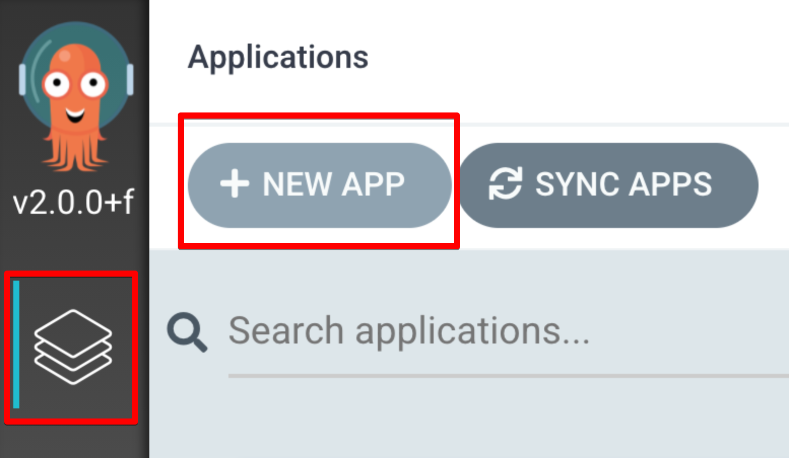
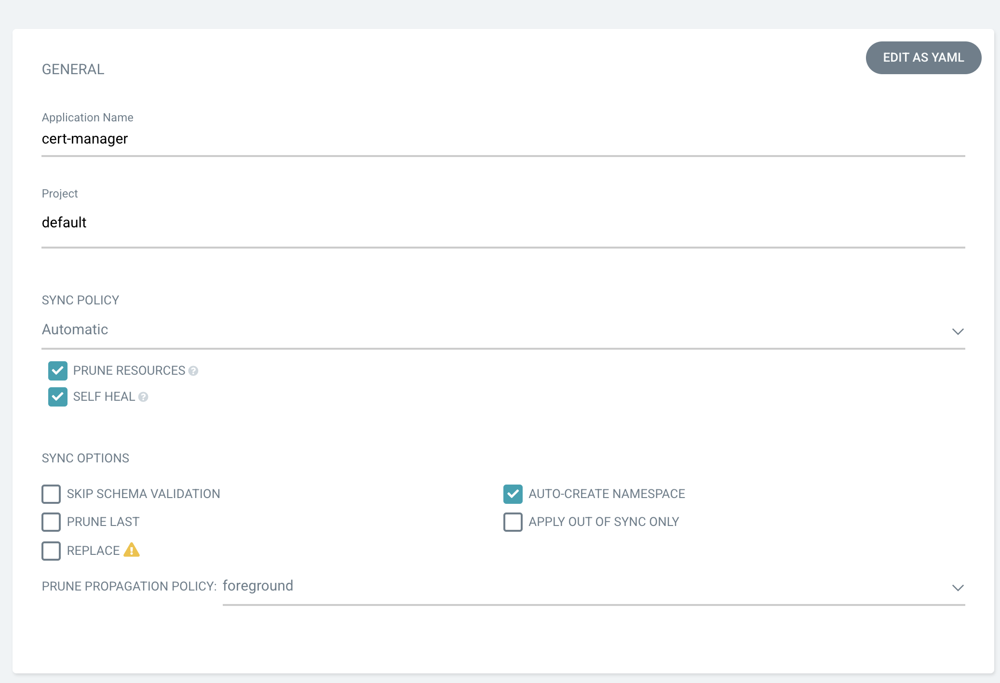
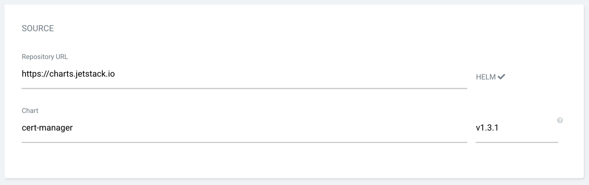
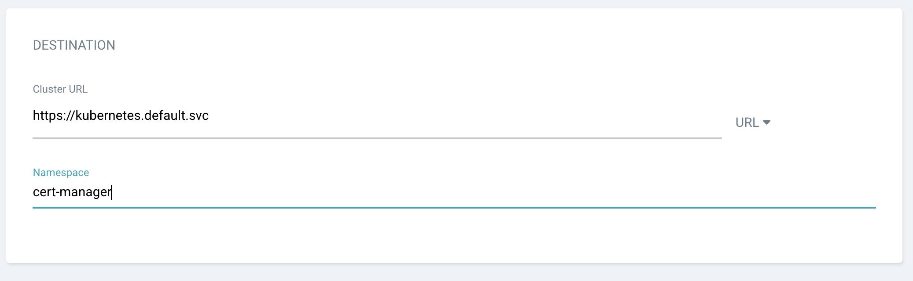
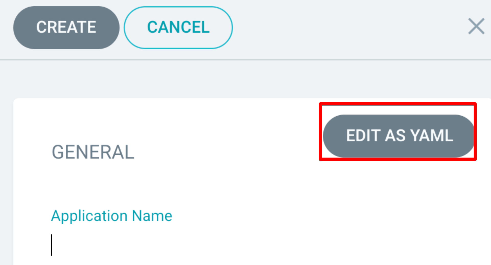

# Apps

## repo 등록

앞 페이지에 repo등록이 되있어야한다.

## ui를 이용하여 앱 추가

cert-manager 를 앱으로 등록하자.









이런식으로 앱을 추가할수 있다.

## yml을 사용하여 앱 추가





```yaml
apiVersion: argoproj.io/v1alpha1
kind: Application
metadata:
  name: cert-manager
  namespace: argocd
spec:
  destination:
    name: ''
    namespace: cert-manager
    server: 'https://kubernetes.default.svc'
  source:
    path: ''
    repoURL: 'https://charts.jetstack.io'
    targetRevision: v1.3.1
    chart: cert-manager
    helm:
      parameters:
        - name: installCRDs
          value: 'true'
  project: default
  syncPolicy:
    syncOptions:
      - CreateNamespace=true
```



save하면 앱이 만들어지고 sync를 누르면 설치가 된다.

## command line으로 적용

```bash
kubectl apply -f add-apps/cert-manager.yml
```

## nginx 앱 추가

nginx앱을 하나 만들어서 배포해보자.

argocd git에 폴더를 하나 만들자

```bash
mkdir my-webserver
cd my-webserver
```



```yaml
---
apiVersion: v1
kind: Service
metadata:
  name: www
  namespace: www
  labels:
    app: www
spec:
  selector:
    app: www
  ports:
    - name: http
      port: 80
      targetPort: 80
```



```yaml
apiVersion: apps/v1
kind: Deployment
metadata:
  name: www
  namespace: www
  labels:
    app: www
spec:
  replicas: 1
  selector:
    matchLabels:
      app: www
  template:
    metadata:
      labels:
        app: www
    spec:
      containers:
        - name: www
          image: nginx:latest
          ports:
            - containerPort: 80
```





```yaml
apiVersion: argoproj.io/v1alpha1
kind: Application
metadata:
  name: my-webserver
  namespace: my-webserver
spec:
  destination:
    name: ''
    namespace: my-webserver
    server: 'https://kubernetes.default.svc'
  source:
    path: apps/my-webserver
    repoURL: 'git@github.com:YOUR/argocd.git'
    targetRevision: main
  project: default
  syncPolicy:
    automated:
      prune: true
      selfHeal: true
    syncOptions:
      - CreateNamespace=true
```



이제 커밋을 하고 app을 추가해 주자.

```bash
kubectl apply -f add-apps/my-webserver.yml
```

