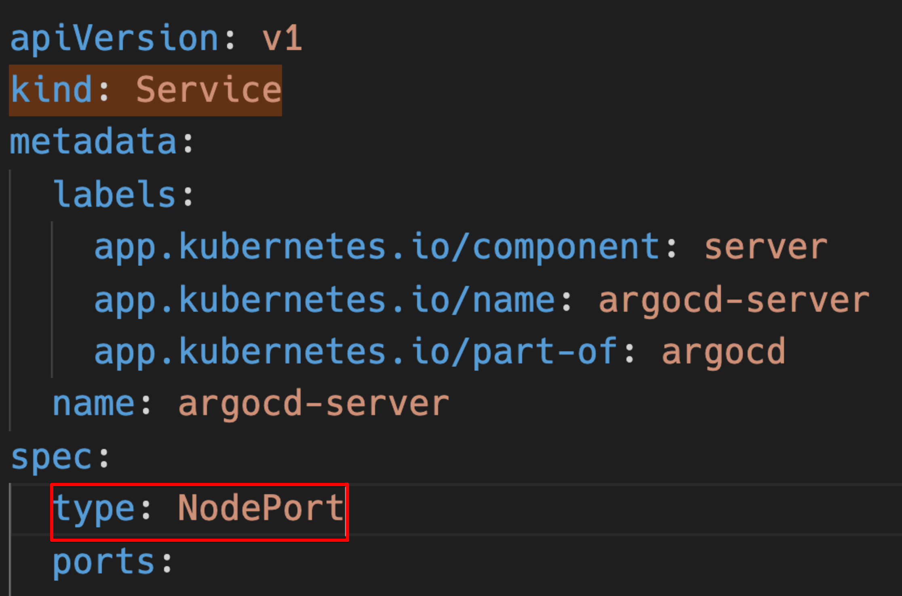

# AWS ALB 사용

argocd 를 port forward로 사용하여 localhost로 썼는데 외부로 오픈을 하고 싶다.

aws alb를 사용하여 오픈해보자.

먼저 aws alb controller가 설치가 되있어야 한다.

[aws alb controller](../aws/eks/alb-controller.md)

설치가 끝났으면 다음 내용을 진행한다.

이걸 aws certificate-manager에서 받은 ssl을 가지고 사용해보자.

## ssl 발급

aws certificate manager에서 소유한 도메인으로 tls(ssl)을 발급받아서 arn을 적어둔다.

## argocd를 insecure 모드

이걸 하지않으면 too many redirect라는 메세지가 나오면서 동작하지 않는다.

deploy에서 다음부분을 추가해준다.



```
- command:
    - argocd-server
    - --staticassets
    - /shared/app
    - --insecure
```




이부분이 최신에 업데이트됬다 configmap을 하나 만들어주면 insecure하게 동작한다.

```yml
apiVersion: v1
kind: ConfigMap
metadata:
  labels:
    app.kubernetes.io/name: argocd-cmd-params-cm
    app.kubernetes.io/part-of: argocd
  name: argocd-cmd-params-cm
data:
  server.insecure: 'true'
```

적용해주고 argocd-server를 재시작하면된다.

### argocd-server service를 nodeport

```yaml
spec:
  type: NodePort
```



`kubectl apply -n argocd -f argocd/argocd_install_v2.0.3.yaml`

배포가 잘 됬는지 확인해보자.


로드 발란서로 사용도 가능하다. clusterip만 alb에서 지원하지 않음.

```sh
kubectl patch svc argocd-server -n argocd -p '{"spec": {"type": "LoadBalancer"}}'
```

## ingress 설정(with ssl)



```yaml
apiVersion: networking.k8s.io/v1
kind: Ingress
metadata:
  name: argocd-ingress
  namespace: argocd
  annotations:
    kubernetes.io/ingress.class: 'alb'
    alb.ingress.kubernetes.io/listen-ports: '[{"HTTP": 80}, {"HTTPS":443}]'
    alb.ingress.kubernetes.io/scheme: internet-facing
    alb.ingress.kubernetes.io/certificate-arn: arn:aws:acm:us-west-1:530310000353:certificate/e3a71be4-7628-4758-b674-a45ed23eb4f1
    alb.ingress.kubernetes.io/actions.ssl-redirect: '{"Type": "redirect", "RedirectConfig": { "Protocol": "HTTPS", "Port": "443", "StatusCode": "HTTP_301"}}'

spec:
  rules:
    - host: argocd.your-domain.com
      http:
        paths:
          - path: /
            pathType: Prefix
            backend:
              service:
                name: ssl-redirect
                port:
                  name: use-annotation
          - path: /
            pathType: Prefix
            backend:
              service:
                name: argocd-server
                port:
                  number: 80
```



ssl redirect를 했다.

ssl이 꼭 위로 가야한다.

certificate-arn도 기존에 적어놓은 내용을 넣어준다.

```bash
kubectl apply -f argocd/ingress.yml
```

aws / ec2 / load balancer 가 자동으로 생성이 된다.

## route53 설정

route53에 만들어주면 된다.

cname으로 새로 생긴 load balancer를 추가해주면된다.


이제 http로 접속하면 https로 변경되면서 warning없이 진행된다.

https redirect가 된다.
