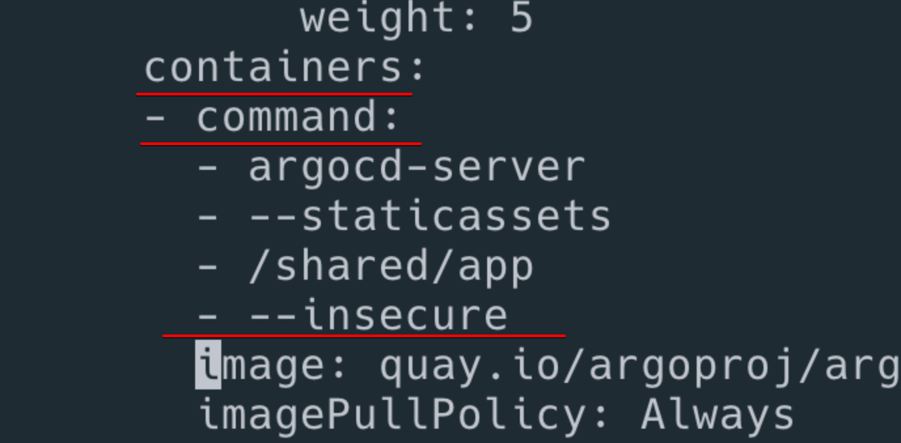
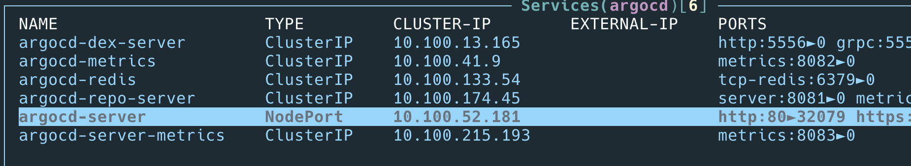
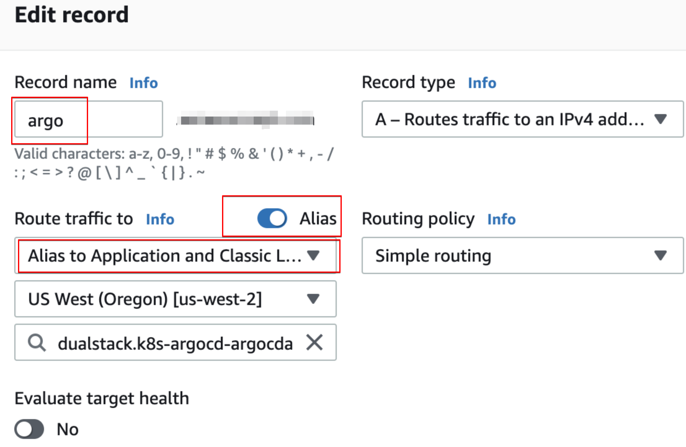

# AWS ALB 사용

argocd 를 port forward로 사용하여 localhost로 썼는데 외부로 오픈을 하고 싶다.

aws alb를 사용하여 오픈해보자.

먼저 aws alb controller가 설치가 되있어야 한다.

[aws alb controller](../aws/eks/alb-controller.md)

설치가 끝났으면 다음 내용을 진행한다.

이걸 aws certificate-manager에서 받은 ssl을 가지고 사용해보자.

## ssl 발급

aws certificate manager에서 소유한 도메인으로 tls\(ssl\)을 발급받아서 arn을 적어둔다.

## argocd를 insecure 모드

이걸 하지않으면 too many redirect라는 메세지가 나오면서 동작하지 않는다.

deploy에서 다음부분을 추가해준다.

```bash
kubectl edit deployment/argocd-server -n argocd

- --insecure
```



배포가 잘 됬는지 확인해보자.

## argocd-server service를 nodeport

alb는 ClusterIP를 지원하지 않으므로 노드 포트로 사용해야한다.

```bash
kubectl patch svc argocd-server -n argocd -p '{"spec": {"type": "NodePort"}}'
```



## ingress 설정\(with ssl\)


```yaml
apiVersion: extensions/v1beta1
kind: Ingress
metadata:
  name: argocd-alb
  namespace: argocd
  annotations:
    kubernetes.io/ingress.class: 'alb'
    alb.ingress.kubernetes.io/listen-ports: '[{"HTTP": 80}, {"HTTPS":443}]'
    alb.ingress.kubernetes.io/scheme: internet-facing
    alb.ingress.kubernetes.io/certificate-arn: arn:aws:acm:us-west-2:xxxxx:certificate/xxxxx-0278-437a-afed-xxxxxf880
    alb.ingress.kubernetes.io/actions.ssl-redirect: '{"Type": "redirect", "RedirectConfig": { "Protocol": "HTTPS", "Port": "443", "StatusCode": "HTTP_301"}}'
    alb.ingress.kubernetes.io/ssl-passthrough: 'true'

spec:
  rules:
    - host: argo.wnwconcept.com
      http:
        paths:
          - path: /*
            backend:
              serviceName: ssl-redirect
              servicePort: use-annotation
          - path: /*
            backend:
              serviceName: argocd-server
              servicePort: 80
```


ssl redirect를 했다.

certificate-arn도 기존에 적어놓은 내용을 넣어준다.

이제 커밋/푸시를 하면 argocd 가 적용을 해준다. \(앱을 추가해줘야하 할수도 있다.\)

aws / ec2 / load balancer 가 자동으로 생성이 된다.


## route53 설정

route53에 자동으로 생성이 되기는 한다. 없는경우에는 만들어주면 된다. cname으로 새로 생긴 load balancer를 추가해주면된다.



이제 http로 접속하면 https로 변경되면서 warning없이 진행된다.

https redirect가 된다.

