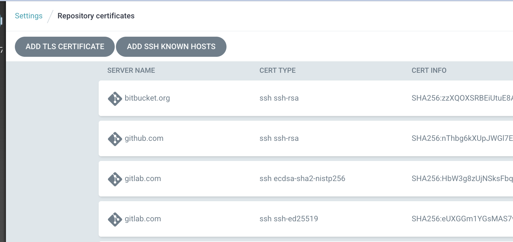
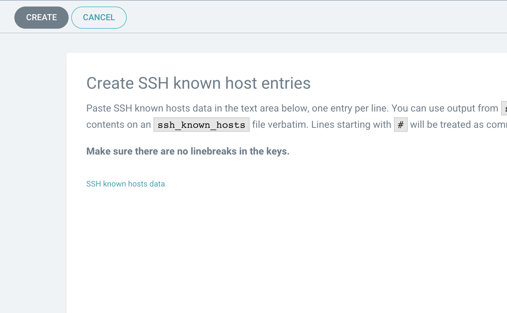

# argocd cant connect github

2021-11-16 github change their ssh endpoint so all argocd stop working.

```text
github.com ssh-rsa AAAAB3NzaC1yc2EAAAABIwAAAQEAq2A7hRGmdnm9tUDbO9IDSwBK6TbQa+PXYPCPy6rbTrTtw7PHkccKrpp0yVhp5HdEIcKr6pLlVDBfOLX9QUsyCOV0wzfjIJNlGEYsdlLJizHhbn2mUjvSAHQqZETYP81eFzLQNnPHt4EVVUh7VfDESU84KezmD5QlWpXLmvU31/yMf+Se8xhHTvKSCZIFImWwoG6mbUoWf9nzpIoaSjB+weqqUUmpaaasXVal72J+UX2B+2RPW3RcT0eOzQgqlJL3RKrTJvdsjE3JEAvGq3lGHSZXy28G3skua2SmVi/w4yCE6gbODqnTWlg7+wC604ydGXA8VJiS5ap43JXiUFFAaQ==
github.com ecdsa-sha2-nistp256 AAAAE2VjZHNhLXNoYTItbmlzdHAyNTYAAAAIbmlzdHAyNTYAAABBBEmKSENjQEezOmxkZMy7opKgwFB9nkt5YRrYMjNuG5N87uRgg6CLrbo5wAdT/y6v0mKV0U2w0WZ2YB/++Tpockg=
github.com ssh-ed25519 AAAAC3NzaC1lZDI1NTE5AAAAIOMqqnkVzrm0SdG6UOoqKLsabgH5C9okWi0dh2l9GKJl
```

3 줄을 다음 화면에 넣고 처리한다.



add ssh known host



여기에 넣고 create 버튼을 누르면 됩니다.

다시 repo를 등록하면됩니다.

스크립트로도 처리 가능

```sh
argocd login localhost:8000
ssh-keyscan github.com | argocd cert add-ssh --batch
```
