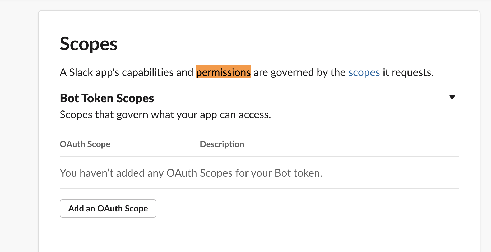
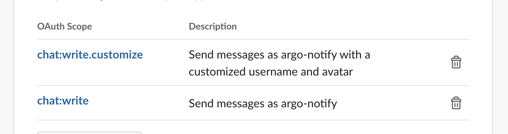

# notification slack



## slack 설정

[https://argocd-notifications.readthedocs.io/en/stable/services/slack/](https://argocd-notifications.readthedocs.io/en/stable/services/slack/)

slack에서 add apps  ==&gt; app directory ==&gt; build ==&gt; create custom app 

create an app from scratch

create app

oauth permission

bot token scope ==&gt; add an oauth scope ==&gt; chat:write추

chat:write:customize는 메세지를 커스터마이즈하려면 추

 Install App to Workspace

allow

토큰이 생성이 되면 복사해둔다.

채널을 만든다. argocd 

채널에서 Add apps &gt;&gt; argocd-notifications

core/argocd/



slack-notification/







