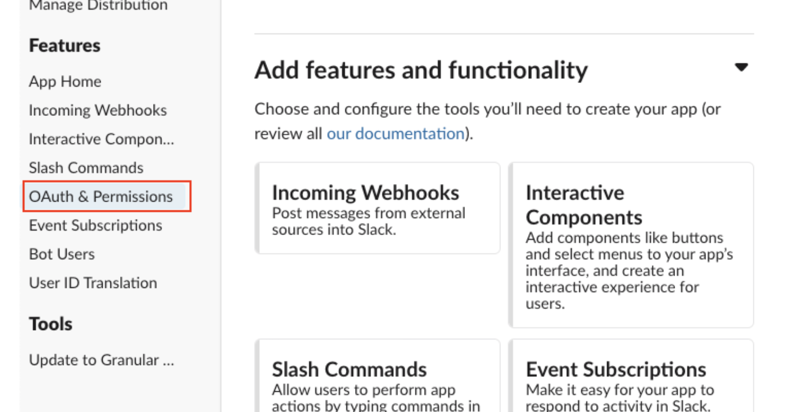
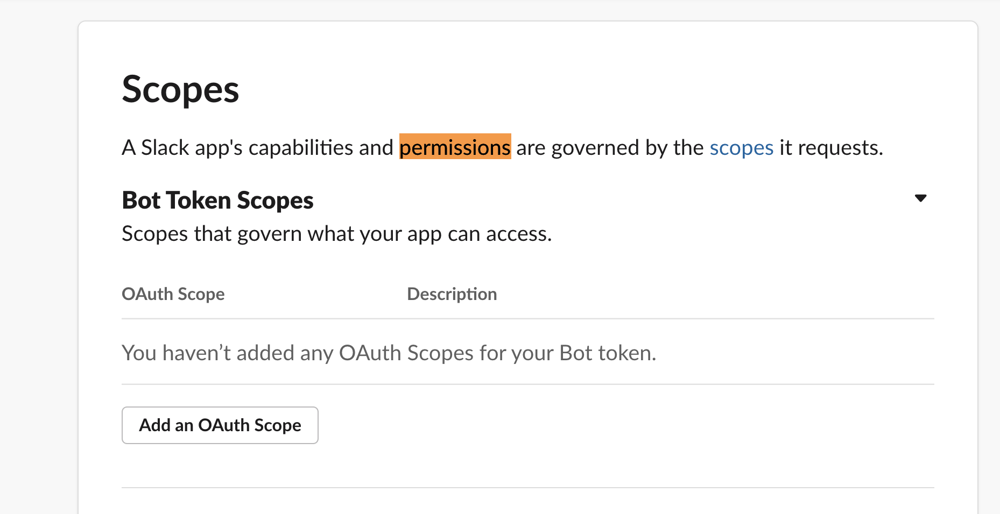

# notification slack



## slack 설정

[https://argocd-notifications.readthedocs.io/en/stable/services/slack/](https://argocd-notifications.readthedocs.io/en/stable/services/slack/)

slack에서 add apps ==&gt; app directory ==&gt; build ==&gt; create custom app


create an app from scratch


oauth & permission



bot token scope ==&gt; add an oauth scope ==&gt; chat:write추가




chat:write:customize는 메세지를 커스터마이즈하려면 추가

Install App to Workspace


allow

토큰이 생성이 되면 복사해둔다.


argocd 채널에 application추가

채널에서 Add apps &gt;&gt; argocd-notifications


## argocd에 설치하기

```bash
mkdir -p core/argocd-notifications
cd core/argocd-notifications
```



```yaml
apiVersion: kustomize.config.k8s.io/v1beta1

kind: Kustomization

resources:
  - https://raw.githubusercontent.com/argoproj-labs/argocd-notifications/v1.1.1/manifests/install.yaml

patches:
  - path: https://raw.githubusercontent.com/argoproj-labs/argocd-notifications/v1.1.1/catalog/install.yaml
    target:
      kind: ConfigMap
      name: argocd-notifications-cm
  - path: slack-secret.yml
    target:
      kind: Secret
      name: argocd-notifications-secret

patchesStrategicMerge:
  - slack-configmap.yml
```



```yaml
apiVersion: v1
data:
  service.slack: |
    token: $slack-token
kind: ConfigMap
metadata:
  name: argocd-notifications-cm
```



```yaml
apiVersion: v1
kind: Secret
metadata:
  name: argocd-notifications-secret
stringData:
  slack-token: YOUR-TOKEN
type: Opaque
```



argocd에서 앱을 추가하자.


```text
apiVersion: argoproj.io/v1alpha1
kind: Application
metadata:
  name: argocd-notifications
spec:
  destination:
    name: ''
    namespace: argocd
    server: 'https://kubernetes.default.svc'
  source:
    path: apps/core/argocd-notifications
    repoURL: 'git@github.com:teamsmiley/rendercore-argocd.git'
    targetRevision: HEAD
  project: default
  syncPolicy:
    automated:
      prune: true
      selfHeal: true
    syncOptions:
      - CreateNamespace=true
```


```bash
kubectl apply -f add-apps/argocd-notifications.yml
```

## subscribe trigger

### Application

Application에 annotations 을 추가해주면된다.

```bash
kubectl edit application AAA -n argocd
```

```yaml
apiVersion: argoproj.io/v1alpha1
kind: Application
metadata:
  # 여기만 추가
  annotations:
    notifications.argoproj.io/subscribe.on-sync-succeeded.slack: my_channel
```

이러면 알림을 받을수 있다.

### Project

Project 단위에 다 보내려면 프로젝트설정에 annotations 을 추가해주면 된다.

```bash
kubectl get AppProjects -n argocd
```


```bash
kubectl edit appProject default -n argocd
```

```yaml
apiVersion: argoproj.io/v1alpha1
kind: AppProject
metadata:
  # 여기만 추가
  annotations:
    notifications.argoproj.io/subscribe.on-sync-succeeded.slack: my-channel1;my-channel2
```

### command line으로


```yaml
metadata:
  annotations:
    notifications.argoproj.io/subscribe.on-sync-succeeded.slack: argocd
```


```bash
kubectl patch AppProjects default -n argocd --patch "$(cat trigger.yaml)" --type=merge
```

