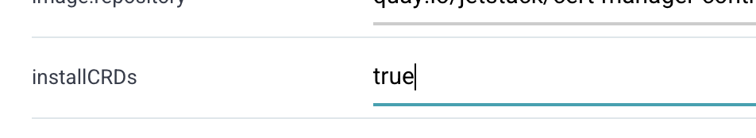

# Repository

## helm 등록

helm chart를 등록하여 앱에 추가하여 사용할수 있다.

argo ui에서 helm repo 등록 : [https://charts.jetstack.io](https://charts.jetstack.io)




installCRDs를 false에서 true로 변경하자.

앱 생성하자.

## git repo 등록

git repo를 등록하여 앱에 추가할수 있다.

### argo용 ssh key 생성

```bash
ssh-keygen
> .ssh/argocd
```


### repo 등록

* UI
  * private키 argocd에 repo에 등록한다.
  * public key는 깃허브에 추가해야할듯
* cat .ssh/id\_rsaXXXX


만들어진 키의 내용을 복사해다 붙여넣는다.

* Command

```bash
argocd repo add git@github.com:YOURS/argocd.git \
--ssh-private-key-path ~/.ssh/argocd
```

