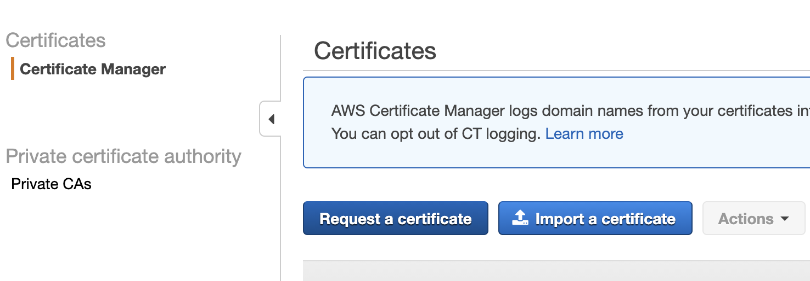
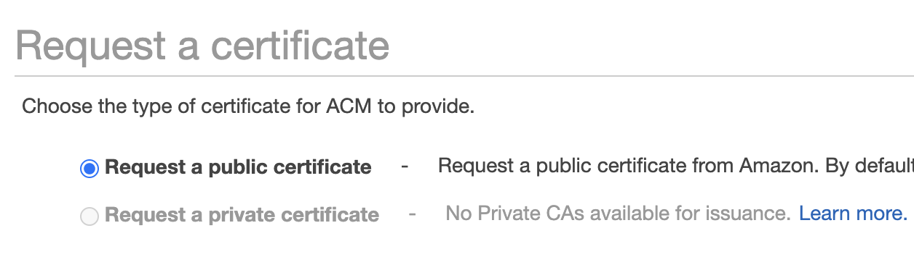
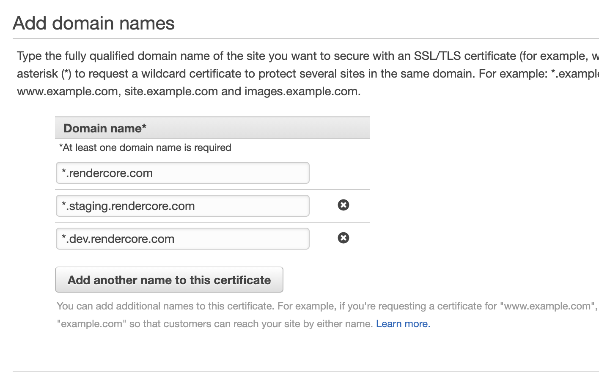
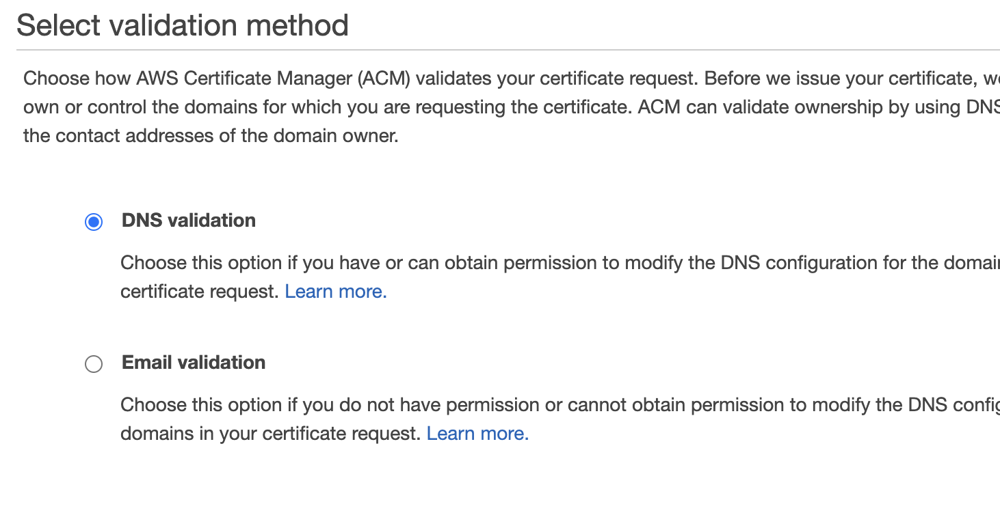
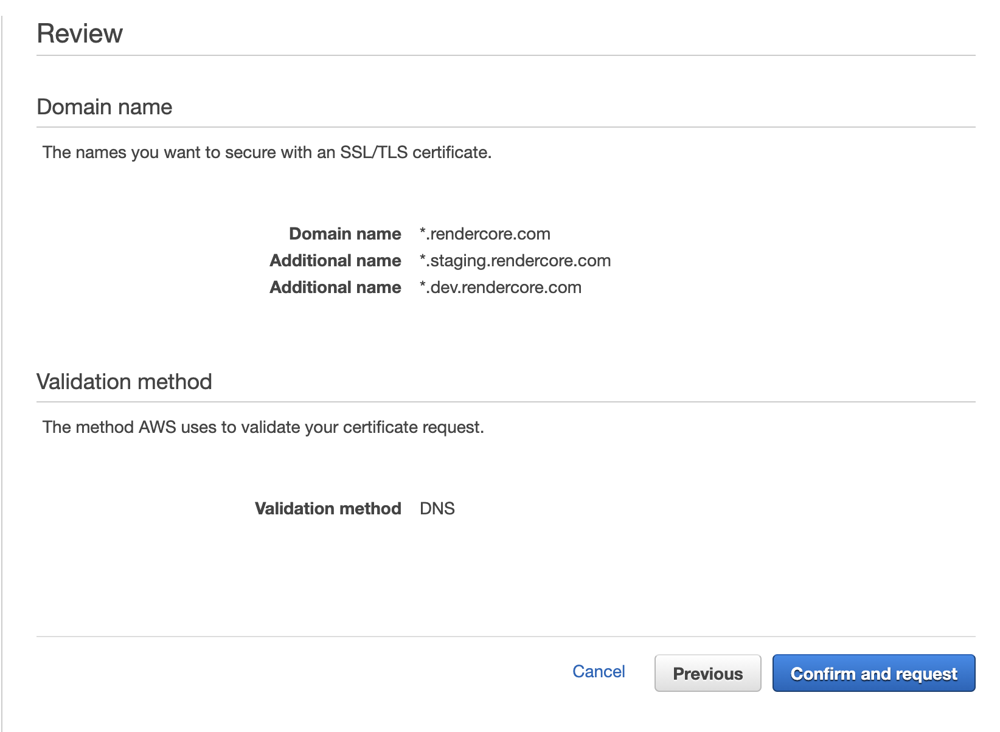
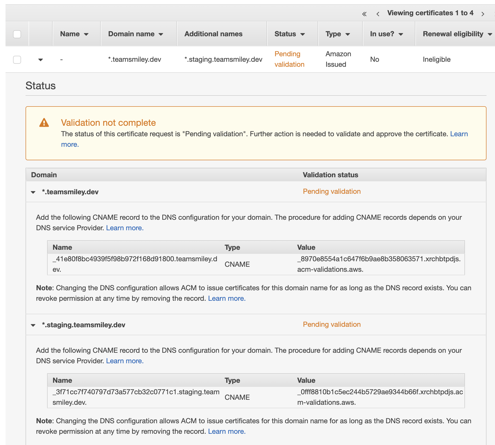
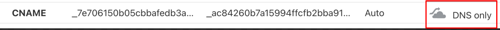

# Certificate Manager

## create certificate

request

## create cname

cname을 dns에서 만들어주면 인증완료

이제 arn을 가져다 사용하면 된다.

## cloudflare

cloudflare를 사용할경우 인증이 되지 않는다. cloudflare에서 dns only로 해야한다.

