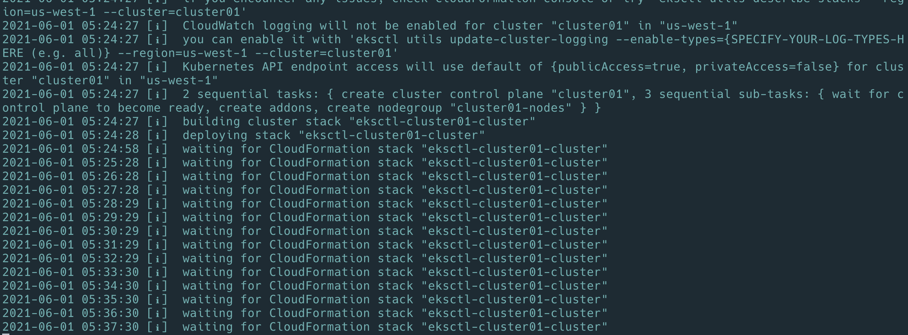
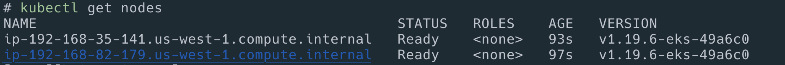
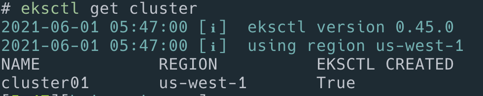
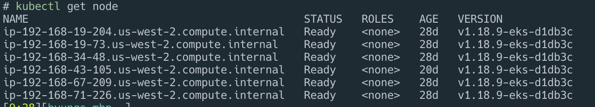
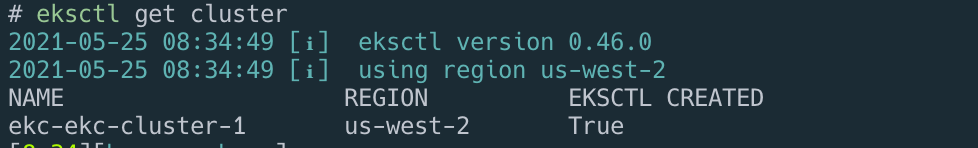

# EKS

## prerequisite

### aws cli 설치

[aws cli](../cli.md)

### eksctl tool 설치

[https://eksctl.io](https://eksctl.io)

```bash
brew install aws-iam-authenticator
brew tap weaveworks/tap
brew install weaveworks/tap/eksctl
```

리눅스 윈도우 사용자는 [https://eksctl.io/introduction/\#installation](https://eksctl.io/introduction/#installation) 참고

## kubernetes cluster 생성

```bash
aws configure list-profiles

echo $AWS_PROFILE

export AWS_PROFILE=rendercore

echo $AWS_PROFILE

eksctl create cluster \
--name cluster01 \
--version 1.19 \
--region us-west-1 \
--nodegroup-name cluster01-nodes \
--node-type t3.small \
--nodes 2
```

- type
  - t3.nano
  - t3.micro
  - t3.small
  - t3.medium
  - t3.large

여기서 한참 걸린다. 한 20분..뭐하지 ?



```bash
2021-05-10 12:22:19 [ℹ]  waiting for the control plane availability...
2021-05-10 12:22:19 [✔]  saved kubeconfig as "/Users/ragon/.kube/c2-config"
2021-05-10 12:22:19 [ℹ]  no tasks
2021-05-10 12:22:19 [✔]  all EKS cluster resources for "cluster01" have been created
2021-05-10 12:22:39 [ℹ]  adding identity "arn:aws:iam::849053568:role/eksctl-cluster01-nodegroup-cluste-NodeInstanceRole-PFUE0IKTPN8T" to auth ConfigMap
2021-05-10 12:22:40 [ℹ]  nodegroup "cluster01-nodes" has 0 node(s)
2021-05-10 12:22:40 [ℹ]  waiting for at least 4 node(s) to become ready in "cluster01-nodes"
2021-06-01 05:43:59 [ℹ]  kubectl command should work with "/Users/ragon/.kube/config", try 'kubectl get nodes'
2021-06-01 05:43:59 [✔]  EKS cluster "cluster01" in "us-west-1" region is ready
```

## 생성 확인

```bash
kubectl get nodes
ls ~/.kube/
cat ~/.kube/config
eksctl get cluster
```





생성이 되고 나면 ~/.kube/ 폴더에 config파일이 생성이 된다. 이 정보로 kubernetes와 통신할수 있다.

```yaml
apiVersion: v1
clusters:
  - cluster:
      certificate-authority-data: xxxx
    name: cluster01
contexts:
  - context:
      cluster: cluster01
      user: cluster01
    name: cluster01
kind: Config
preferences: {}
users:
  - name: cluster01
    user:
      exec:
        apiVersion: client.authentication.k8s.io/v1alpha1
        args:
          - token
          - -i
          - cluster01
        command: aws-iam-authenticator
        env:
          - name: AWS_STS_REGIONAL_ENDPOINTS
            value: regional
          - name: AWS_DEFAULT_REGION
            value: us-west-1
          - name: AWS_PROFILE
            value: Profile_Name
```

이부분을 주의하자 없으면 넣어줄것. 없어도 되지만 프로파일 매번 설정하기 싫은경우에 넣어주면된다.

```yaml
- name: AWS_PROFILE
  value: Profile_Name
```

## config를 이용한 생성

config.yml을 미리 만들거나 위에서 만들어진 config를 백업해두면 똑같이 나중에 만들수 있다.



```yaml
apiVersion: eksctl.io/v1alpha5
kind: ClusterConfig

metadata:
  name: cluster-in-existing-vpc
  region: us-west-1

vpc:
  subnets:
    private:
      eu-north-1a: { id: subnet-0fxxx6e0c4a6d300c }
      eu-north-1b: { id: subnet-05xxxb573695c03 }
      eu-north-1c: { id: subnet-04xxxa607393184 }

nodeGroups:
  - name: ng-1-workers
    labels: { role: workers }
    instanceType: t3.micro
    desiredCapacity: 10
    privateNetworking: true
```



```bash
eksctl create cluster --config-file=./config.yml --kubeconfig ~/.kube/aws-config
```

## 접속 확인

vi ~/.zshrc




```bash
export KUBECONFIG=~/.kube/config
```




```bash
kubectl get node
```



## check cluster

```bash
eksctl get cluster
```


