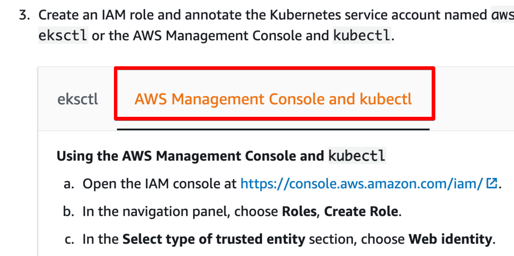

# ALB Controller

aws alb controller \(application load balance controller\)

쿠버네티스를 직접 설치하고 사용할때는 ingress-nginx를 사용하였으나 eks에는 aws \(alb\) application load balance를 사용할수 있는 방법이 있다.

처음 고민이 aws에서 로드발란스를 세팅하는게 번거롭다는 고민이 있엇는데 그걸 aws에서 알고 있엇는지 kubernete 설정파일에 적어만 주면 자동으로 alb가 생성이 된다.

[https://docs.aws.amazon.com/eks/latest/userguide/aws-load-balancer-controller.html](https://docs.aws.amazon.com/eks/latest/userguide/aws-load-balancer-controller.html)

ALB Controller를 설치를 해두면 쿠버네티스에 설정을 하면 이 컨트롤러가 ALB를 자동으로 등록해주는 것이다.

이 컨트롤러가 alb에 접속이 가능하게 되야는데 이걸 oidc를 사용한다.\(인증\)

ALB는 nodeport 나 loadbalance만 지원을 한다.\(중요\)

링크에 있는 내용을 해주면 된다. 간단하게 요약해보면

## Oidc를 이용하여 인증을 체크

### oidc.issuer가 있는지 체크

```bash
aws eks describe-cluster --name cluster01 --query "cluster.identity.oidc.issuer" --output text
```

```text
> https://oidc.eks.us-west-2.amazonaws.com/id/55078434365FAxxx21D4C440DD
```

결과 나왓으므로 이걸로 다시

```bash
aws iam list-open-id-connect-providers | grep 55078434365FAxxx21D4C440DD
```

아무것도 안나온다. 없다는거다 그러면 생성 해줘야 한다. 있으면 생성부분을 넘어가면 된다.

없으면 생성

### Create IAM OIDC provider

[https://docs.aws.amazon.com/eks/latest/userguide/enable-iam-roles-for-service-accounts.html](https://docs.aws.amazon.com/eks/latest/userguide/enable-iam-roles-for-service-accounts.html)

```bash
eksctl utils associate-iam-oidc-provider \
    --region us-west-2 \
    --cluster cluster01 \
    --approve

> 2021-05-04 19:17:23 [ℹ]  eksctl version 0.45.0
> 2021-05-04 19:17:23 [ℹ]  using region us-west-2
> 2021-05-04 19:17:23 [ℹ]  IAM Open ID Connect provider is already associated with cluster "ekc-ekc-cluster-1" in "us-west-2"
```

내용 확인

```bash
aws iam list-open-id-connect-providers | grep 55078434365FAxxx21D4C440DD
```

```bash
> - Arn: arn:aws:iam::YOURACCOUNT:oidc-provider/oidc.eks.us-west-2.amazonaws.com/id/55078434365FAxxx21D4C440DD
```

내용이 있다. oidc는 만들어졌다.

### Download IAM policy for the AWS Load Balancer Controller

```bash
curl -o iam_policy.json https://raw.githubusercontent.com/kubernetes-sigs/aws-load-balancer-controller/v2.1.3/docs/install/iam_policy.json
```

### Create an IAM policy called AWSLoadBalancerControllerIAMPolicy

```bash
aws iam create-policy \
 --policy-name AWSLoadBalancerControllerIAMPolicy \
 --policy-document file://iam_policy.json
```

```yaml
Policy:
  Arn: arn:aws:iam::YOURACCOUNT:policy/AWSLoadBalancerControllerIAMPolicy
  AttachmentCount: 0
  CreateDate: '2021-05-10T23:28:33+00:00'
  DefaultVersionId: v1
  IsAttachable: true
  Path: /
  PermissionsBoundaryUsageCount: 0
  PolicyId: ANPA4LLXXXXH5RKWDGU
  PolicyName: AWSLoadBalancerControllerIAMPolicy
  UpdateDate: '2021-05-10T23:28:33+00:00'
```

### create iam role and annotate kubernetes account named aws-load-balancer-controller in kube-system namespaces

이건 잘 안되는듯 그냥 웹에서 하는게 좋을듯 싶다.

```bash
eksctl create iamserviceaccount \
  --cluster=cluster01 \
  --namespace=kube-system \
  --name=aws-load-balancer-controller \
  --attach-policy-arn=arn:aws:iam::YOURACCOUNT:policy/AWSLoadBalancerControllerIAMPolicy \
  --override-existing-serviceaccounts \
  --approve
```



이 탭을 눌러서 여기에 적힌대로 진행한다.

웹에서 마지막단계에서 arn을 복사해두자.

```text
arn:aws:iam::YOURACCOUNT:role/AmazonEKSLoadBalancerControllerRole
```

[https://github.com/kubernetes-sigs/aws-load-balancer-controller](https://github.com/kubernetes-sigs/aws-load-balancer-controller) 에서 최신 릴리즈를 확인하고

git에서 폴더를 하나 만들고

mkdir aws-alb-controller

파일을 다운받는다.

```bash
curl -o v2_2_0_full.yaml https://raw.githubusercontent.com/kubernetes-sigs/aws-load-balancer-controller/v2.2.0/docs/install/v2_2_0_full.yaml
```

파일을 수정하자. clustername만 바꿔주면된다.

파일 추가

vi aws-load-balancer-controller-service-account.yaml

```yaml
apiVersion: v1
kind: ServiceAccount
metadata:
  labels:
    app.kubernetes.io/component: controller
    app.kubernetes.io/name: aws-load-balancer-controller
  name: aws-load-balancer-controller
  namespace: kube-system
  annotations:
    eks.amazonaws.com/role-arn: arn:aws:iam::xxxxx:role/AmazonEKSLoadBalancerControllerRole
```

arn을 복사해둔 내용을 여기에 적어넣는다.

aws-load-balancer-controller-service-account.yaml 도 위에서 복사해둔 내용을 추가해서 저장

적용하자.

## 확인

```bash
kubectl get deployment -n kube-system aws-load-balancer-controller
```

아웃풋이 나오면 잘 된것이다.

## 기본 ingress 사용법

```text
apiVersion: extensions/v1beta1
kind: Ingress
metadata:
  name: www
  namespace: www-staging
  annotations:
    kubernetes.io/ingress.class: 'alb' # alb를 사용하겠다
    alb.ingress.kubernetes.io/listen-ports: '[{"HTTP": 80}, {"HTTPS":443}]' # 포트를 80 443을 로드발란스에서 오픈하겟다.
    alb.ingress.kubernetes.io/scheme: internet-facing # 인터넷(public)에서 접속이 되게 한다.
    alb.ingress.kubernetes.io/certificate-arn: arn:aws:acm:us-west-2:xxxxxx:certificate/199b8e95 # load balance에 ssl을 적용
    alb.ingress.kubernetes.io/actions.ssl-redirect: '{"Type": "redirect", "RedirectConfig": { "Protocol": "HTTPS", "Port": "443", "StatusCode": "HTTP_301"}}'
spec:
  rules:
    - host: www.aaa.com
      http:
        paths:
          - path: /*
            backend:
              serviceName: ssl-redirect
              servicePort: use-annotation
          - path: /*
            backend:
              serviceName: www
              servicePort: 80
```

이걸 사용하면 자동으로 aws application load balance도 만들어주고 listen port도 추가해준다. ssl도 적용해준다.

ssl의 경우 aws certificate manager 에서 미리 만들어 둬야한다.

## http를 https로 redirect

위에 샘플에 적혀는 있으나 특별히 따로 설명한다.

anotation에 다음 추가

```text
alb.ingress.kubernetes.io/actions.ssl-redirect: '{"Type": "redirect", "RedirectConfig": { "Protocol": "HTTPS", "Port": "443", "StatusCode": "HTTP_301"}}'
```

그리고 path에 다음 추가

```text
- path: /*
  backend:
    serviceName: ssl-redirect
    servicePort: use-annotation
```

이러면 http로 접근하면 https로 리다이렉트를 시켜준다.

관련 내용은 여기를 참고하자. [https://github.com/kubernetes-sigs/aws-load-balancer-controller/blob/main/docs/guide/tasks/ssl\_redirect.md](https://github.com/kubernetes-sigs/aws-load-balancer-controller/blob/main/docs/guide/tasks/ssl_redirect.md)

## ssl backend

특정 pod는 프로그램 자체에서 ssl로 접근을 받아야할 필요가 있을때 alb controller에서는 다음처럼 처리한다.

```text
apiVersion: extensions/v1beta1
kind: Ingress
metadata:
  name: auth
  namespace: auth-staging
  annotations:
    kubernetes.io/ingress.class: 'alb'
    alb.ingress.kubernetes.io/certificate-arn: arn:aws:acm:us-west-2:xxxx:certificate/199b8e95-fe5b-43e6-b499-061e4f133011
    alb.ingress.kubernetes.io/listen-ports: '[{"HTTP": 80},{"HTTPS":443}]'
    alb.ingress.kubernetes.io/scheme: internet-facing
    alb.ingress.kubernetes.io/actions.ssl-redirect: '{"Type": "redirect", "RedirectConfig": { "Protocol": "HTTPS", "Port": "443", "StatusCode": "HTTP_301"}}'
    alb.ingress.kubernetes.io/backend-protocol: HTTPS # 여기 추가
spec:
  rules:
    - host: www.aaa.com
      http:
        paths:
          - path: /*
            backend:
              serviceName: ssl-redirect
              servicePort: use-annotation
          - path: /*
            backend:
              serviceName: auth
              servicePort: 443
```

anotation에 다음 추가를 볼수 있다.

```text
alb.ingress.kubernetes.io/backend-protocol: HTTPS # 여기 추가
```

만약 이걸 추가하지 않으면 이런 에러를 볼수가 있다.

```text
Getting “Handshake failed…unexpected packet format”
```

alb가 기본적으로 http로 통신을 시도하므로 포트는 443을 쓰면서 http를 보내게 되다보니 이런 에러가 나온다.

## health check

로드 발란스가 기본적으로 pod를 다 체크해서 서비스를 유지해준다. 특별히 health check 경로를 수정하려면 다음처럼 하자.

```text
alb.ingress.kubernetes.io/healthcheck-protocol: HTTPS #기본값 http
alb.ingress.kubernetes.io/healthcheck-path: /api/values
```

pod가 ssl을 기대하고 있으면 healthcheck-protocol도 맞는값을 넣어줘야한다.

## nginx app을 alb에 오픈

한번더 모든걸 적용해서 alb를 사용해보자



```yaml
---
apiVersion: v1
kind: Service
metadata:
  name: www
  namespace: www-staging
  labels:
    app: www
spec:
  type: NodePort
  selector:
    app: www
  ports:
    - name: http
      port: 80
      targetPort: 80
```



```yaml
apiVersion: apps/v1
kind: Deployment
metadata:
  name: www
  namespace: www
  labels:
    app: www
spec:
  replicas: 1
  selector:
    matchLabels:
      app: www
  template:
    metadata:
      labels:
        app: www
    spec:
      containers:
        - name: www
          image: nginx
```



```yaml
apiVersion: extensions/v1beta1
kind: Ingress
metadata:
  name: www
  namespace: www
  annotations:
    kubernetes.io/ingress.class: 'alb'
    alb.ingress.kubernetes.io/scheme: internet-facing
    alb.ingress.kubernetes.io/listen-ports: '[{"HTTP": 80}, {"HTTPS":443}]'
    alb.ingress.kubernetes.io/certificate-arn: arn:aws:acm:us-west-2:YOURACCOUNT:certificate/a2eb12f7-7e36-4d50-811c-8bxxxxx7
    alb.ingress.kubernetes.io/actions.ssl-redirect: '{"Type": "redirect", "RedirectConfig": { "Protocol": "HTTPS", "Port": "443", "StatusCode": "HTTP_301"}}'
spec:
  rules:
    - host: www.staging.wnwconcept.com
      http:
        paths:
          - path: /*
            backend:
              serviceName: ssl-redirect
              servicePort: use-annotation
          - path: /*
            backend:
              serviceName: www
              servicePort: 80
```



적용하면 alb가 생기는것을 aws console 에서 볼 수 있다.

* ssl도 적용햇다. cert-arn은 certificate-manager에 가서 만들면 생긴다. 그걸 사용
* ssl redirect 적용 완료
* `internet-facing` : 필수이다.
* 포트는 80 443은 둘다 열어주면 좋다.

