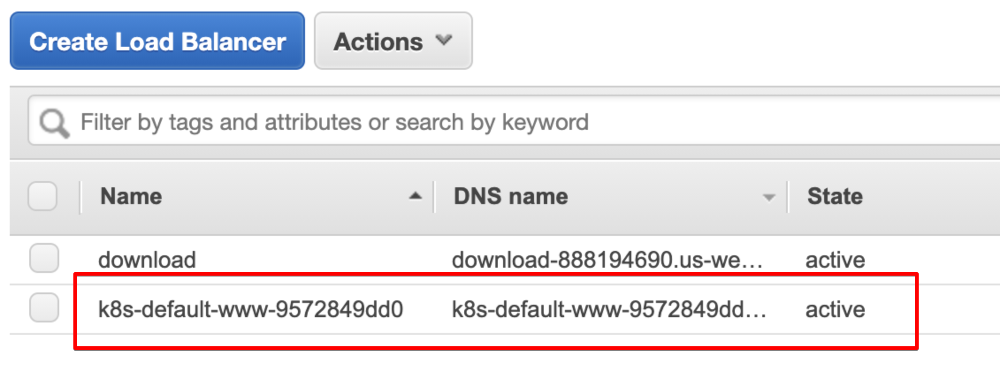
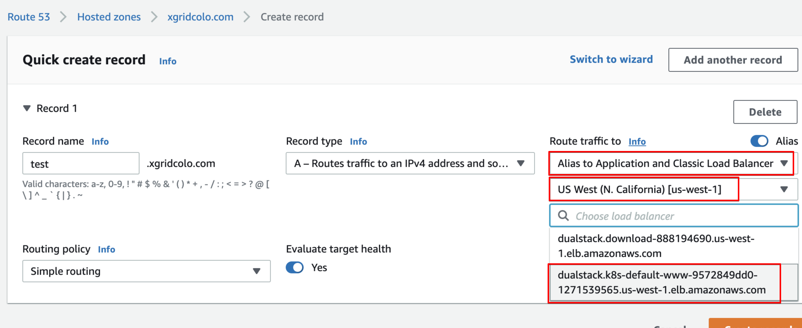
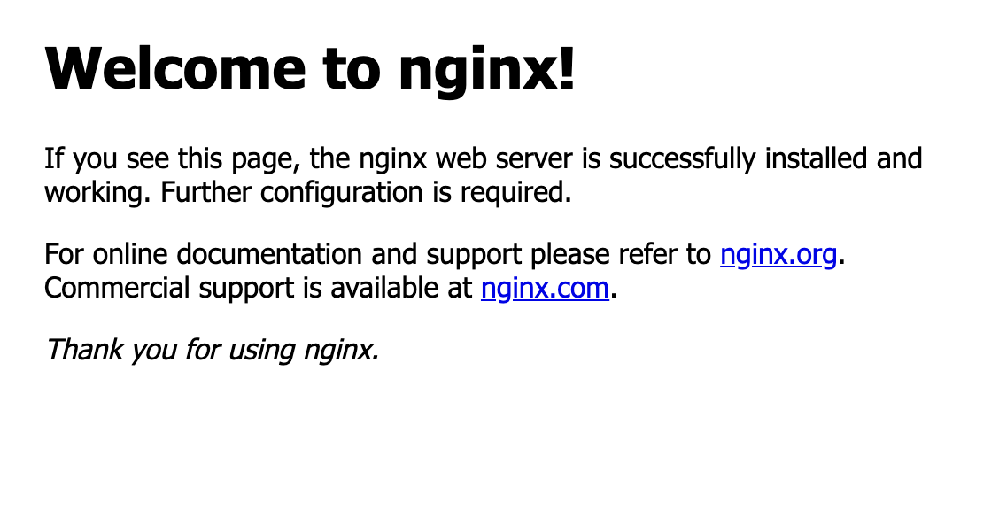

# ALB Controller

aws alb controller \(application load balance controller\)

쿠버네티스를 직접 설치하고 사용할때는 ingress-nginx를 사용하였으나 eks에는 aws \(alb\) application load balance를 사용할수 있는 방법이 있다.

처음 고민이 aws에서 로드발란스를 세팅하는게 번거롭다는 고민이 있엇는데 그걸 aws에서 알고 있엇는지 kubernete 설정파일에 적어만 주면 자동으로 alb가 생성이 된다.



ALB Controller를 설치를 해두면 쿠버네티스에 설정을 하면 이 컨트롤러가 ALB를 자동으로 등록해주는 것이다.

이 컨트롤러가 alb에 접속이 가능하게 되야는데 이걸 oidc를 사용한다.\(인증\)

ALB는 nodeport 나 loadbalance만 지원을 한다.\(중요\)

링크에 있는 내용을 해주면 된다. 간단하게 요약해보면

## OIDC

[https://docs.aws.amazon.com/eks/latest/userguide/enable-iam-roles-for-service-accounts.html](https://docs.aws.amazon.com/eks/latest/userguide/enable-iam-roles-for-service-accounts.html)



### OIDC Issuer

기본적으로 eksctl로 생성하면 이건 기본값이 같이 생김

```bash
aws eks describe-cluster --name cluster01 --query "cluster.identity.oidc.issuer" --output text
```

```yaml
> https://oidc.eks.us-west-1.amazonaws.com/id/295F23831974F59E6DF049E7284078A6
```

### OIDC Provider

```bash
aws iam list-open-id-connect-providers | grep 295F23831974F59E6DF049E7284078A6
```

아무것도 안나온다. 없다는거다 그러면 생성 해줘야 한다. 있으면 생성 부분을 넘어가면 된다.

없으면 생성

## Create an IAM OIDC provider for your cluster

```bash
eksctl utils associate-iam-oidc-provider \
    --region us-west-1 \
    --cluster cluster01 \
    --approve
```

내용 확인

```bash
aws iam list-open-id-connect-providers | grep 295F231974F59E6DF049E7284078A6
```

```bash
> - Arn: arn:aws:iam::530310009353:oidc-provider/oidc.eks.us-west-1.amazonaws.com/id/295F23831974F59E6DF049E7284078A6
```

내용이 있다. oidc provider는 만들어졌다.

웹사이트에서도 생성 확인 가능

[https://console.aws.amazon.com/iamv2/home\#/identity\_providers](https://console.aws.amazon.com/iamv2/home#/identity_providers)


## ALB Controller Install



### Create an IAM policy

```bash
# download
curl -o iam_policy.json https://raw.githubusercontent.com/kubernetes-sigs/aws-load-balancer-controller/v2.2.0/docs/install/iam_policy.json

aws iam create-policy \
  --policy-name AWSLoadBalancerControllerIAMPolicy \
  --policy-document file://iam_policy.json
```

arn을 복사해서 보관해둔다.

```yaml
Policy:
  Arn: arn:aws:iam::530310009353:policy/AWSLoadBalancerControllerIAMPolicy
  AttachmentCount: 0
  CreateDate: '2021-06-02T22:27:30+00:00'
  DefaultVersionId: v1
  IsAttachable: true
  Path: /
  PermissionsBoundaryUsageCount: 0
  PolicyId: ANPAXW6HU27ETIAOLPJGG
  PolicyName: AWSLoadBalancerControllerIAMPolicy
  UpdateDate: '2021-06-02T22:27:30+00:00'
```

웹사이트에서 확인

[https://console.aws.amazon.com/iam/home\#/policies](https://console.aws.amazon.com/iam/home#/policies)

AWSLoadBalancerControllerIAMPolicy로 검색해보면 생성된 것을 알수 있다.


### create Role

* Open the IAM console at [https://console.aws.amazon.com/iam/](https://console.aws.amazon.com/iam/)
* role &gt; create role
* trusted entity &gt; Web identity

  

* permissions
* Attach Policy section &gt; AWSLoadBalancerControllerIAMPolicy

  

* tags &gt; review &gt;
* Role Name : AmazonEKSLoadBalancerControllerRole &gt; create role

  생성된거 확인

  

* After the role is created, choose the role in the console to open it for editing
* Trust relationships &gt; Edit trust relationship

  

* 다음 부분을 수정

  

* 다음 코드로 변경

  `sub": "system:serviceaccount:kube-system:aws-load-balancer-controller"`

* Update Trust Policy
* role arn을 복사해둔다. `arn:aws:iam::530310009353:role/AmazonEKSLoadBalancerControllerRole` 

  
  ```yaml
  apiVersion: v1
  kind: ServiceAccount
  metadata:
    labels:
      app.kubernetes.io/component: controller
      app.kubernetes.io/name: aws-load-balancer-controller
    name: aws-load-balancer-controller
    namespace: kube-system
    annotations:
      eks.amazonaws.com/role-arn: arn:aws:iam::530310009353:role/AmazonEKSLoadBalancerControllerRole
  ```
  

  role-arn 을 복사해둔걸로 덮어쓴다.

* create service account `kubectl apply -f aws-load-balancer-controller-service-account.yaml`

### controller 설치

현재 alb controller가 있는지 확인한다. 없어야 한다. 있으면 지운다.

```yaml
kubectl get deployment -n kube-system alb-ingress-controller
> Error from server (NotFound): deployments.apps "alb-ingress-controller" not found
```

[https://github.com/kubernetes-sigs/aws-load-balancer-controller](https://github.com/kubernetes-sigs/aws-load-balancer-controller) 에서 최신 릴리즈를 확인한수 버전등은 수정해라.

cert-manager가 디펜던시가 걸려있다. 같이 설치하자.

```bash
kubectl apply -f https://github.com/jetstack/cert-manager/releases/download/v1.3.1/cert-manager.yaml
```

```bash
curl -o v2_2_0_full.yaml https://raw.githubusercontent.com/kubernetes-sigs/aws-load-balancer-controller/v2.2.0/docs/install/v2_2_0_full.yaml
```

파일을 수정하자.

ServiceAccount 삭제


cluster name변경


```bash
kubectl apply -f v2_2_0_full.yaml
```

### 확인

```bash
kubectl get deployment -n kube-system aws-load-balancer-controller
kubectl logs deploy/aws-load-balancer-controller -n kube-system
```

아웃풋이 나오면 잘 된것이다.

에러가 나오면 권한부분을 다시 해보도록 하자.

### 로그 확인

잘 안되면 로그를 확인해봐야한다.

```bash
kubectl logs  aws-load-balancer-controller-7d7f98596-rg8wf -n kube-system
> {"level":"error","ts":1622646021.3727376,"logger":"controller","msg":"Reconciler error","controller":"ingress","name":"www","namespace":"default","error":"couldn't auto-discover subnets: UnauthorizedOperation: You are not authorized to perform this operation.\n\tstatus code: 403, request id: 73f7cb4e-c285-4a5a-9068-13e4e6c94f6a"}
```


이러면 Oidc가 잘 동작하지 않는 것이다.

version이 안맞았다. policy는 2.1.3 controller는 2.2.2 로 되버렸다.

2.1.3으로 하면 잘된다.

### alb controller 삭제

```bash
kubectl delete -f test-deploy.yml
kubectl delete -f aws-load-balancer-controller-service-account.yaml
kubectl delete -f v2_2_0_full.yaml
```

delete role : AmazonEKSLoadBalancerControllerRole

delete policy : AWSLoadBalancerControllerIAMPolicy

## 기본 ingress 사용법


```yaml
---
apiVersion: apps/v1
kind: Deployment
metadata:
  name: www
  namespace: default
  labels:
    app: www
spec:
  replicas: 1
  selector:
    matchLabels:
      app: www
  template:
    metadata:
      labels:
        app: www
    spec:
      containers:
        - name: www
          image: nginx:latest
          ports:
            - containerPort: 80

---
apiVersion: v1
kind: Service
metadata:
  name: www
  namespace: default
  labels:
    app: www
spec:
  type: NodePort
  selector:
    app: www
  ports:
    - name: http
      port: 80
      targetPort: 80

---
apiVersion: networking.k8s.io/v1
kind: Ingress
metadata:
  name: www
  namespace: default
  annotations:
    kubernetes.io/ingress.class: 'alb'
    alb.ingress.kubernetes.io/listen-ports: '[{"HTTP": 80}]'
    alb.ingress.kubernetes.io/scheme: internet-facing # 인터넷(public)에서 접속이 되게 한다.
spec:
  rules:
    - http:
        paths:
          - path: /
            pathType: Prefix
            backend:
              service:
                name: www
                port:
                  number: 80
```


이걸 사용하면 자동으로 aws application load balance도 만들어 준다.

```bash
kubectl apply -f test-deploy.yml
```

ec2 -&gt; load balance



## dns에 추가

route53






## http를 https로 redirect

위에 샘플에 적혀는 있으나 특별히 따로 설명한다.

anotation에 다음 추가

```yaml
alb.ingress.kubernetes.io/actions.ssl-redirect: '{"Type": "redirect", "RedirectConfig": { "Protocol": "HTTPS", "Port": "443", "StatusCode": "HTTP_301"}}'
```

그리고 path에 다음 추가

```yaml
- path: /
  backend:
    service:
      name: ssl-redirect
      port:
        name: use-annotation
```

이러면 http로 접근하면 https로 리다이렉트를 시켜준다. 꼭 이설정이 맨위에 와야한다.

관련 내용은 여기를 참고하자. [https://github.com/kubernetes-sigs/aws-load-balancer-controller/blob/main/docs/guide/tasks/ssl\_redirect.md](https://github.com/kubernetes-sigs/aws-load-balancer-controller/blob/main/docs/guide/tasks/ssl_redirect.md)

## ssl backend

특정 pod는 프로그램 자체에서 ssl로 접근을 받아야할 필요가 있을때 alb controller에서는 다음처럼 처리한다.

```yaml
apiVersion: extensions/v1beta1
kind: Ingress
metadata:
  name: auth
  namespace: auth-staging
  annotations:
    kubernetes.io/ingress.class: 'alb'
    alb.ingress.kubernetes.io/certificate-arn: arn:aws:acm:us-west-2:xxxx:certificate/199b8e95-fe5b-43e6-b499-061e4f133011
    alb.ingress.kubernetes.io/listen-ports: '[{"HTTP": 80},{"HTTPS":443}]'
    alb.ingress.kubernetes.io/scheme: internet-facing
    alb.ingress.kubernetes.io/actions.ssl-redirect: '{"Type": "redirect", "RedirectConfig": { "Protocol": "HTTPS", "Port": "443", "StatusCode": "HTTP_301"}}'
    alb.ingress.kubernetes.io/backend-protocol: HTTPS # 여기 추가
spec:
  rules:
    - host: www.aaa.com
      http:
        paths:
          - path: /
            backend:
              service:
                name: ssl-redirect
                port:
                  name: use-annotation
          - path: /
            backend:
              service:
                name: auth
                port:
                number: 80
```

anotation에 다음 추가를 볼수 있다.

```yaml
alb.ingress.kubernetes.io/backend-protocol: HTTPS # 여기 추가
```

만약 이걸 추가하지 않으면 이런 에러를 볼수가 있다.

```yaml
Getting Handshake failed…unexpected packet format
```

alb가 기본적으로 http로 통신을 시도하므로 포트는 443을 쓰면서 http를 보내게 되다보니 이런 에러가 나온다.

## health check

로드 발란스가 기본적으로 pod를 다 체크해서 서비스를 유지해준다. 특별히 health check 경로를 수정하려면 다음처럼 하자.

```yaml
alb.ingress.kubernetes.io/healthcheck-protocol: HTTPS #기본값 http
alb.ingress.kubernetes.io/healthcheck-path: /health
alb.ingress.kubernetes.io/healthcheck-interval-seconds: '60'
```

pod가 ssl을 기대하고 있으면 healthcheck-protocol도 맞는값을 넣어줘야한다.

ELB target group에 가면 위 내용을 안넣더라도 기본으로 healthcheck가 생성이 된다. 기본값이 있기 때문이다.

## nginx app을 alb에 오픈

한번더 모든걸 적용해서 alb를 사용해보자



```yaml
---
apiVersion: v1
kind: Service
metadata:
  name: www
  namespace: default
  labels:
    app: www
spec:
  type: NodePort
  selector:
    app: www
  ports:
    - name: http
      port: 80
      targetPort: 80
```



```yaml
apiVersion: apps/v1
kind: Deployment
metadata:
  name: www
  namespace: default
  labels:
    app: www
spec:
  replicas: 1
  selector:
    matchLabels:
      app: www
  template:
    metadata:
      labels:
        app: www
    spec:
      containers:
        - name: www
          image: nginx
```



```yaml
apiVersion: extensions/v1beta1
kind: Ingress
metadata:
  name: www
  namespace: default
  annotations:
    kubernetes.io/ingress.class: 'alb'
    alb.ingress.kubernetes.io/scheme: internet-facing
    alb.ingress.kubernetes.io/listen-ports: '[{"HTTP": 80}, {"HTTPS":443}]'
    #alb.ingress.kubernetes.io/certificate-arn: arn:aws:acm:us-west-2:YOURACCOUNT:certificate/a2eb12f7-7e36-4d50-811c-8bxxxxx7
    alb.ingress.kubernetes.io/actions.ssl-redirect: '{"Type": "redirect", "RedirectConfig": { "Protocol": "HTTPS", "Port": "443", "StatusCode": "HTTP_301"}}'
spec:
  rules:
    - host: www.aaa.com
      http:
        paths:
          # - path: /*
          #  backend:
          #    serviceName: ssl-redirect
          #    servicePort: use-annotation
          - path: /*
            backend:
              serviceName: www
              servicePort: 80
```



적용하면 alb가 생기는것을 aws console 에서 볼 수 있다.

* ssl도 적용햇다. cert-arn은 certificate-manager에 가서 만들면 생긴다. 그걸 사용
* ssl redirect 적용 완료
* `internet-facing` : 필수이다.
* 포트는 80 443은 둘다 열어주면 좋다.

## multiple domain and ssl 적용

rules에 여러개의 도메인을 추가한다. 그리고 ssl을 컴마로 연결한다.


```yaml
apiVersion: extensions/v1beta1
kind: Ingress
metadata:
  name: www
  namespace: default
  annotations:
    ...
    alb.ingress.kubernetes.io/certificate-arn: arn:aws:acm:us-west-2:YOURACCOUNT:certificate/a2eb12f7-7e36-4d50-811c-8bxxxxx7,arn:aws:acm:us-west-2:YOURACCOUNT:certificate/a2eb12f7-7e36-4d50-811c-8xxxxxxx #comma로 연결
spec:
  rules:
    - host: www.aaa.com
      http:
        paths:
          - path: /*
            backend:
              serviceName: aaa
              servicePort: 80
    - host: www.bbb.com
      http:
        paths:
          - path: /*
            backend:
              serviceName: bbb
              servicePort: 80
```


## 여러개의 인그레스에서 alb하나를 공유하기

```yaml
alb.ingress.kubernetes.io/group.name: shared-ingress
```

Ingress가 다 각각의 name space에 생기는것은 맞다.

그리고 그것들이 하나의 로드발란스를 사용한다.

