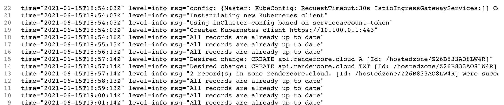

# external-dns

ingress에 만들어둔 hostname을 자동으로 route53에 추가해준다.

namespace는 default로 가정하고 진행했습니다. 다른곳을 사용하려면 설정해주시면됩니다.

## create policy



```javascript
{
  "Version": "2012-10-17",
  "Statement": [
    {
      "Effect": "Allow",
      "Action": ["route53:ChangeResourceRecordSets"],
      "Resource": ["arn:aws:route53:::hostedzone/*"]
    },
    {
      "Effect": "Allow",
      "Action": ["route53:ListHostedZones", "route53:ListResourceRecordSets"],
      "Resource": ["*"]
    }
  ]
}
```



## Create IAM Role, k8s Service Account & Associate IAM Policy

k8s Service Account named external-dns

```sh
# 확인
eksctl get iamserviceaccount --cluster cluster01

# Template
eksctl create iamserviceaccount \
    --name service_account_name \
    --namespace service_account_namespace \
    --cluster cluster_name \
    --attach-policy-arn IAM_policy_ARN \
    --approve

# Replaced name, namespace, cluster, arn
eksctl create iamserviceaccount \
--name external-dns \
--namespace default \
--cluster cluster01 \
--attach-policy-arn arn:aws:iam::530310009353:policy/AllowExternalDNSUpdates \
--approve

# 확인
eksctl get iamserviceaccount --cluster cluster01

kubectl get sa
# anotation에 내용이 잘 들어갓는지가 중요함.
```

## install external-dns

```sh
wget https://raw.githubusercontent.com/kubernetes-sigs/aws-load-balancer-controller/v2.0.0/docs/examples/external-dns.yaml
```

ServiceAccount 부분은 지우고 \(벌써 만들엇기때문\)

```sh
- --domain-filter=external-dns-test.my-org.com #주석

- --txt-owner-id=my-identifier #주석
```

가지고 있는 모든 도메인을 사용하려면 주석처리하고 특정한걸로 바꾸려면 위처럼 도메인을 넣어준다.

my-identifier는 route53에서 hostid를 가져다 넣으면 된다.

다 정리하면

```yaml
---
apiVersion: rbac.authorization.k8s.io/v1beta1
kind: ClusterRole
metadata:
  name: external-dns
rules:
  - apiGroups: ['']
    resources: ['services']
    verbs: ['get', 'watch', 'list']
  - apiGroups: ['']
    resources: ['pods']
    verbs: ['get', 'watch', 'list']
  - apiGroups: ['extensions']
    resources: ['ingresses']
    verbs: ['get', 'watch', 'list']
  - apiGroups: ['']
    resources: ['nodes']
    verbs: ['list']

---
apiVersion: rbac.authorization.k8s.io/v1beta1
kind: ClusterRoleBinding
metadata:
  name: external-dns-viewer
roleRef:
  apiGroup: rbac.authorization.k8s.io
  kind: ClusterRole
  name: external-dns
subjects:
  - kind: ServiceAccount
    name: external-dns
    namespace: default

---
apiVersion: apps/v1
kind: Deployment
metadata:
  name: external-dns
spec:
  selector:
    matchLabels:
      app: external-dns
  strategy:
    type: Recreate
  template:
    metadata:
      labels:
        app: external-dns
    spec:
      serviceAccountName: external-dns
      containers:
        - name: external-dns
          image: bitnami/external-dns:0.7.1
          args:
            - --source=service
            - --source=ingress
            - --provider=aws
            - --policy=upsert-only
            - --aws-zone-type=public
            - --registry=txt
```

절대 버전을 0.7.1에서 바꾸지 말자. 바꾸려면 업데이트된 내용을 확인해서 policy가 바뀌어야함.

적용

`kubectl apply -f external-dns.yaml`

pod의 로그를 보자.



uptodate가 된다. 이러면 성공

이제 ingress에서 host name을 변경하면 route53에 생성되는것을 볼수 있다.

policy는 따로 보기바람. 기본값은 sync,

upsert는 새로운건 넣고 기존건 업데이트 delete는 안됨.

## issue

aws / idc에서 동시에 아이피를 업데이트하면 에러가 된다.

인그레스 별로 사용을 막으려고 해봣는데 잘 안된다.

external-dns.alpha.kubernetes.io/exclude: 'true'

이걸로 검색하면 나오는데 동작이 안된다.

아이피를 두개를 넣는것도 잘 안된다. 클라우드 플레어는 2개의 raw를 넣어 라운드로빈을 함.

특정 아이피를 넣을려고 하면 인그레스에 다음을 사용한다.

```text
external-dns.alpha.kubernetes.io/target: "204.16.116.99"
```
