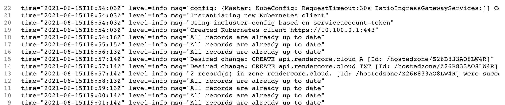

# external-dns

ingress에 만들어둔 hostname을 자동으로 route53에 추가해준다.

namespace는 default로 가정하고 진행했습니다. 다른곳을 사용하려면 설정해주시면됩니다.

## create policy



```json
{
  "Version": "2012-10-17",
  "Statement": [
    {
      "Effect": "Allow",
      "Action": ["route53:ChangeResourceRecordSets"],
      "Resource": ["arn:aws:route53:::hostedzone/*"]
    },
    {
      "Effect": "Allow",
      "Action": ["route53:ListHostedZones", "route53:ListResourceRecordSets"],
      "Resource": ["*"]
    }
  ]
}
```



## Create IAM Role, k8s Service Account & Associate IAM Policy

k8s Service Account named external-dns

```bash
# 확인
eksctl get iamserviceaccount --cluster cluster01

# Template
eksctl create iamserviceaccount \
    --name service_account_name \
    --namespace service_account_namespace \
    --cluster cluster_name \
    --attach-policy-arn IAM_policy_ARN \
    --approve

# Replaced name, namespace, cluster, arn
eksctl create iamserviceaccount \
--name external-dns \
--namespace default \
--cluster cluster01 \
--attach-policy-arn arn:aws:iam::530310289353:policy/AllowExternalDNSUpdates \
--approve

# 확인
eksctl get iamserviceaccount --cluster cluster01

kubectl get sa
# anotation에 내용이 잘 들어갓는지가 중요함.
```

## install external-dns

```bash
wget https://raw.githubusercontent.com/kubernetes-sigs/aws-load-balancer-controller/v2.0.0/docs/examples/external-dns.yaml
```

ServiceAccount 부분은 지우고 (벌써 만들엇기때문)

```bash
- --domain-filter=external-dns-test.my-org.com #주석
석
- --txt-owner-id=my-identifier #주석
```

가지고 있는 모든 도메인을 사용하려면 주석처리하고 특정한걸로 바꾸려면 위처럼 도메인을 넣어준다.

my-identifier는 route53에서 hostid를 가져다 넣으면 된다.

적용

`kubectl apply -f external-dns.yaml`

pod의 로그를 보자.



uptodate가 된다. 이러면 성공

이제 ingress에서 host name을 변경하면 route53에 생성되는것을 볼수 있다.

policy는 따로 보기바람. 기본값은 sync, upsert는 새로운건 넣고 기존건 업데이트 delete는 안됨.
