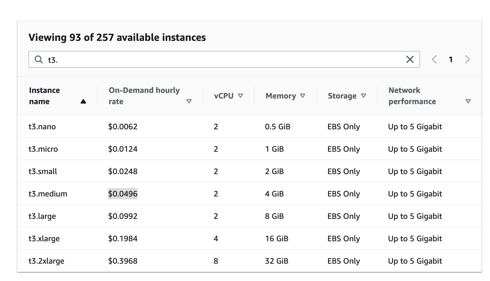
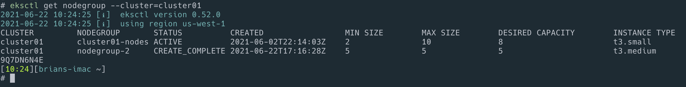

# cluster manage

## delete eks

```bash
eksctl delete cluster --name cluster01 --wait
```


## cluster 리스트보기

```bash
eksctl get cluster
```

## 기타 사용법

```bash
eksctl get nodegroup --cluster=cluster01

# 노드 확장

eksctl scale nodegroup --cluster=cluster01  --nodes=2 --name=cluster01-nodes

eksctl scale nodegroup --cluster=cluster01  --nodes=3 --nodes-max=3 --name=cluster01-nodes

eksctl scale nodegroup --cluster=<clusterName> --nodes=<desiredCount> --name=<nodegroupName> [ --nodes-min=<minSize> ] [ --nodes-max=<maxSize> ]
```

## manage cluster

```bash
eksctl scale nodegroup --cluster=<clusterName> --nodes=<desiredCount> --name=<nodegroupName> [ --nodes-min=<minSize> ] [ --nodes-max=<maxSize> ]
```

kubectl 사용

```bash
kubectl get pod --all-namespaces
kubectl get pod --all-namespaces -o wide
```

전체 pod 갯수 :

```bash
kubectl get pod --all-namespaces  | wc -l
```

노드당 갯수 \(노드 이름을 확인후 노드별로 체크\)

```bash
kubectl get node
kubectl get pod --all-namespaces -o wide | grep ip-192-168-10-183 | wc -l
kubectl get pod --all-namespaces -o wide | grep ip-192-168-28-3 | wc -l
kubectl get pod --all-namespaces -o wide | grep ip-192-168-4-220 | wc -l
kubectl get pod --all-namespaces -o wide | grep ip-192-168-65-172 | wc -l
kubectl get pod --all-namespaces -o wide | grep ip-192-168-69-253 | wc -l
kubectl get pod --all-namespaces -o wide | grep ip-192-168-78-242 | wc -l
kubectl get pod --all-namespaces -o wide | grep ip-192-168-9-123 | wc -l
```

## max pod 갯수

공식은 다음과 같다.

```text
ENI * (# of IPv4 per ENI - 1)  + 2
```

[https://docs.aws.amazon.com/ko_kr/AWSEC2/latest/UserGuide/using-eni.html](https://docs.aws.amazon.com/ko_kr/AWSEC2/latest/UserGuide/using-eni.html)

여기에서 eni\(최대 네트워크 인터페이스 수\) 하고 인터페이스당 프라이밋 주소 알수 있다.

t3.small 를 사용하면

```text
3 * (4-1) + 2 = 11
```

노드당 11개의 pod를 사용할수 있다.

누군가가 정리를 해서 적어둔게 있다.

[https://github.com/awslabs/amazon-eks-ami/blob/master/files/eni-max-pods.txt](https://github.com/awslabs/amazon-eks-ami/blob/master/files/eni-max-pods.txt)

아래 표에서 가격을 구할수 있다.

[https://aws.amazon.com/ec2/pricing/on-demand](https://aws.amazon.com/ec2/pricing/on-demand)



pod 갯수를 잘 확인해서 어느 타입이 편한건지 고려야할듯하다.

## node not ready status

node가 갑자기 not ready 상태이다.

k9s로 노드 선택후 cordon ==> drain ==> delete를 순서대로 해주었다. 그러니 새로운 노드를 만들어 준다.

## 노드그룹 변경

### 노드 그룹 추가



```yml
apiVersion: eksctl.io/v1alpha5
kind: ClusterConfig

metadata:
  name: cluster01
  region: us-west-1

managedNodeGroups:
  - name: nodegroup-2
    instanceType: t3.medium
    desiredCapacity: 4
    volumeSize: 80
    minSize: 3
    maxSize: 10
    ssh:
      allow: true
```



```bash
eksctl create nodegroup --config-file nodegroup.yaml
```

eksctl get nodegroup --cluster=cluster01



### 기존 노드그룹 삭제

```
eksctl delete nodegroup cluster01-nodes --cluster=cluster01
```
