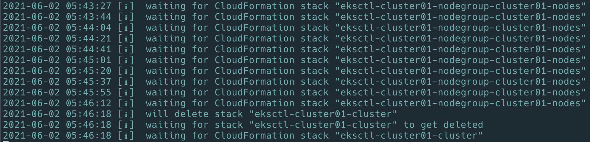
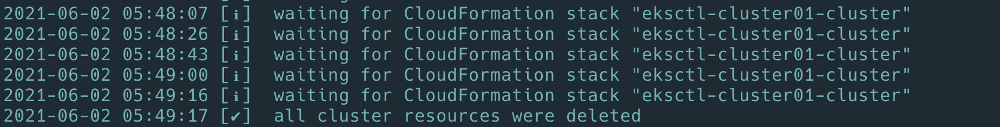

# cluster manage

## delete eks

```bash
eksctl delete cluster --name cluster01 --wait
```





## cluster 리스트보기

```bash
eksctl get cluster
```

## 기타 사용법

```bash
eksctl get nodegroup --cluster=cluster01

# 노드 확장

eksctl scale nodegroup --cluster=cluster01  --nodes=2 --name=cluster01-nodes

eksctl scale nodegroup --cluster=cluster01  --nodes=3 --nodes-max=3 --name=cluster01-nodes

eksctl scale nodegroup --cluster=<clusterName> --nodes=<desiredCount> --name=<nodegroupName> [ --nodes-min=<minSize> ] [ --nodes-max=<maxSize> ]
```

## manage cluster

```bash
eksctl scale nodegroup --cluster=<clusterName> --nodes=<desiredCount> --name=<nodegroupName> [ --nodes-min=<minSize> ] [ --nodes-max=<maxSize> ]
```
