# S3

## bucket 만들기

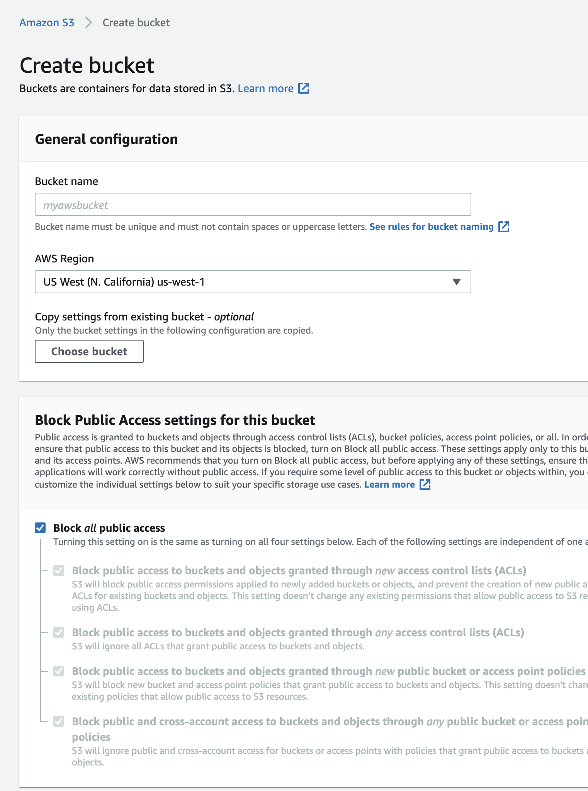

region을 잘 정하자.

이름이 글로벌하기 때문에 중복된 이름을 다른 고객이 사용하고 잇으면 안된다.

정적 웹사이트를 올릴 예정이므로 Block all public access 을 끄고 사용한다.

versioning도 할수 있고 로그도 모아서 볼수 있고 암호화도 할수 있다.

## 버킷 public 만들기

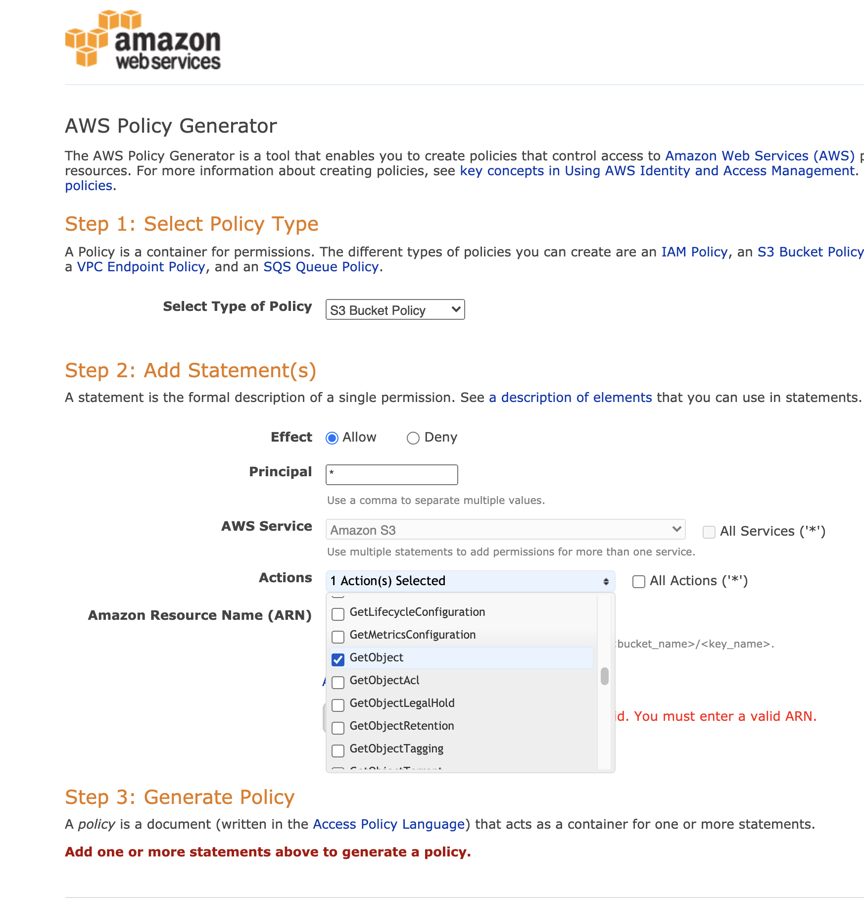

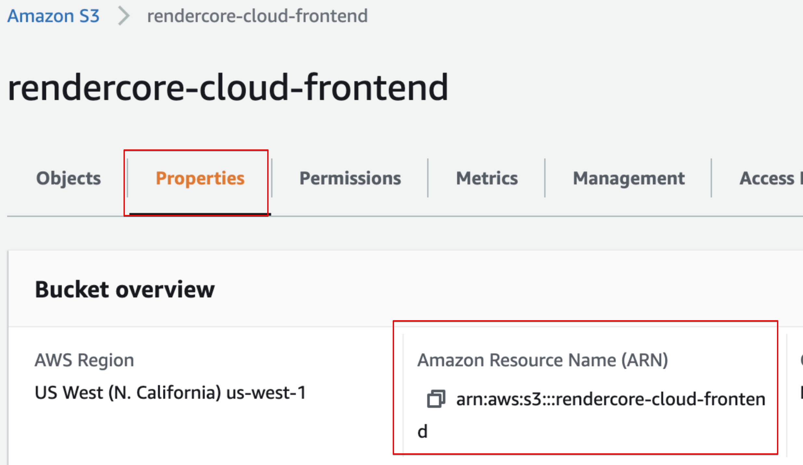

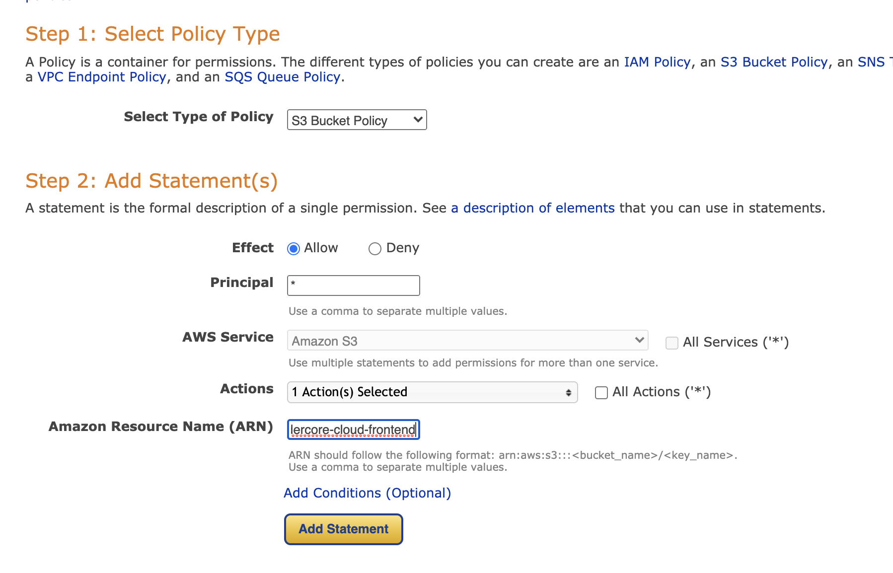

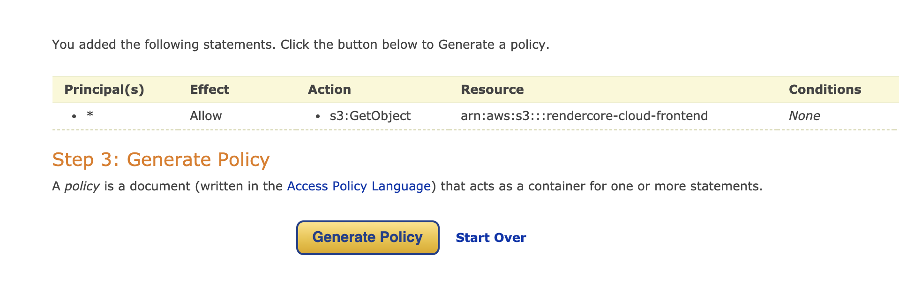

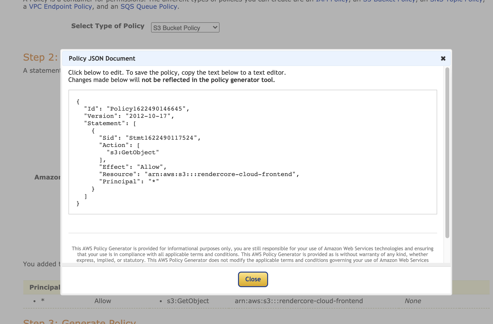

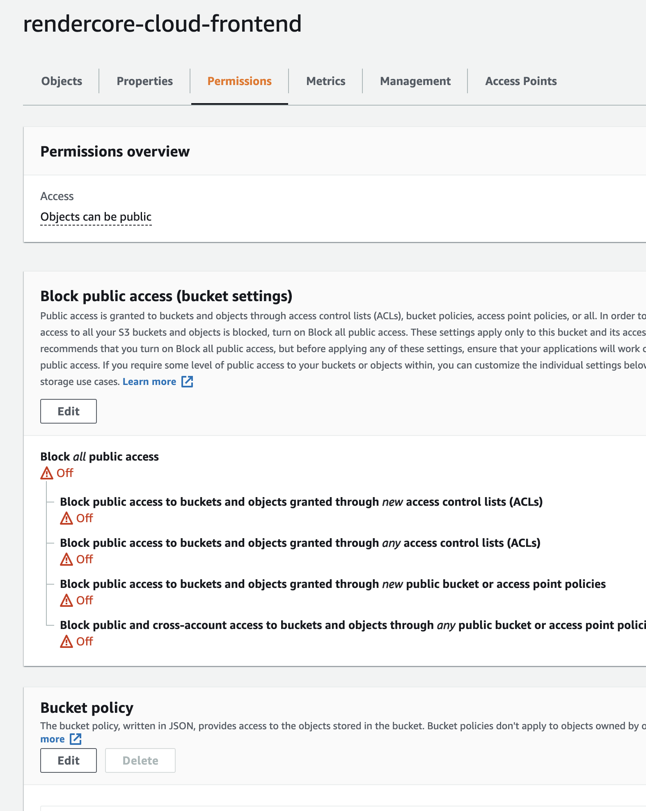

```json
{
  "Id": "Policy1622490146645",
  "Version": "2012-10-17",
  "Statement": [
    {
      "Sid": "Stmt1622490117524",
      "Action": ["s3:GetObject"],
      "Effect": "Allow",
      "Resource": "arn:aws:s3:::rendercore-cloud-frontend/*",
      "Principal": "*"
    }
  ]
}
```

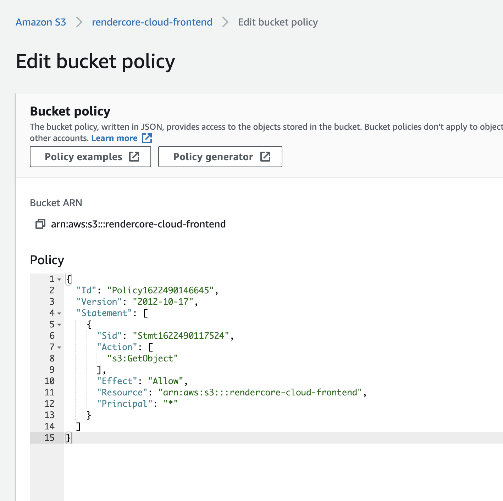

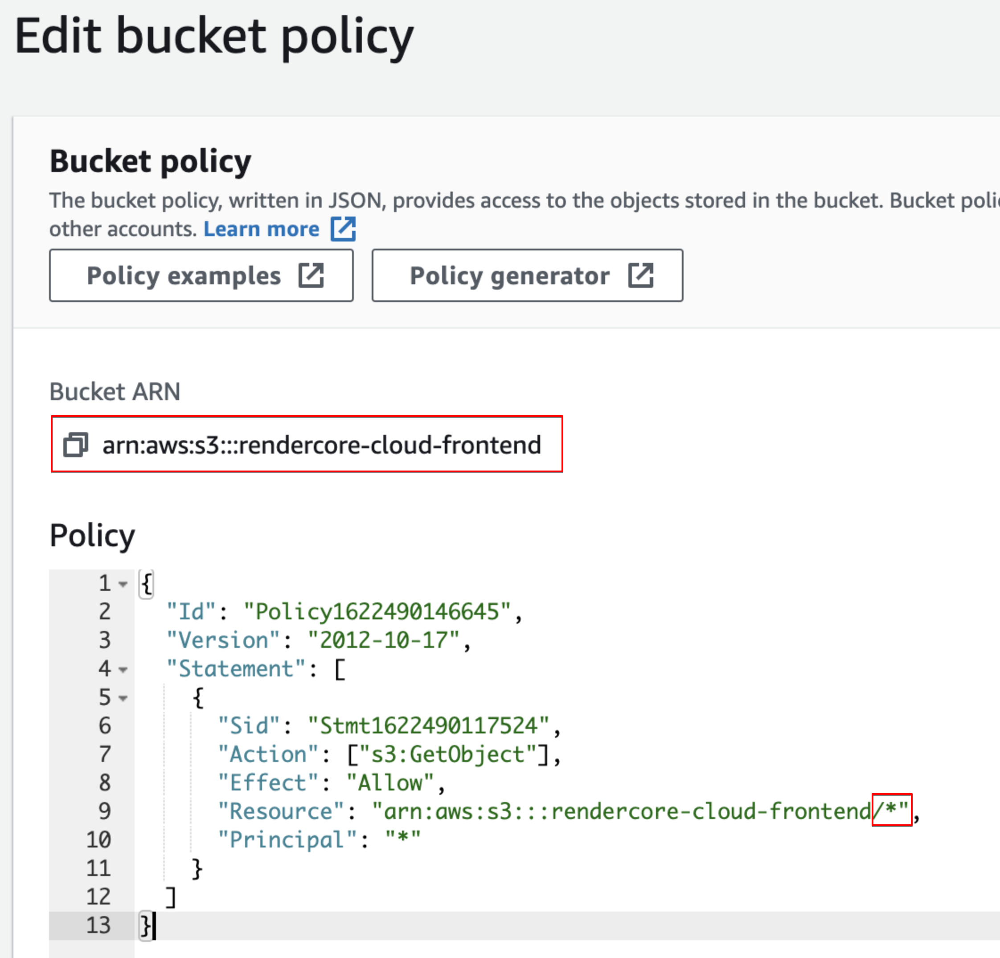

`/*` 중요

이제 s3가 퍼블릭으로 된것을 확인할수 있다.

이제 이미지를 확인해보면 이미지가 잘 나오는걸 확인할수 있다.

## 정적 웹사이트

버킷을 퍼블릭으로 만들어야하고 다음 옵션을 활성화해야한다.

버킷 >> 프로퍼티 >> Static website hosting >> true

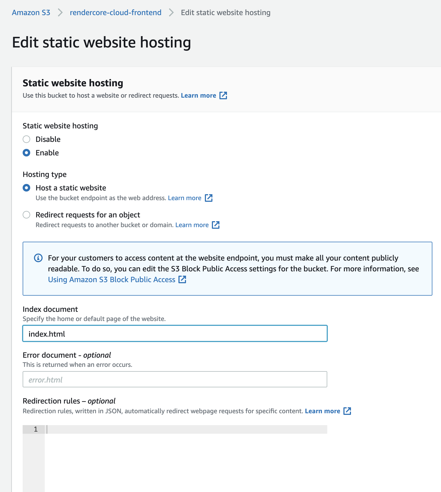



```txt
it works
```

index.html을 업로드하고

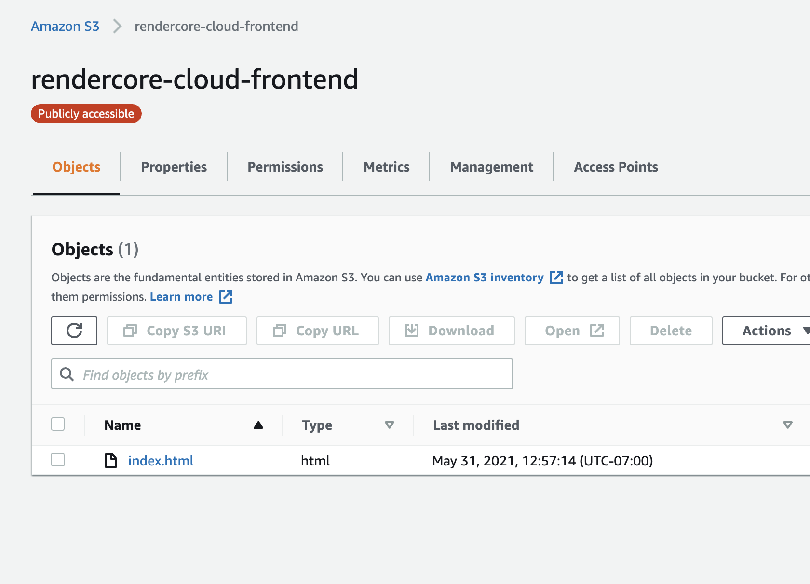

다음을 확인해보자.

- 프로퍼티

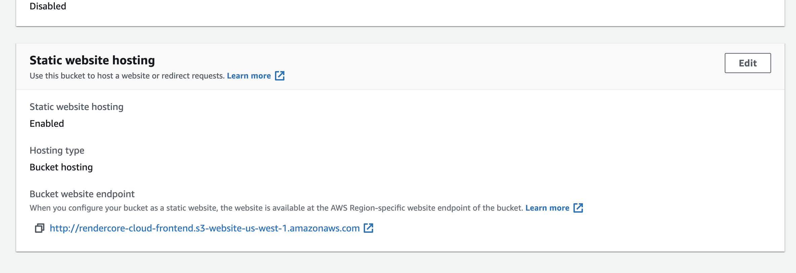

Bucket website endpoint 로 사이트를 확인할수 있다.

이제 앵귤러로 컴파일된 걸 이곳에 업로드하면 사이트가 보인다.

이제 route53 에서 도메인을 설정해주면 된다.

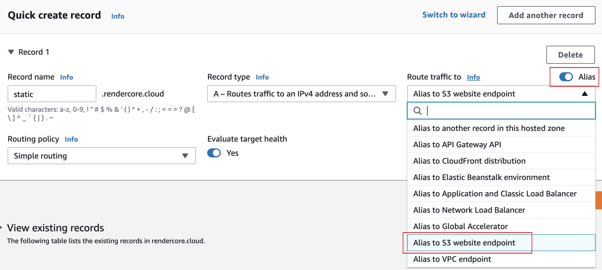

## cors 설정

bucket >> permission >> cors 설정

```json
[
  {
    "AllowedHeaders": ["Authorization"],
    "AllowedMethods": ["GET"],
    "AllowedOrigins": ["https://www.example.com", "https://staging.example.com"],
    "ExposeHeaders": [],
    "MaxAgeSeconds": 3000
  }
]
```
