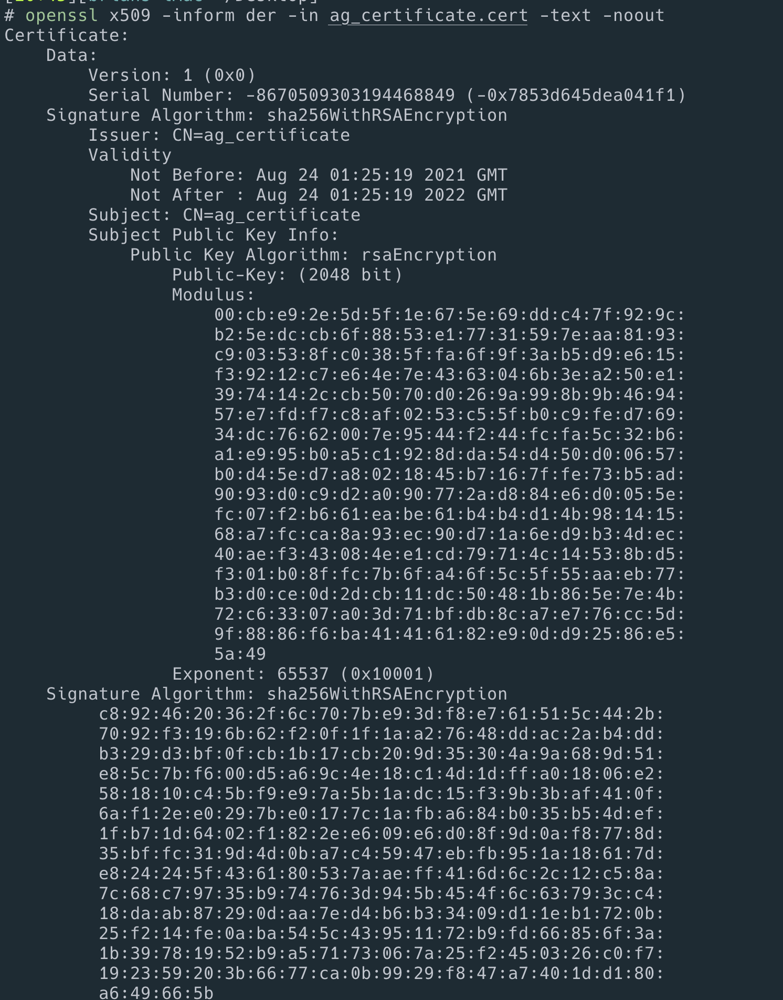

# Mssql

## storage 설정

```text
---
kind: PersistentVolumeClaim
apiVersion: v1
metadata:
  name: mssql-primary
spec:
  accessModes:
    - ReadWriteOnce
  resources:
    requests:
      storage: 8Gi
---
kind: PersistentVolumeClaim
apiVersion: v1
metadata:
  name: mssql-secondary1
spec:
  accessModes:
    - ReadWriteOnce
  resources:
    requests:
      storage: 8Gi
---
kind: PersistentVolumeClaim
apiVersion: v1
metadata:
  name: mssql-secondary2
spec:
  accessModes:
    - ReadWriteOnce
  resources:
    requests:
      storage: 8Gi
```

## secret 설정

```text
apiVersion: v1
kind: Secret
metadata:
  name: mssql-secret
type: Opaque
data:
  SA_PASSWORD: S2ltY2XXXSkpNw==
```

## primary deploy

```yaml
apiVersion: apps/v1
kind: Deployment
metadata:
  name: primary-deployment
spec:
  replicas: 1
  selector:
    matchLabels:
      app: mssql-primary
  strategy:
    type: Recreate
  template:
    metadata:
      labels:
        app: mssql-primary
    spec:
      terminationGracePeriodSeconds: 10
      securityContext:
        fsGroup: 1000
      hostname: mssql-primary
      containers:
        - name: mssql-primary
          image: mcr.microsoft.com/mssql/rhel/server:2019-latest
          env:
            - name: ACCEPT_EULA
              value: 'Y'
            - name: MSSQL_PID
              value: 'Developer'
            - name: MSSQL_ENABLE_HADR
              value: '1'
            - name: MSSQL_AGENT_ENABLED
              value: 'true'
            - name: MSSQL_SA_PASSWORD
              valueFrom:
                secretKeyRef:
                  name: mssql-secret
                  key: SA_PASSWORD
          resources:
            limits:
              memory: 4G
          volumeMounts:
            - name: mssqldb
              mountPath: /var/opt/mssql
      volumes:
        - name: mssqldb
          persistentVolumeClaim:
            claimName: mssql-primary
---
# Create the load balancing service
apiVersion: v1
kind: Service
metadata:
  name: mssql-primary
spec:
  selector:
    app: mssql-primary
  ports:
    - name: sqlserver
      port: 1433
      targetPort: 1433
    - name: endpoint
      port: 5022
      targetPort: 5022
  type: LoadBalancer
```

## secondary1 deploy

```text
apiVersion: apps/v1
kind: Deployment
metadata:
  name: secondary1-deployment
spec:
  replicas: 1
  selector:
    matchLabels:
      app: mssql-secondary1
  strategy:
    type: Recreate
  template:
    metadata:
      labels:
        app: mssql-secondary1
    spec:
      terminationGracePeriodSeconds: 10
      securityContext:
        fsGroup: 1000
      hostname: mssql-secondary1
      containers:
        - name: mssql-secondary1
          image: mcr.microsoft.com/mssql/rhel/server:2019-latest
          env:
            - name: ACCEPT_EULA
              value: 'Y'
            - name: MSSQL_PID
              value: 'Developer'
            - name: MSSQL_ENABLE_HADR
              value: '1'
            - name: MSSQL_AGENT_ENABLED
              value: 'true'
            - name: MSSQL_SA_PASSWORD
              valueFrom:
                secretKeyRef:
                  name: mssql-secret
                  key: SA_PASSWORD
          resources:
            limits:
              memory: 4G
          volumeMounts:
            - name: mssqldb
              mountPath: /var/opt/mssql
      volumes:
        - name: mssqldb
          persistentVolumeClaim:
            claimName: mssql-secondary1
---
apiVersion: v1
kind: Service
metadata:
  name: mssql-secondary1
spec:
  selector:
    app: mssql-secondary1
  ports:
    - name: sqlserver
      port: 1433
      targetPort: 1433
    - name: endpoint
      port: 5022
      targetPort: 5022
  type: LoadBalancer
```

## secondary2 deploy

```text
apiVersion: apps/v1
kind: Deployment
metadata:
  name: secondary2-deployment
spec:
  replicas: 1
  selector:
    matchLabels:
      app: mssql-secondary2
  strategy:
    type: Recreate
  template:
    metadata:
      labels:
        app: mssql-secondary2
    spec:
      terminationGracePeriodSeconds: 10
      securityContext:
        fsGroup: 1000
      hostname: mssql-secondary2
      containers:
        - name: mssql-secondary2
          image: mcr.microsoft.com/mssql/rhel/server:2019-latest
          env:
            - name: ACCEPT_EULA
              value: 'Y'
            - name: MSSQL_PID
              value: 'Developer'
            - name: MSSQL_ENABLE_HADR
              value: '1'
            - name: MSSQL_AGENT_ENABLED
              value: 'true'
            - name: MSSQL_SA_PASSWORD
              valueFrom:
                secretKeyRef:
                  name: mssql-secret
                  key: SA_PASSWORD
          resources:
            limits:
              memory: 4G
          volumeMounts:
            - name: mssqldb
              mountPath: /var/opt/mssql
      volumes:
        - name: mssqldb
          persistentVolumeClaim:
            claimName: mssql-secondary2
---
apiVersion: v1
kind: Service
metadata:
  name: mssql-secondary2
spec:
  selector:
    app: mssql-secondary2
  ports:
    - name: sqlserver
      port: 1433
      targetPort: 1433
    - name: endpoint
      port: 5022
      targetPort: 5022
  type: LoadBalancer
```

## 접속테스트

```sh
kubectl get svc
```

아이피 확인후 접속해본다. 


잘 된다.

## Primary Availablitity Group 설정

```sql
-- Create AG test database
USE [master]
GO
CREATE DATABASE DevTestAG
GO
USE [DevTestAG]
GO
CREATE TABLE Customers([CustomerID] int NOT NULL, [CustomerName] varchar(30) NOT NULL)
GO
INSERT INTO Customers (CustomerID, CustomerName) VALUES (30,'CANNON TOOLS'),(90,'INTERNATIONAL BANK'),(130,'SUN DIAL CITRUS')
-- Change DB recovery model to Full and take full backup
ALTER DATABASE [DevTestAG] SET RECOVERY FULL ;
GO
BACKUP DATABASE [DevTestAG] TO  DISK = N'/var/opt/mssql/backup/DevTestAG.bak' WITH NOFORMAT, NOINIT,  NAME = N'DevTestAG-Full Database Backup', SKIP, NOREWIND, NOUNLOAD,  STATS = 10
GO
USE [master]
GO
--create logins for AG
CREATE LOGIN ag_login WITH PASSWORD = 'AGPa55w0rd';
CREATE USER ag_user FOR LOGIN ag_login;
-- Create a master key and certificate
CREATE MASTER KEY ENCRYPTION BY PASSWORD = 'AGPa55w0rd';
GO
CREATE CERTIFICATE ag_certificate WITH SUBJECT = 'ag_certificate';
-- Copy these two files to the same directory on secondary replicas
BACKUP CERTIFICATE ag_certificate
TO FILE = '/var/opt/mssql/ag_certificate.cert'
WITH PRIVATE KEY (
        FILE = '/var/opt/mssql/ag_certificate.key',
        ENCRYPTION BY PASSWORD = 'AGPa55w0rd'
    );
GO
-- Create AG endpoint on port 5022
CREATE ENDPOINT [AG_endpoint]
STATE=STARTED
AS TCP (
    LISTENER_PORT = 5022,
    LISTENER_IP = ALL
)
FOR DATA_MIRRORING (
    ROLE = ALL,
    AUTHENTICATION = CERTIFICATE ag_certificate,
    ENCRYPTION = REQUIRED ALGORITHM AES
)
--Create AG primary replica
CREATE AVAILABILITY GROUP [K8sAG]
WITH (
    CLUSTER_TYPE = NONE
)
FOR REPLICA ON
N'mssql-primary' WITH
(
    ENDPOINT_URL = N'tcp://mssql-primary:5022',
    AVAILABILITY_MODE = SYNCHRONOUS_COMMIT,
    SEEDING_MODE = AUTOMATIC,
    FAILOVER_MODE = MANUAL,
    SECONDARY_ROLE (ALLOW_CONNECTIONS = ALL)
),
N'mssql-secondary1' WITH
(
    ENDPOINT_URL = N'tcp://mssql-secondary1:5022',
    AVAILABILITY_MODE = SYNCHRONOUS_COMMIT,
    SEEDING_MODE = AUTOMATIC,
    FAILOVER_MODE = MANUAL,
    SECONDARY_ROLE (ALLOW_CONNECTIONS = ALL)
),
N'mssql-secondary2' WITH
(
    ENDPOINT_URL = N'tcp://mssql-secondary2:5022',
    AVAILABILITY_MODE = ASYNCHRONOUS_COMMIT,
    SEEDING_MODE = AUTOMATIC,
    FAILOVER_MODE = MANUAL,
    SECONDARY_ROLE (ALLOW_CONNECTIONS = ALL)
);

-- Add database to AG
USE [master]
GO
ALTER AVAILABILITY GROUP [K8sAG] ADD DATABASE [DevTestAG]
GO
```


AG_endpoint 생성 확인

## copy certificate from primary to secondary

```sh
# Copy the certificates from the AG primary

# Retreive the pod anmes to variables
# Retrieve pod name to variable
primary=$(kubectl get pods | grep primary | awk '{print $1}')
secondary1=$(kubectl get pods | grep secondary1 | awk '{print $1}')
secondary2=$(kubectl get pods | grep secondary2 | awk '{print $1}')

echo $primary
> primary-deployment-c5b5454f6-hsfsm

echo $secondary1
> secondary1-deployment-c7559dd7d-jkt5n

echo $secondary2
> secondary2-deployment-6579d765b8-cx89s

# primary to local
ag_certificate.cert
kubectl cp $primary:/var/opt/mssql/ag_certificate.key ag_certificate.key

# local to secondary1
kubectl cp ag_certificate.cert  $secondary1:/var/opt/mssql
kubectl cp ag_certificate.key  $secondary1:/var/opt/mssql

# local to secondary2
kubectl cp ag_certificate.cert $secondary2:/var/opt/mssql
kubectl cp ag_certificate.key $secondary2:/var/opt/mssql
```

생긴 cert를 확인해보니 같은 결과가 나온다.

```sh
openssl x509 -inform der -in ag_certificate.cert -text -noout
```



1년짜리 인증서임

인증서를 나중에는 연장해야겟다.

## secondary1 설정

```sql
USE [master]
GO
--Create login for AG
-- It should match the password from the primary script
CREATE LOGIN ag_login WITH PASSWORD = 'AGPa55w0rd';
CREATE USER ag_user FOR LOGIN ag_login;

-- Create the certificate using the certificate file created in the primary node
CREATE MASTER KEY ENCRYPTION BY PASSWORD = 'AGPa55w0rd';
GO
-- Create from copied cert - the password must match the primary
CREATE CERTIFICATE ag_certificate
    AUTHORIZATION ag_user
    FROM FILE = '/var/opt/mssql/ag_certificate.cert'
    WITH PRIVATE KEY (
    FILE = '/var/opt/mssql/ag_certificate.key',
    DECRYPTION BY PASSWORD = 'AGPa55w0rd'
)
GO
--create HADR endpoint
CREATE ENDPOINT [AG_endpoint]
STATE=STARTED
AS TCP (
    LISTENER_PORT = 5022,
    LISTENER_IP = ALL
)
FOR DATA_MIRRORING (
    ROLE = ALL,
    AUTHENTICATION = CERTIFICATE ag_certificate,
    ENCRYPTION = REQUIRED ALGORITHM AES
)
GRANT CONNECT ON ENDPOINT::AG_endpoint TO [ag_login];
GO
--add current node to the availability group
ALTER AVAILABILITY GROUP [K8sAG] JOIN WITH (CLUSTER_TYPE = NONE)
ALTER AVAILABILITY GROUP [K8sAG] GRANT CREATE ANY DATABASE
GO
```

## secondary2 설정

```sql
USE [master]
GO
--Create login for AG
-- it should match the password from the primary script
CREATE LOGIN ag_login WITH PASSWORD = 'AGPa55w0rd';
CREATE USER ag_user FOR LOGIN ag_login;
-- create certificate
-- this time, create the certificate using the certificate file created in the primary node
CREATE MASTER KEY ENCRYPTION BY PASSWORD = 'AGPa55w0rd';
GO
-- Create the certificate using the certificate file created in the primary node
CREATE CERTIFICATE ag_certificate
    AUTHORIZATION ag_user
    FROM FILE = '/var/opt/mssql/ag_certificate.cert'
    WITH PRIVATE KEY (
    FILE = '/var/opt/mssql/ag_certificate.key',
    DECRYPTION BY PASSWORD = 'AGPa55w0rd'
)
GO
--create HADR endpoint
CREATE ENDPOINT [AG_endpoint]
STATE=STARTED
AS TCP (
    LISTENER_PORT = 5022,
    LISTENER_IP = ALL
)
FOR DATA_MIRRORING (
    ROLE = ALL,
    AUTHENTICATION = CERTIFICATE ag_certificate,
    ENCRYPTION = REQUIRED ALGORITHM AES
)
GRANT CONNECT ON ENDPOINT::AG_endpoint TO [ag_login];
GO
--add current node to the availability group
ALTER AVAILABILITY GROUP [K8sAG] JOIN WITH (CLUSTER_TYPE = NONE)
ALTER AVAILABILITY GROUP [K8sAG] GRANT CREATE ANY DATABASE
GO
```

준비 완료

## 확인 ssms


## data input on primary

secondary1 에서 데이터가 잇는것을 확인을 하고난후 primary에서 데이터를 지워보자.

```sql
Delete FROM [DevTestAG].[dbo].[Customers]
```

## data확인 on secondary1

```sql
select * from [DevTestAG].[dbo].[Customers];
```

지워진것을 확인할수 있다.

## 결론

longhorn이 3개의 리플리카를 가지고 있으므로 파드가 죽어도 다른곳에서 바로 올라와서 디비를 안전하게 관리할수 있다.

## 참고

- 1개의 primary에 8개의 secondary까지 만들수 있다 \(엔터프라이즈에서만인가?\)
- 8개중 sync는 맥스 3개까지 만들수 있다.

## todo

- 디비를 하나만 햇는데 모든 디비가 생기자 마자 하려면 어덯게 해야할가?
