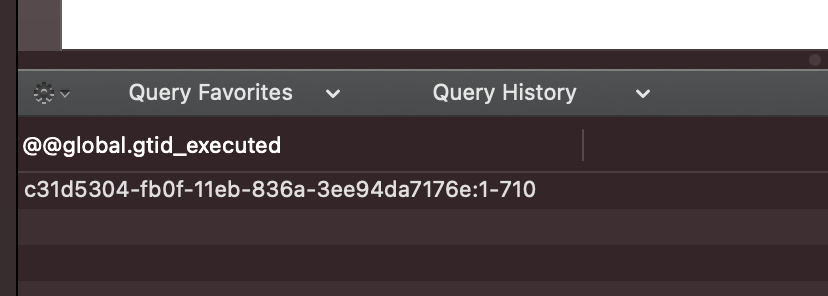
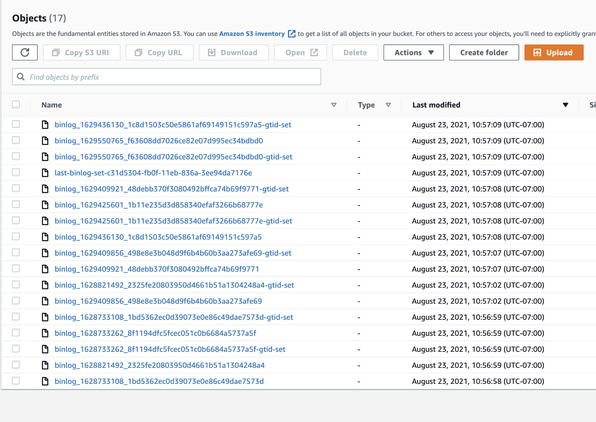
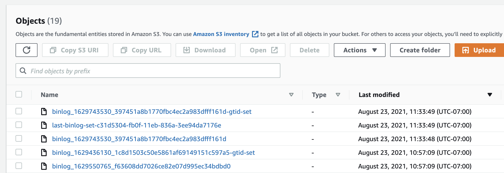

# GTID

## Global Transaction Identifier

각각의 트렌젝션들은 고유한 전역식별자를 갖게 된다.

GTID = source_id:transaction_Id

transaction_id는 해당 서버에서 커밋된 트랜잭션의 순서에 따라 순차적인 숫자로 결정된다.
예로 첫 번째 트랜잭션은 transaction_id=1이 되고, 동일한 서버에서 열 번째 트랜잭션은 transaction_id=10이 된다.
(GTID에서 트랜잭션이 순차적인 숫자는 1부터 시작된다. 0은 될 수 없다.)

## 백업하기



```yaml
backup:
  pitr:
    enabled: true
    storageName: s3-us-west-binlog
    timeBetweenUploads: 60
  storages:
    s3-us-west-fullbackup:
      type: s3
      s3:
        bucket: xgrid-pxc-cluster01-fullbackup
        credentialsSecret: backup-aws-s3
        region: us-west-1
    s3-us-west-binlog:
      type: s3
      s3:
        bucket: xgrid-pxc-cluster01-binlog
        credentialsSecret: backup-aws-s3
        region: us-west-1
```



full backup과 같이 pitr를 활성화 하고 적용하자.

s3에 확인을 해보면 파일들이 백업이 되고 잇는것을 알수 있다.


## 확인

```sql
select @@global.gtid_executed; -- 현재 GTID 확인
create database test;
select @@global.gtid_executed; -- GTID가 증가한것을 볼수 있다.
```



s3 현재


60초 뒤에



새로운 파일이 올라온것을 확인할수 있다.


## 복구하기



```yaml
kind: PerconaXtraDBClusterRestore
metadata:
  name: restore1
spec:
  pxcCluster: cluster01
  backupName: backup1
  pitr:
    type: latest
    date: '2021-08-23 16:00:00'
    # gtid: "aaaaaaaa-bbbb-cccc-dddd-eeeeeeeeeeee:nnn"
    # gtid: "aaaaaaaa-bbbb-cccc-dddd-eeeeeeeeeeee:nnn-nnn,nnn-nnn"
    backupSource:
      storageName: 's3-us-west-binlog'
```



```sh
kubectl apply -f deploy/backup/restore.yaml
```

date를 사용해서 특정 날짜로 복구가 가능하다.

gtid를 이용해서 '20' 거기까지 복구가 가능하다. 마지막 번호 바로 앞까지만 복구된다. 19까지 복구된다.

gtid set를 이용해서 '1-10,11-20' 으로 그룹화하여 복구가 가능하다. 9번까지 복구하고 10번은 건너뛰고 11-20번까지 복구된다.
