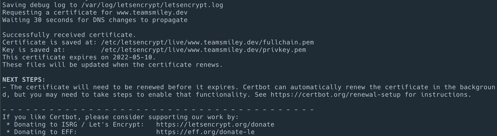

# Certbot

certbot을 사용하여 lets encrypt ssl을 발급해보자. 

## docker

docker를 설치

## create ini file

vi rfc2136.ini

```conf
# Target DNS server (IPv4 or IPv6 address, not a hostname)
dns_rfc2136_server = 172.21.1.20
# Target DNS port
dns_rfc2136_port = 53
# TSIG key name
dns_rfc2136_name = teamsmiley-dev-secret
# TSIG key secret
dns_rfc2136_secret = KzqRA3OnnSxx3Awp9m8Pt
# TSIG key algorithm
dns_rfc2136_algorithm = HMAC-SHA512
```

## create ssl 

```sh
docker run -it --rm \
	-v "/etc/letsencrypt:/etc/letsencrypt" \
	-v "/var/lib/letsencrypt:/var/lib/letsencrypt" \
	-v "/root/netops_infra/ansible/templates:/tmp" \
	certbot/dns-rfc2136  \
	certonly \
	--dns-rfc2136 \
	--dns-rfc2136-credentials /tmp/rfc2136.ini \
	--dns-rfc2136-propagation-seconds 30 \
	--agree-tos \
	--no-eff-email \
	--email teamsmiley@gmail.com \
	-n \
	-d www.teamsmiley.dev
```



## renew ssl

```sh
docker run -it --rm \
 	-v "/etc/letsencrypt:/etc/letsencrypt" \
 	-v "/var/lib/letsencrypt:/var/lib/letsencrypt" \
 	-v "/root/netops_infra/ansible/templates:/tmp" \
 	certbot/dns-rfc2136  \
    renew \
 	--dns-rfc2136 \
 	--dns-rfc2136-credentials /tmp/rfc2136.ini \
 	--dns-rfc2136-propagation-seconds 30 \
 	--agree-tos \
 	--no-eff-email \
 	--email teamsmiley@gmail.com \
 	-n 
```
