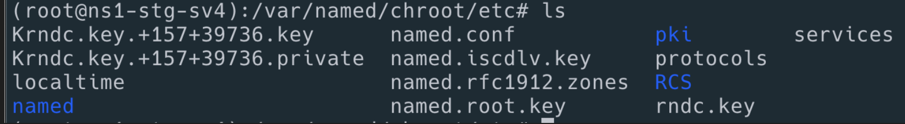

# Dynamic Update

Route 53 나 google domain등에서는 api를 이용하여 동적으로 도메인을 등록하거나 삭제할 수 있습니다. 그런데 리눅스에서 지원하는 bind에서는 이게 안되는줄 알고 있엇습니다. 확인해보니 지원이 됩니다. 

rfc2136 에서 정의를 해두고 있네요.




Bind9에서 Dynamic Update를 사용해보도록 합니다.



## prerequisites

기본적으로 bind9을 사용하고 있다고 가정합니다. 인터넷에 내용이 많으니 금방 검색 될겁니다.

## 키를 생성

dns서버에서 키를 생성합니다.

도메인은 teamsmiley.dev를 기준으로 합니다.

```sh
dnssec-keygen -r /dev/urandom -a HMAC-SHA512 -b 512 -n HOST teamsmiley-dev-secret
```



위 형태로 key와 private가 생성됩니다.

확인해보면 다음과 같습니다.

```sh
cat Kteamsmiley-dev-secret.+157+39736.private

Private-key-format: v1.3
Algorithm: 165 (HMAC_SHA512)
Key: KzqRA3OnnSxx3Awp9m8Pt
Bits: AAA=
Created: 20220209130648
Publish: 20220209130648
Activate: 20220209130648
```

## named.conf에 추가

```sh
vi named.conf

## 수정
zone "teamsmiley.dev"{
        type master;
        file "teamsmiley.dev";
		....
        allow-update { key "teamsmiley-dev-secret"; }; # 추가
};

## 다음 추가 
key "teamsmiley-dev-secret" {
    algorithm hmac-sha256;
    secret "KzqRA3OnnSxx3Awp9m8Pt";
};
```

## named 재시작

```sh
/etc/init.d/named restart
```

## 동작확인

nsupdate 툴을 이용하여 테스트하기로 한다.

```sh
nsupdate -y hmac-md5:teamsmiley-dev-secret:KzqRA3OnnSxx3Awp9m8Pt

update add teamsmiley.dev 60 txt testing

send
```

## 실패

혹시 실패한다면 named 폴더의 그룹에 write권한을 부여해주세요.

```sh
chmod 775 /var/named/chroot/var/named/

/etc/init.d/named restart
```

다시 테스트해본다.

## update-policy

allow-update 보다는 update-policy를 사용하는 것이 좋다. 자세한 컨트롤이 가능

```conf
zone "teamsmiley.dev"{
        type master;
        file "teamsmiley.dev";
        #allow-update { key "ooma-com-secret"; };
        update-policy {
          grant ooma-com-secret name _acme-challenge.teamsmiley.dev. txt;
        };
};
```
