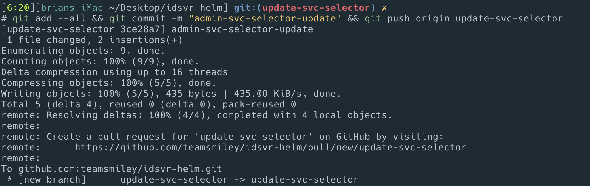
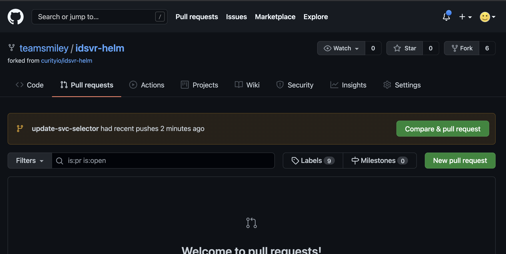
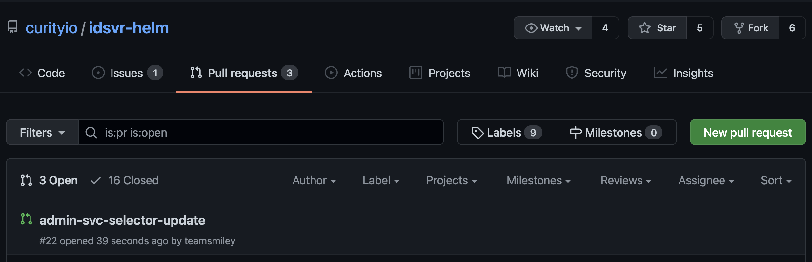
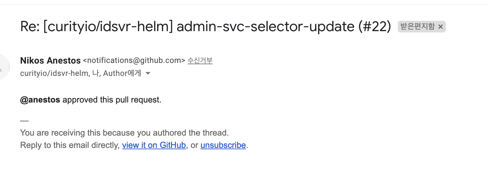
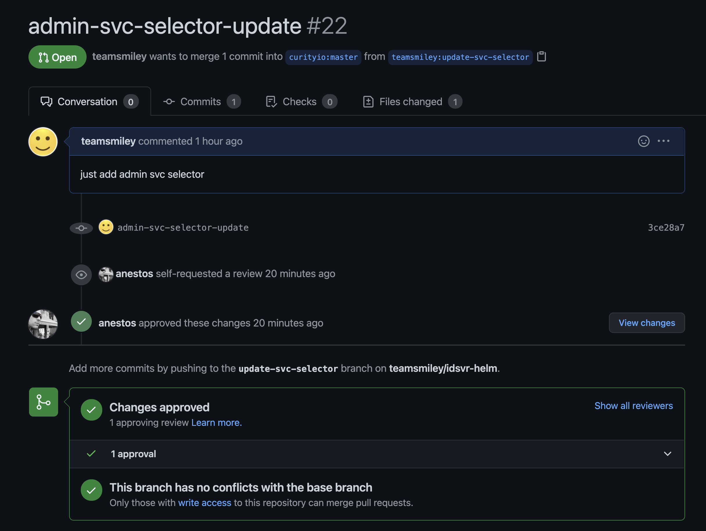

# pull request

Pull Request(PR) 보내는 방법

1. 부모 저장소를 포크하자.

2. 내 저장소에 포크된 프로젝트를 git clone하자.

   ```sh
   git clone git@github.com:teamsmiley/idsvr-helm.git
   ```

3. 원격 저장소 Remote 설정하기
   - PR을 보낼 곳을 추가.
   - 원격 저장소의 이름은 upstream 으로 지정
   - 원격 저장소의 git 주소는 fork를 하기 전 원래의 저장소를 말합니다.
   ```sh
   # git remote add upstream https://github.com/ORIGIN_OWNER/ORIGIN_REPO.git
   git remote add upstream https://github.com/curityio/idsvr-helm.git
   ```
4. PR용 branch 생성하기
   ```sh
   git checkout -b update-svc-selector
   ```
5. 코드 수정 / 커밋 / 푸시
   ```yml
   selector:
     app.kubernetes.io/name: {{ include "curity.name" . }}
     app.kubernetes.io/instance: {{ .Release.Name }}
     role: {{ include "curity.fullname" . }}-admin
   ```
   ```sh
   git add --all && git commit -m "admin-svc-selector-update" && git push origin update-svc-selector
   ```
   
6. github에서 PR 보내기
   github웹사이트에 가보면 compare & pull request버튼이 활성화 되있다. 여기서 PR을 보내면 원격 저장소에 새로운 버전이 생성된다. 위 그림에 있는 로그에 경로로 직접 접속해도 됨.
   
7. 부모 프로젝트에 PR이 있는지 확인하기
   
8. 머지될때가지 기다린다. 머지되면 내 브랜치는 지워도 된다. 로컬하고 리모트 모두다.





approve 완료
