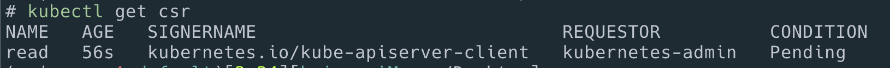

# k8s user / permission

<https://kubernetes.io/docs/reference/access-authn-authz/certificate-signing-requests/#normal-user>

## add user

```sh
cd ~/Desktop

openssl genrsa -out dev-eng.key 2048

openssl req -new -key dev-eng.key -out dev-eng.csr -subj "/CN=dev-eng"

cat dev-eng.csr | base64 | tr -d "\n"

cat <<EOF | kubectl apply -f -
apiVersion: certificates.k8s.io/v1
kind: CertificateSigningRequest
metadata:
  name: dev-eng
spec:
  request: LS0tLS1CRUdJTiBDRVJUSUZJQ0FURSBSRVFVRVNULS0tLS0KTUlJQ1Z6Q0NBVDhDQVFBd0VqRVFNQTRHQTFVRUF3d0haR1YyTFdWdVp6Q0NBU0l3RFFZSktvWklodmNOQVFFQgpCUUFEZ2dFUEFEQ0NBUW9DZ2dFQkFMWVBrV2hwT2d0NVl0N3hNYlJOeW1hUDNxaGpwcWZrVTh2VmFmckNPQS9WCnR5VW5NK2w2OGNkblVqaWhwb1BVOEpmSVZzSWhObzlzcXdsMlRKVWNUQ2NCa1FrODRPVExzdkYrWU1SSzZDbmwKWmd0L3IyVWxXUUIzRUl5Wm1oY09hTnpYWHA0NHpnYlVNdnZsbmRMek90UXA1VnI1S3hWdzEwWER0R0pBZm1hbwowQ2pjNjRlMGxDVStpaXVxR0tUZVNLRkNab0IyMUxpRERuc0h4c1NlWEZvUjhxcTZKK3RnSEg1ZEl2TFBBeFZWCmFQMG9FcCtCck5md09CRGxuWS9JblF5dXhxV2RtZTBDRWl4ZkdQTExzTXlYeEU4TWdhMXdzdDBtSzQ5cVhRZlgKZ3hvd0JRRkF1SWNkdEs3TnlNYlpzNGhZWXFURGg0SHBhUFpIWlpsMFdRa0NBd0VBQWFBQU1BMEdDU3FHU0liMwpEUUVCQ3dVQUE0SUJBUUJaSm9DUUY1T3d6UzhRTGtPUW9EbWgrNmZJZ0pKdEVkMnRxaTNUUGdlNzI2SzcxQjh4CjVtakVxcnJaR0ovejNVb1hOS2QwT2dGbGtjcE1TZ1Z1Qk9KWkUzR0p5Sm5Ma3hjblFOZkdCQlNlcVV4UERzTzYKTG14bTJwNS83VC83cEpmRDRheVJrcW92dEZBclgzNDM4dTBRaUsvM0sxc2VlK2NDNGtQbXNMOHYzVXRqUzk2NwpjWVE0bWUwQ1ZFYUFBMHNpWGNoc28vcDdjN280MFBheTN5dUhCVjRKWGxhMnEwTDlyVGJiODBrWDdabkFJNHMwCkJ0ZW1tTkN2NzhPdWpFTllFaWpoN3NPS0N3NzhlbzJMTHdzU0FIY241OGdRbmxLam1rRnBHVnNCZUxKUE44OG8KMytjdkRURWtDYXM1UmJ0TWtINlN1aWl2Yit1MkZJSERSUklOCi0tLS0tRU5EIENFUlRJRklDQVRFIFJFUVVFU1QtLS0tLQo=
  signerName: kubernetes.io/kube-apiserver-client
  usages:
  - client auth
EOF
```

## 확인

```sh
kubectl get csr # status: Pending 으로 됨.
```



## Approve the CSR

```sh
kubectl certificate approve dev-eng
kubectl get csr
```


approved로 상태가 바뀜.

## Get the certificate

```sh
kubectl get csr dev-eng -o jsonpath='{.status.certificate}'| base64 -d > dev-eng.crt
```

## Create Role and RoleBinding

dev-eng

```sh
kubectl create role dev-eng --verb=get --verb=list --resource=pods

kubectl create rolebinding dev-eng-binding-roleonly --role=dev-eng --user=dev-eng
```

## add to kubeconfig

```sh
kubectl config set-credentials dev-eng --client-key=dev-eng.key --client-certificate=dev-eng.crt --embed-certs=true

kubectl config set-context dev-eng --cluster=c1 --user=dev-eng

```

## test

```sh
kubectl config use-context dev-eng
```

## 삭제

```sh
kcn default
k delete roles/dev-eng
k delete rolebindings/dev-eng-binding-dev-eng

k delete clusterroles/reader
k delete clusterrolebindings/reader-binding-dev-eng

kubectl config delete-user dev-eng
kubectl config delete-context dev-eng

kubectl get csr

kubectl delete csr dev-eng
```

## 추가

k get clusterrole

view: 볼수 있다.

cluster-admin : 전체 리소스에 대한 전체 권한을 준다.

api group : <https://kubernetes.io/docs/reference/generated/kubernetes-api/v1.22/>

resources: <https://kubernetes.io/docs/reference/kubectl/overview/#resource-types>
