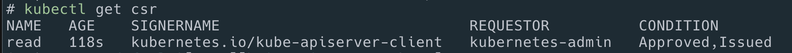

# k8s user / permission

<https://kubernetes.io/docs/reference/access-authn-authz/certificate-signing-requests/#normal-user>

## add user

```sh
openssl genrsa -out readonly.key 2048

openssl req -new -key readonly.key -out readonly.csr -subj "/CN=readonly"

cat readonly.csr | base64 | tr -d "\n"

cat <<EOF | kubectl apply -f -
apiVersion: certificates.k8s.io/v1
kind: CertificateSigningRequest
metadata:
  name: readonly
spec:
  request: LS0tLS1CRUdJTiBDRVJUSUZJQ0FURSBSRVFVRVNULS0tLS0KTUlJQ1dEQ0NBVUFDQVFBd0V6RVJNQThHQTFVRUF3d0ljbVZoWkc5dWJIa3dnZ0VpTUEwR0NTcUdTSWIzRFFFQgpBUVVBQTRJQkR3QXdnZ0VLQW9JQkFRRFA4TXAzUXBZVWYyZStsL0k4ekF6MnpSYjZLT3lTaG16d1pNb1ZsRzVvClZESGhVTlozLzYvbkdCNjZuajJnZUhsTWNlYjZEV2JzNjJRN3cwVXI5Rk9MeHkybnRrbFMwUm1qRWxlT2FNVUoKRGREMzYvMmMva1pSYytUeFVTMzNyWUpNSis3WWVpMitrdVo4SWNQM0dNUEtnU2xiV0IxMElaM1AzVWg1bTdtVwpHUjhCWVk4ZGJ0Q05FdXpieWY2c3UxSnBQdE9BekZ2aEJ3VnJYeWNZSmtMYmViajE0L0pNRmNOYTYwdm5ZOVBKCjRsVi9qVkpxREF1eTlHaVNvWE1ZaEMyZzE4UUcvWkZ3UWpuNFd1SUdES3ByVFZOTUxjSXhraUJTU3lZdjZxcXcKa1pxeWt0ekhqaG11aGsyY0hxaWRWRUZBQlVVY21SYkp0OEliRUtYd0RlaGJBZ01CQUFHZ0FEQU5CZ2txaGtpRwo5dzBCQVFzRkFBT0NBUUVBSHhqSXlEMmt6KzFuRllXOXRKd253QzBxRGEwdmhKS3owdjhwblZOY2huQmtxamZkCmFwYU41bmRwZEM4MWhwV2V0OVBnWUpFdURBcElDbkxPY1ZpODkzVU9zTVVPSHZvUDd1Wld0NG1zTGdNQ3RGNlQKcDJ4a0VkZlJBdU1NaC9XckJDQ0ZVUTcreHNVOUhweWVDQ0wrRWEydnZoRGF3SVhxSWdHMWpWeXBGN0hXSXdkLwpySlNFbFdENEg5K0F3V1pJRitzRnVwUFlsWUxlQlIwbnVNTlBVNnYxTU9PQzc2cUxCNFc4SWtBZ2piOUEyeGlLClpwUkJkQ3IvM3ZCL0JCTnc5NUVydTlZdGM4eFJaaDZPelNYbVNFZ2gzY0N2VlRYWkpIbnoxYlp4OVhsR3JWREoKSit5bE9RYjdnUWZGWDJZRUVsY3NFZFNaTUVzenpqMmZta1RTM1E9PQotLS0tLUVORCBDRVJUSUZJQ0FURSBSRVFVRVNULS0tLS0K
  signerName: kubernetes.io/kube-apiserver-client
  usages:
  - client auth
EOF
```

## 확인

```sh
kubectl get csr # status: Pending 으로 됨.
```


## Approve the CSR

```sh
kubectl certificate approve readonly
kubectl get csr
```



approved로 상태가 바뀜.

## Get the certificate

```sh
kubectl get csr readonly -o jsonpath='{.status.certificate}'| base64 -d > readonly.crt
```

## Create Role and RoleBinding

readonly

```sh
kubectl create role readonly --verb=get --verb=list --resource=pods

kubectl create rolebinding readonly-binding-roleonly --role=readonly --user=readonly
```

## add to kubeconfig

```sh
kubectl config set-credentials readonly --client-key=readonly.key --client-certificate=readonly.crt --embed-certs=true

kubectl config set-context readonly --cluster=ooma-c1 --user=readonly

```

## test

```sh
kubectl config use-context readonly
```

## 삭제

```sh
kcn default
k delete roles/readonly
k delete rolebindings/readonly-binding-readonly

k delete clusterroles/reader
k delete clusterrolebindings/reader-binding-readonly

kubectl config delete-user readonly
kubectl config delete-context readonly

kubectl get csr

kubectl delete csr readonly
```

## 추가

k get clusterrole

view: 볼수 있다.

cluster-admin : 전체 리소스에 대한 전체 권한을 준다.

api group : <https://kubernetes.io/docs/reference/generated/kubernetes-api/v1.22/>
