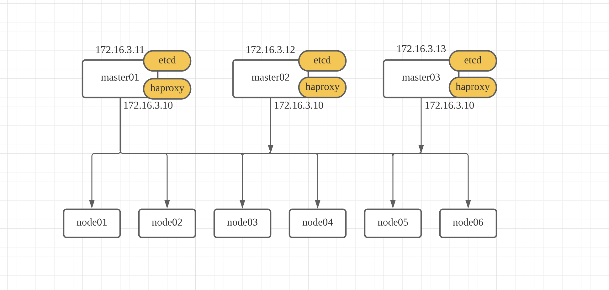

# install with kubespray

## [https://github.com/teamsmiley/devops-senima-argocd](https://github.com/teamsmiley/devops-senima-argocd)

## vm 준비

master 3대, node 6대로 진행

각각의 노드에 랩탑에서 자동 로그인 설정을 진행해 두어야한다. cloud-init을 이용하여 vm설치시 자동화를 추천 드린다.

## architechture



master 1 2 3 에 keepalived를 설치하고 vip를 10번을 할당해준다.

master 1 2 3 에 haproxy가 설치. 문제가 발생해도 서비스에 문제 없게 한다.

haproxy가 1 2 3 번에 설치된 kube api를 포인트 한다.

node1-6는 vip를 kube-api 가 연결된다. 이러면 ha 가 완성된다.

## prepare install

나는 gitops를 좋아하므로 깃 리포를 하나 만든다.

[https://github.com/teamsmiley/custom-kubespray](https://github.com/teamsmiley/custom-kubespray)

```sh
git clone git@github.com:teamsmiley/custom-kubespray.git
cd custom-kubespray

```

## set custom k8s-cluser.yml

```sh
vi k8s-cluster.yml

# Set the drain timeout for pre-upgrade
drain_grace_period: 600
drain_timeout: 600s

kube_version: v1.21.5 # 원하는 버전 추가
```

## review setup-kubespray.sh

```sh
vi setup-kubespray.sh

KUBESPRAY_VERSION=2.17.0
ENV=xgrid
```

원하는 버전으로 설정을 변경한다.

```sh
./setup-kubespray.sh
```

## sh 설명

준비 완료

kubespray가 다운되고 설정을 내가 미리 정해둔대로 변경한다. 이러게 해서 이 폴더 자체를 커밋/푸시를 해두어야한다. 그래야 나중에 내가 이버전을 사용하여 설치한것이 나온다. 사용한 모든걸 스냅샷찍듯이 소스코드에 넣어둬야하는게 맞다. 나중에 혹시 스크립트가 동작하지 않아 변경하더라도 다시 고치더라도 스크립트로 자동 생성이 되야 개인이 그냥 고쳐버리는것보다 뒤에 작업하는 사람이 더 쉽게 작업할수 있다.

## Run setup haproxy for Kubernetes masters

```bash
ENV=xgrid
ansible-playbook -i inventory/${ENV}/hosts.yml k8s-setup-haproxy-for-masters.yml -b -v
```

### vip 확인

```bash
ping 172.16.4.10 #(vip) 이게 잘 되면 성공한거다.
```

### keepalived 확인

마스터 노드 각각 데몬 상태 확인

```bash
ssh c4-master01.c4
sudo systemctl status snap.keepalived.daemon
ip addr show ens4
```

## kubernetes 설치

haproxy-for-k8s-masters 관련 내용 수정

group_vars/all/all.yml

```yaml
## External LB example config
apiserver_loadbalancer_domain_name: 'api.c4'
loadbalancer_apiserver:
  address: 172.16.4.10
  port: 443
```

hosts 파일도 확인

```text
kube-master:
  hosts:
    c4-master01:
      vrrp_instance_state: MASTER
      vrrp_instance_priority: 101
    c4-master02:
      vrrp_instance_state: BACKUP
      vrrp_instance_priority: 100
    c4-master03:
      vrrp_instance_state: BACKUP
      vrrp_instance_priority: 99
  vars:
    vrrp_interface: ens4
    vrrp_instance_virtual_router_id: 103
```

이렇게

버전 선택

kubespray/roles/download/defaults/main.yml에서 버전을 확인할수 있다.

v1.20.0로 선택

```bash
cd /data/kube-on-premise/
vi inventory/${ENV}/group_vars/k8s_cluster/k8s-cluster.yml
```

```text
kube_version: v1.20.0
```

```bash
cd kubespray
ansible-playbook -i inventory/${ENV}/hosts.yml cluster.yml -b -v
```

### 문제들

1. 설치시 특정노드는 빠지는듯 보임 특정노드만 따로 설치후 전체를 다시 실행해주었다.

```bash
# 한개 노드
ansible-playbook -i inventory/${ENV}/hosts.yml cluster.yml -b -v --limits=c4-node01

# 전체 노드
ansible-playbook -i inventory/${ENV}/hosts.yml cluster.yml -b -v
```

### 상태 확인

```bash
kubectl --kubeconfig=inventory/${ENV}/artifacts/admin.conf cluster-info
> Kubernetes master is running at https://172.16.4.10:443

kubectl --kubeconfig=inventory/${ENV}/artifacts/admin.conf get nodes

> NAME          STATUS     ROLES    AGE   VERSION
> c4-master01   Ready      master   64m   v1.18.9
> c4-master02   Ready      master   63m   v1.18.9
> c4-master03   Ready      master   63m   v1.18.9
> c4-node01     Ready      <none>   60m   v1.18.9
> c4-node03     NotReady   <none>   60m   v1.18.9
```

## 접속 설정 정보 가져오기

```bash
cd /data/kube-on-premise/
git add --all && git commit -am server && git push

ENV=xgrid-c4
scp maas:/data/kube-on-premise/kubespray/deploy/kubespray-2.17.0/inventory/${ENV}/artifacts/admin.conf ~/.kube/${ENV}
```

```bash
export KUBECONFIG=$PWD/inventory/${ENV}/artifacts/admin.conf
```

```bash
cp inventory/${ENV}/artifacts/admin.conf ~/.kube/c4-config

inventory/${ENV}/artifacts/ 에 서버 접속할수 있는 설정이 생긴다.

vi ~/.zshrc

export KUBECONFIG=~/.kube/config:~/.kube/c2-config:~/.kube/c4-config:~/.kube/c4-config:~/.kube/aws-config
```


잘 설치되었는지 확인한다.

## argocd 설치

```bash
kubectl create namespace argocd
kubectl apply -n argocd -f https://raw.githubusercontent.com/argoproj/argo-cd/stable/manifests/install.yaml
```


## 비번 알아내기

```bash
k -n argocd get secret argocd-initial-admin-secret \
-o jsonpath="{.data.password}" | base64 -d && echo

NXXhjrWj7lDD54Xb
```

## 접속

```bash
k port-forward svc/argocd-server -n argocd 8080:443
```

[http://localhost:8080/](http://localhost:8080/)

update password


## create repo for add

[https://github.com/teamsmiley/devops-senima-argocd](https://github.com/teamsmiley/devops-senima-argocd)


그림처럼 2개의 폴더가 있다

- add-apps

  앱을 추가하기 위한 yaml

- deploy

  app 자체의 yaml을 넣는 폴더

두개의 폴더는 다시 구분된다.

- core

  쿠버네티스를 운영하기위해 관리해야하는 앱 폴더

- apps

  사용하는 앱을 넣는 폴더

## add argocd repo to argocd

```bash
argocd login localhost:8080

argocd repo add git@github.com:teamsmiley/argocd-c4.git --ssh-private-key-path ~/.ssh/id_rsa
```

ui에서 확인 가능


## add core / apps

```bash
k apply -f add-apps/core/
k apply -f add-apps/apps/
```
