# Kubernetes는 무엇인가

## 정의

컨테이너 오케스트레이션 \(Container Orchestration\)

오케스트라

컨테이너를 관리해주는 지위자? 정도

## 왜 필요하지?

### 배포\(Deployment\)의 문제점

- 모든 서버에 직접 접속해서 docker stop, run을 실행 해줘야 함
- 모니터링 시스템 구축 등을 통해서 유휴 자원을 관리하며 도커 컨테이너가 실행 될 수 있는 리소스 관리가 필요
- 새롭게 배포 된 어플리케이션에 장애가 발생하여 롤백 시 신속하게 대처하기 힘듦

### 서비스 검색의 문제점

- 프록시 서버를 통해서 내부의 서비스에 접근할 때
- 부하 발생으로 인해 스케일 아웃을 해야 하는 경우 로드 밸런서 설정 등의 작업이 필요
- 마이크로 서비스의 경우 이러한 경우가 더욱 빈번하게 발생

### 서비스 노출의 문제점

프록시 서버를 통해서 내부의 서비스에 접근할 때 새롭게 서비스가 추가 될 때 마다 프록시 서버 설정 추가가 필요

### 서비스 검색의 문제점과 유사

- 서비스 장애, 부하 모니터링의 문제점
- 장애가 발생한 컨테이너의 로그를 보고 직접 다시 실행하는 작업 필요
- 예상치 못한 시간에 발생한 부하에 대한 대응이 늦을 수 있음

결론은 지위자가 필요하다는 .

## 경쟁 프로그램

- RANCHER, MESOS, MARATHON, Nomad, Docker SWARM, Kubernetes

쿠버네티스가 standard가 되버림.

## 구조도

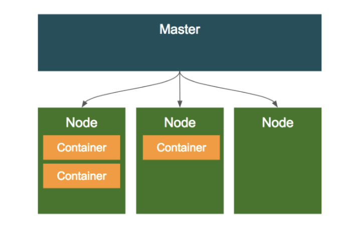

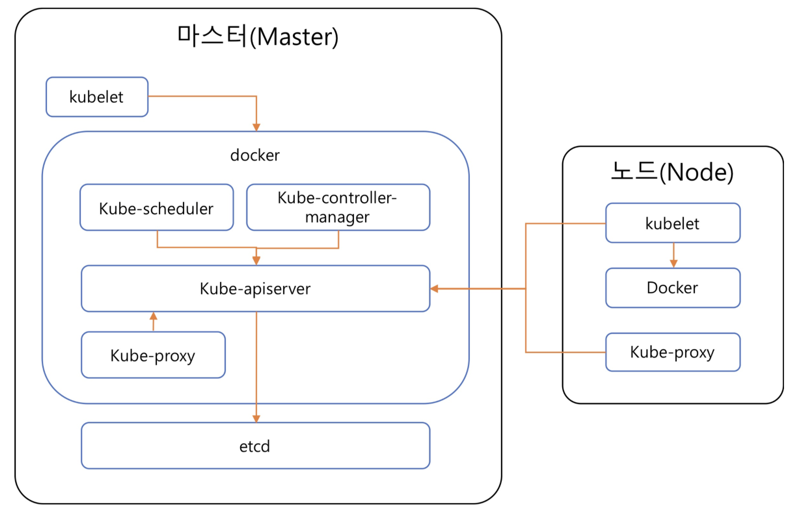

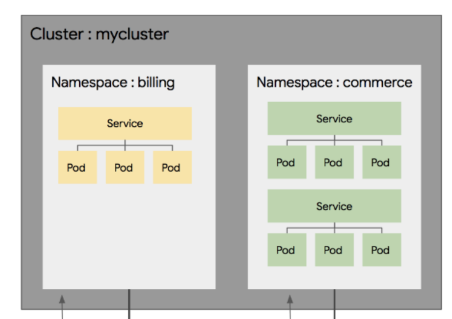

ingress

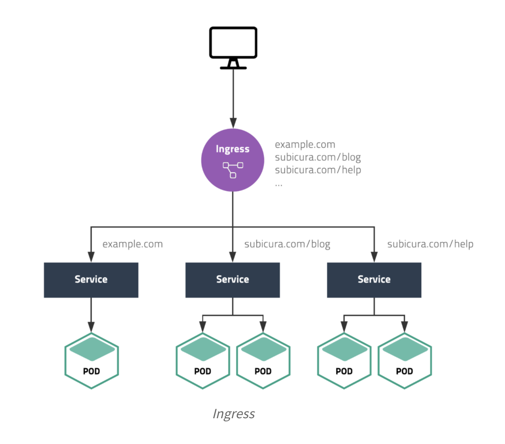

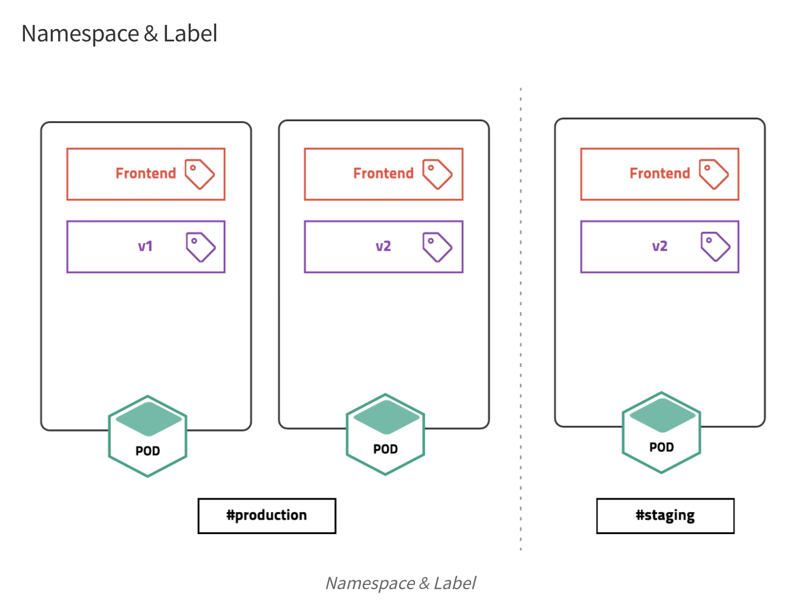

## pod

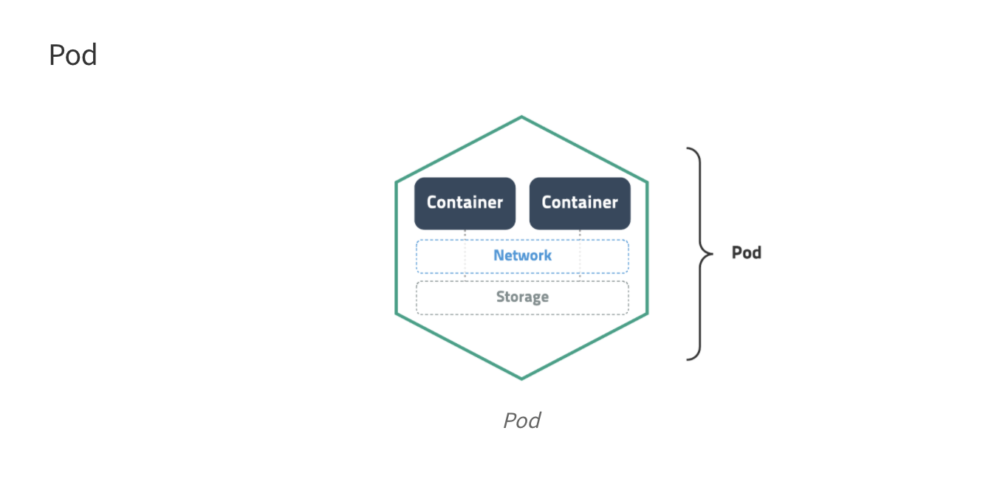

## replicatset

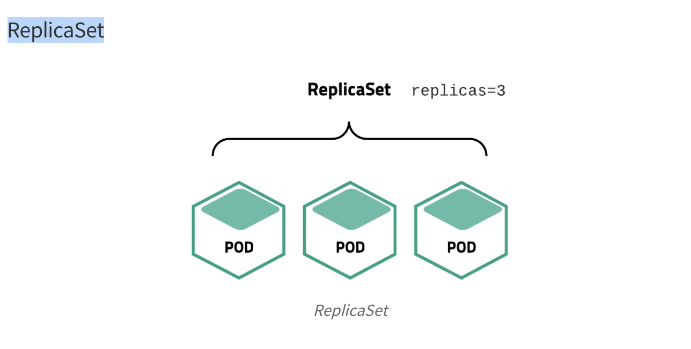

## deployment

## service

## volume

## 추가 설명

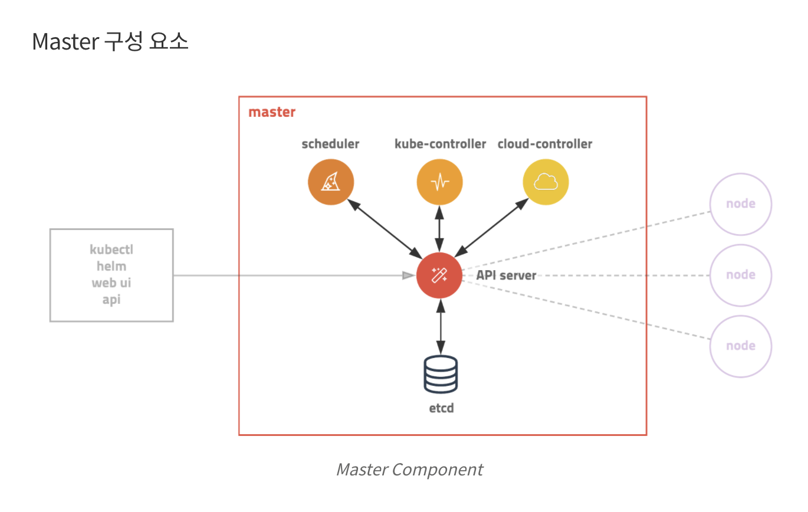

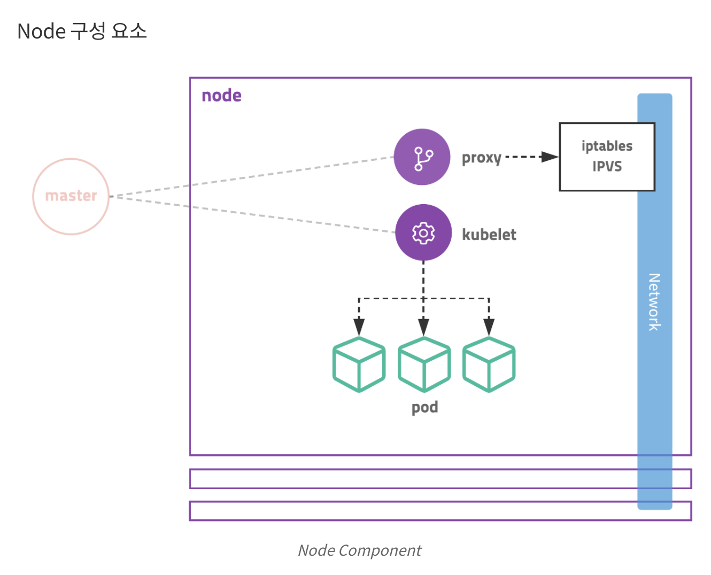

## 하나의 Pod이 생성되는 과정

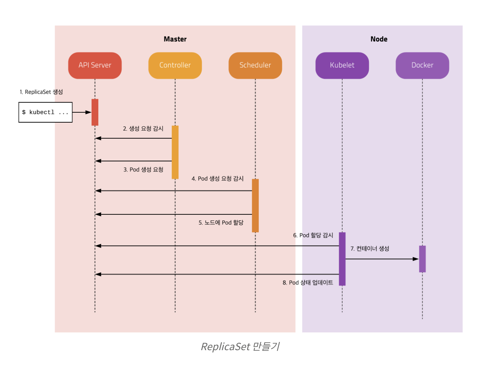

## 주의사항

- 이미지 태그 사용시 꼭 태그 넘버를 사용하자.
  아무것도 안쓰면 latest가 자동으로 붙는다. latest 를 사용하지 말자. 계속 버전이 바뀌므로 문제가 된다.
- 사실 sha 태그도 중복이 된다. 가능하면 container digest를 사용하자.
  digest는 유일하다.
  `docker image ls --digests`
  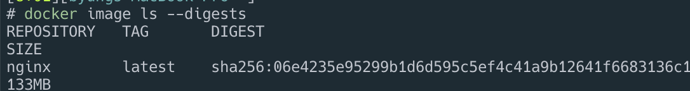
