# longhorn - persistance volume

노드장비를 storage로 사용할수 있다.

persistance volume을 kubernetes 가 설치된 노드를 pv로 사용한다.

pod가 1번 노드에서 뜨면 1번 노드에 pv를 붙여주는거 같음

복제본도 만들어주고 snapshot도 해주고 그런다.



## prerequisites

ubuntu20은 nfs-commons만 추가 설치해야한다.

```bash
apt install nfs-common -y
```

전체 노드에 설치를 한다.

## longhorn 설치

```bash
helm repo add longhorn https://charts.longhorn.io
helm repo update
helm search repo longhorn
helm install longhorn longhorn/longhorn --namespace longhorn-system
```

LoadBalancer타입으로 설치하려면 다음처럼 하면된다.

```bash
helm install longhorn longhorn/longhorn --set service.ui.type=LoadBalancer -n longhorn-system --create-namespace

helm list -n longhorn-system

kcn longhorn-system

k get pod
```

프론트웹으로 접속해서 volume을 하나 만들어보자.


```bash
k get volumes

NAME   STATE      ROBUSTNESS   SCHEDULED   SIZE          NODE   AGE
test   detached   unknown      True        21474836480          7m57s

k get crd | grep longhorn

backingimagemanagers.longhorn.io                      2021-08-11T01:07:42Z
backingimages.longhorn.io                             2021-08-11T01:07:42Z
engineimages.longhorn.io                              2021-08-11T01:07:42Z
engines.longhorn.io                                   2021-08-11T01:07:42Z
instancemanagers.longhorn.io                          2021-08-11T01:07:42Z
nodes.longhorn.io                                     2021-08-11T01:07:42Z
replicas.longhorn.io                                  2021-08-11T01:07:42Z
settings.longhorn.io                                  2021-08-11T01:07:42Z
sharemanagers.longhorn.io                             2021-08-11T01:07:42Z
volumes.longhorn.io                                   2021-08-11T01:07:42Z
```

volume이라는 crd를 제공함..기타 다른것도 제공.

longhorn이라는 스토리지 클라스 제공 디폴트로 세팅되어 있다.

```bash
# k get sc
NAME                 PROVISIONER          RECLAIMPOLICY   VOLUMEBINDINGMODE   ALLOWVOLUMEEXPANSION   AGE
longhorn (default)   driver.longhorn.io   Delete          Immediate           true                   33m
```

pv와 pvc가 자동으로 생성되는 준비가 됬다.

## ingress - dashboard

```yml
---
apiVersion: networking.k8s.io/v1
kind: Ingress
metadata:
  name: longhorn
  namespace: longhorn-system
  annotations:
    kubernetes.io/ingress.class: nginx
spec:
  rules:
    - host: longhorn.yourdoman.com
      http:
        paths:
          - path: /
            pathType: Prefix
            backend:
              service:
                name: longhorn-frontend
                port:
                  number: 80
```

<http://longhorn.yourdoman.com>으로 확인해보면 dashboard가 사용이 가능하다.

## pvc 생성

```yml
apiVersion: v1
kind: PersistentVolumeClaim
metadata:
  name: mypvc
spec:
  accessModes:
    - ReadWriteOnce
  resources:
    requests:
      storage: 2Gi
```

mypvc.yml

```sh
k apply -f mypvc.yml
```

longhorn dashboard에서 volume이 생긴걸 확인할수 있다.

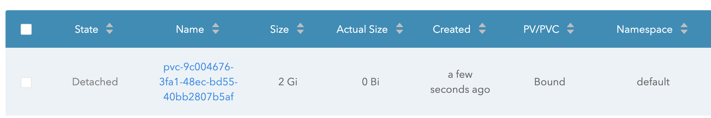

detached 상태이다.

## pod에서 사용

vi pod.yml

```yml
apiVersion: v1
kind: Pod
metadata:
  name: mypod
spec:
  containers:
    - name: myfrontend
      image: nginx
      volumeMounts:
        - mountPath: '/var/www/html'
          name: mypod
  volumes:
    - name: mypod
      persistentVolumeClaim:
        claimName: mypvc
```

```sh
k apply -f pod.yml
```

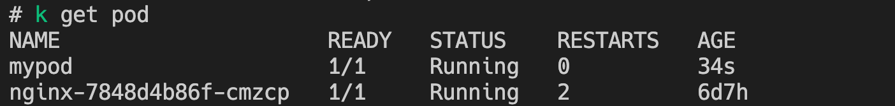

조금 기다리면 volume이 attached가 된걸 볼수가 있다.

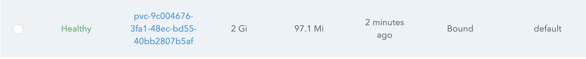

볼륨 name을 눌러서 들어가보면 자세한 내용이 나온다.

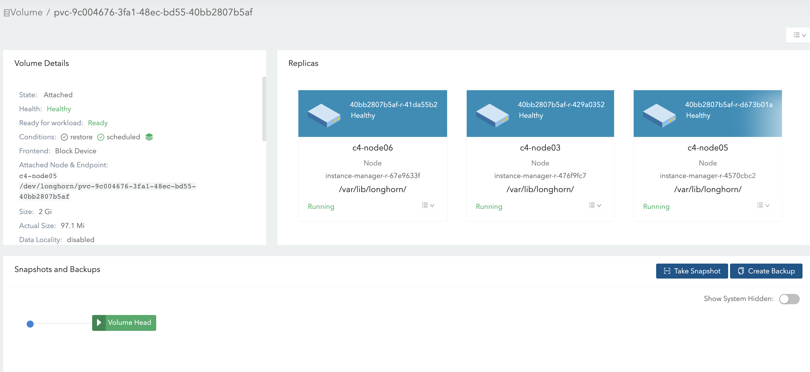

backup도 할수 있고 snapshot도 할수 있다.

replica가 기본값이 3 이므로 3개의 리플리카를 만들어주고 제일먼저 같은 노드에 잇는 pv를 pod에 붙여준다.

이 값을 줄이려면

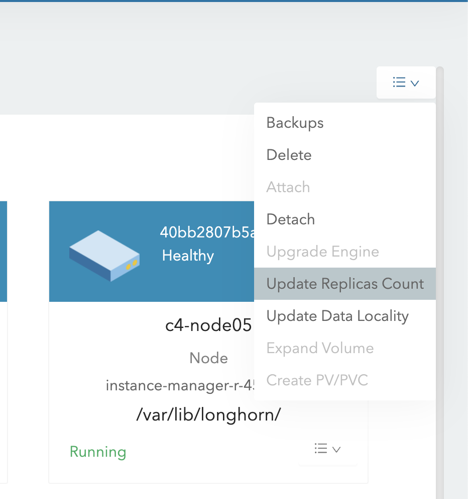

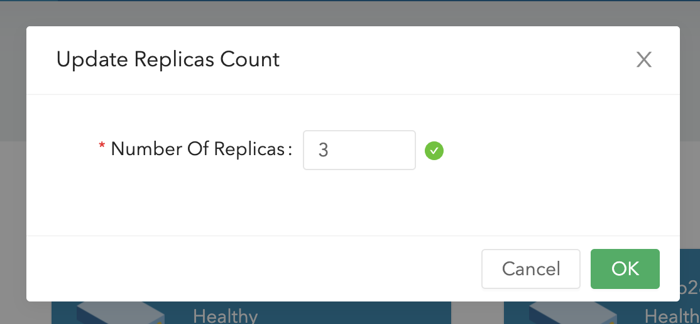

이 버튼을 이용하면된다.

1 개로 줄이면 줄어드는것을 볼수 있다.

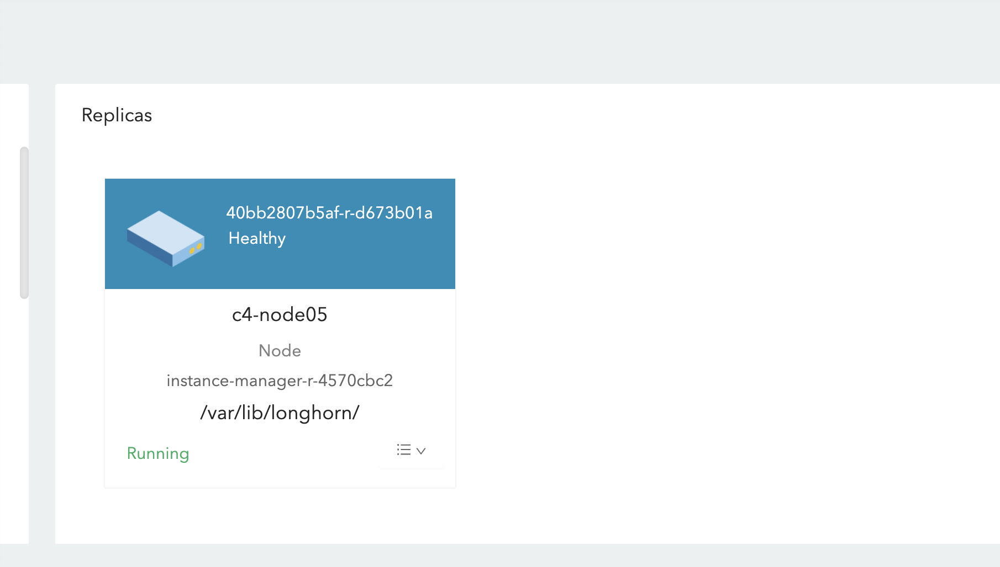

현재 노드가 6개이므로 6개로 늘려주면 모든 노드에 데이터가 다 쌓이므로 파드가 다른 노드로 움직여도 문제가 없는듯 보인다.

메뉴중에 update data locality를 눌러보자.

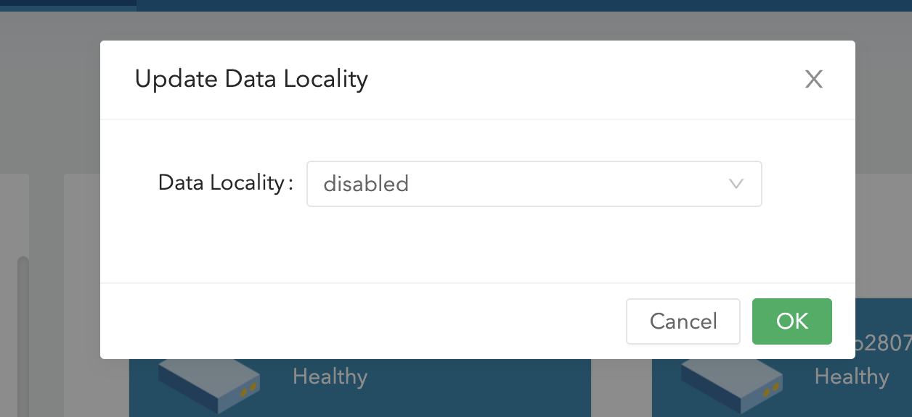

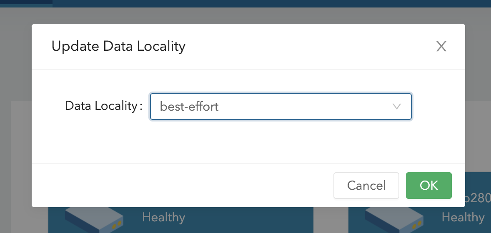

best effort로 하면 pod가 있는 노드에서 pvc를 붙여주는듯 보인다.

현재 node05번에 pvc가 있다.
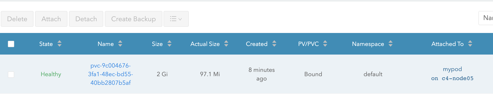

pod도 5번에 있는것을 확인할수 있다.

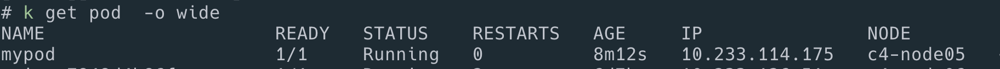

## 기본 옵션 변경

메뉴중 setting이라는곳에 모든 기본 옵션이 들어가 있다.

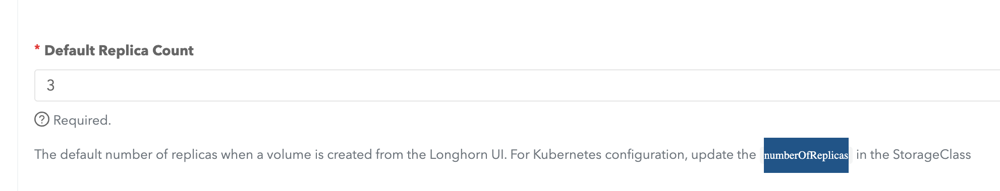

helm설치시 설정해주어도 된다.

## backup

리플리카가 있기는 하지만 클러스터 내부에 있으므로 외부로 백업을 하는것도 가능하다.
