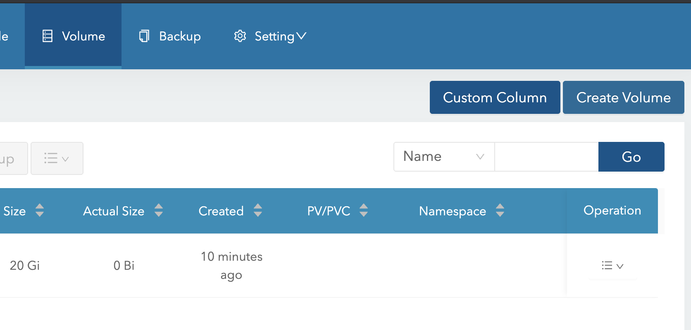

# longhorn - pv

persistance volume을 kubernetes 가 설치된 노드를 pv로 사용한다. 

pod가 1번 노드에서 뜨면 1번 노드에 pv를 붙여주는거 같음 

복제본도 만들어주고 snapshot도 해주고 그런다.




노드장비를 storage로 사용할수 있다.

### prerequisites

기본적으로 ubuntu20은 다 가지고 있고 nfs-commons만 설치해야한다.

```bash
apt install nfs-common
```

전체 노드에 설치를 한다.


### longhorn 설치

```bash
helm repo add longhorn https://charts.longhorn.io
helm repo update
helm search repo longhorn
helm show values longhorn/longhorn > ~/Desktop
kubectl create namespace longhorn-system
helm install longhorn longhorn/longhorn --namespace longhorn-system
```

helm value 생성

```bash
helm show values longhorn/longhorn > ~/Desktop/GitHub/argocd-c4/apps/longhorn/values.yaml
```

* install

```bash
helm install longhorn longhorn/longhorn --set service.ui.type=LoadBalancer -n longhorn-system --create-namespace

helm list -n longhorn-system

kcn longhorn-system

k get pod
```

프론트웹으로 접속해서 volume을 하나 만들어보자.



```bash
# k get volumes
NAME   STATE      ROBUSTNESS   SCHEDULED   SIZE          NODE   AGE
test   detached   unknown      True        21474836480          7m57s
[18:50][brians-iMac ~/Desktop/GitHub/argocd-c4/apps/longhorn] git:(main) ✗
# k get crd | grep longhorn
backingimagemanagers.longhorn.io                      2021-08-11T01:07:42Z
backingimages.longhorn.io                             2021-08-11T01:07:42Z
engineimages.longhorn.io                              2021-08-11T01:07:42Z
engines.longhorn.io                                   2021-08-11T01:07:42Z
instancemanagers.longhorn.io                          2021-08-11T01:07:42Z
nodes.longhorn.io                                     2021-08-11T01:07:42Z
replicas.longhorn.io                                  2021-08-11T01:07:42Z
settings.longhorn.io                                  2021-08-11T01:07:42Z
sharemanagers.longhorn.io                             2021-08-11T01:07:42Z
volumes.longhorn.io                                   2021-08-11T01:07:42Z
```

volume이라는 crd를 제공함..기타 다른것도 제공.

longhorn이라는 스토리지 클라스 제공 디폴트로 세팅되어 있다.

```bash
# k get sc
NAME                 PROVISIONER          RECLAIMPOLICY   VOLUMEBINDINGMODE   ALLOWVOLUMEEXPANSION   AGE
longhorn (default)   driver.longhorn.io   Delete          Immediate           true                   33m
```

pv와 pvc가 자동으로 생성되는 준비가 됬다.

