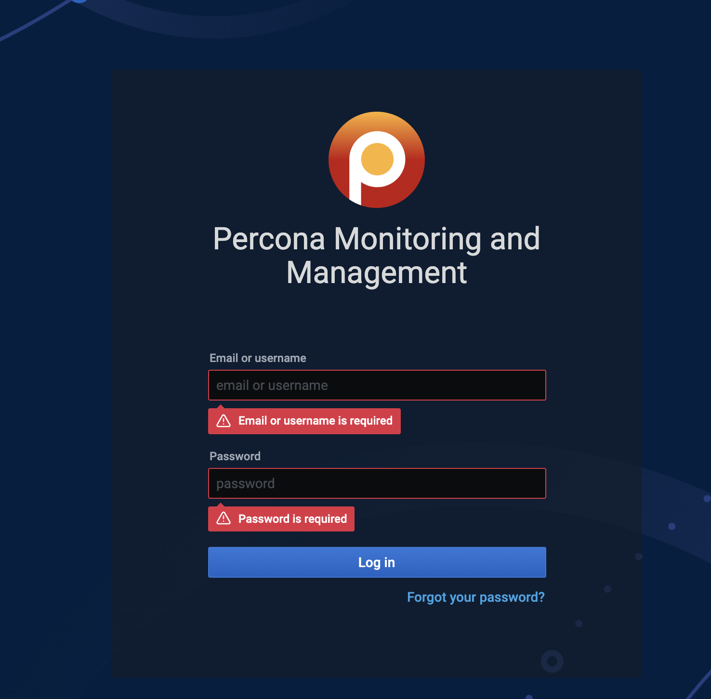
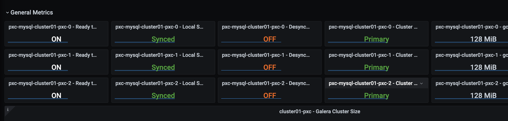
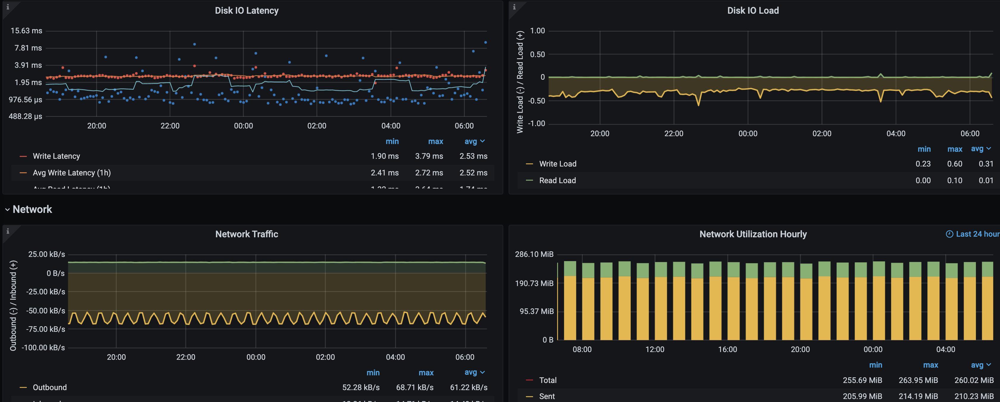
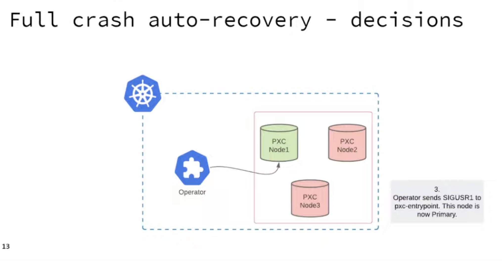

# percona extra db cluster operator

mysql을 설치해주고 복제해주고 모든걸 자동으로 해주는것이 목표

pv/pvc가 없이 tempdir 이나 hostpath로도 테스트는 가능하나 백업/복구 등에 문제가 있다.

현재는 모든 스크립트가 pv/pvc가 있는것을 가정하는것 같다. 그러므로 앞에 설치한 longhorn을 설치를 해두고 작업하기를 바란다

## pmm server

install

```sh
helm repo add percona https://percona-charts.storage.googleapis.com
helm repo update

helm install monitoring pmm/pmm-server -n $NS --set platform=kubernetes --set "credentials.password=your_password"
```

ingress 설정

cert-manager가 설정이 미리 되있어서 ssl까지 만들면서 진행

백앤드에 ssl로 통신하는것 중요

```yml
---
apiVersion: networking.k8s.io/v1
kind: Ingress
metadata:
  name: pmm
  namespace: pxc-mysql
  annotations:
    kubernetes.io/ingress.class: nginx
    cert-manager.io/cluster-issuer: 'dns-issuer-aws-live'
    nginx.ingress.kubernetes.io/force-ssl-redirect: 'true'
    nginx.ingress.kubernetes.io/backend-protocol: 'HTTPS' # 이부분 꼭 확인
spec:
  tls:
    - hosts:
        - 'pmm.c3.yourdomain.com'
      secretName: pmm-tls
  rules:
    - host: pmm.c3.yourdomain.com
      http:
        paths:
          - path: /
            pathType: Prefix
            backend:
              service:
                name: pxc-pmm-service
                port:
                  number: 443
```

사이트에 접속해보면 grafana가 보인다. 로그인하면 된다.

## percona-xtradb-cluster-operator

```sh
git clone -b v1.8.0 https://github.com/percona/percona-xtradb-cluster-operator

cd percona-xtradb-cluster-operator/deploy

k create namespace pxc-mysql

kcn pxc-mysql
k get pod
k apply -f crd.yaml
k apply -f rbac.yaml
k apply -f operator.yaml
# 또는 합쳐져있는 k apply -f bundle

```

## password setting

이제 관련 비밀번호등을 설정하자. 비번을 전부 바꾼다. 적용한다.

`cat secrets.yaml`

```yml
apiVersion: v1
kind: Secret
metadata:
  name: my-cluster-secrets # 중요
type: Opaque
stringData:
  root: your-password
  xtrabackup: your-password
  monitor: your-password
  clustercheck: your-password
  proxyadmin: your-password
  pmmserver: your-password
  operator: your-password
  replication: your-password
```

적용하자.

```sh
k apply -f secrets.yaml
```

aws에 백업을 하기 위한 비번도 필요하다.

`cat backup-s3.yaml`

```yml
apiVersion: v1
kind: Secret
metadata:
  name: backup-s3 # 이름
  namespace: pxc-mysql
type: Opaque
data:
  AWS_ACCESS_KEY_ID: QUtJQVxxxjc=
  AWS_SECRET_ACCESS_KEY: VktqdzZWTjRDMjxxxY5MUQ5OQ==
```

```sh
k apply -f backup-s3.yaml
```

## 디비 디플로이

`vi cr.yaml`

```yml
secretsName: my-cluster-secrets # secret.yml에 있는 이름을 넣어줘야함.
allowUnsafeConfigurations: true # tls 통신안쓰는것으로 처리
haproxy:
  enabled: false # proxysql을 사용할 예정
proxysql:
  enabled: true
  serviceType: LoadBalancer
pmm:
  enabled: true
  image: percona/pmm-client:2.18.0
  serverHost: pxc-pmm-service # pmm-server에서의 서비스 명
  serverUser: admin # 확인
backup: # backup 설정
  storage:
    s3:
      bucket: S3-BACKUP-BUCKET-NAME-HERE #s3 bucket name
      credentialsSecret: backup-s3 # backup-s3.yaml에 있는 이름
      region: us-west-1 # s3 bucket 위치
    #fs-pvc: # 사용하지 않음
    schedule: #스케줄을 적용
      - name: 'sat-night-backup'
        schedule: '0 0 * * 6'
        keep: 52
        storageName: s3-us-west
      - name: 'daily-backup'
        schedule: '0 0 * * *'
        keep: 7
        storageName: s3-us-west
      - name: 'hourly-backup'
        schedule: '0 * * * *'
        keep: 24
        storageName: s3-us-west
```

proxysql을 사용하고 haproxy를 사용하지 않음.

pmm client로 사용

백업 설정

적용

```sh
k apply -f cr.yaml
k get svc # loadbalance ip확인
```

디비에 접속해보면 된다.

## 백업

- 자동 백업
  백업 스케줄을 해두었음로 한시간에 한번씩 s3 bucket으로 업로드 된다.

- 수동 백업
  수동으로 백업을 받고 싶으면 yml을 수정하고 적용하면된다.

```sh
cat backup/backup.yaml
```

```yml
apiVersion: pxc.percona.com/v1
kind: PerconaXtraDBClusterBackup
metadata:
  #  finalizers:
  #    - delete-s3-backup #지울때 s3 backup까지 같이지우고 싶은경우는 사용하자.
  name: backup1 # 이름을 잘 설정하자.
spec:
  pxcCluster: cluster01
  storageName: s3-us-west
```

```sh
kubectl apply -f backup/backup.yaml
```

s3에 업로드 된것을 확인할수 잇다.

https://www.percona.com/doc/kubernetes-operator-for-pxc/backups.html#making-on-demand-backup

## 복구

`vi backup/restore.yaml`

```yml
apiVersion: pxc.percona.com/v1
kind: PerconaXtraDBClusterRestore
metadata:
  name: restore1
spec:
  pxcCluster: cluster01
  backupName: backup1
```

```sh
kubectl apply -f backup/restore.yaml
```

클러스터를 하나씩 없애고 복구하고 다시 올려준다.

## pmm 확인

다 구성되고 나면 pmm 에 접속해보면 클러스터 상태가 보인다.







alert manager를 설정하면 슬랙으로 에러를 받을수 있다.

## DR

일단 노드 1개가 고장나면 자동으로 다른노드에 올려주고 이 노드에서는 자동으로 master에서 파일을 가져와서 복구를 시간한후 자동으로 붙여준다.

만약 3개 노드가 동시에 꺼저버리면 문제가 될듯 보인다. 그래서 찾아봣더니 3개 노드중 마지막 데이터가 잇는곳을 찾아서 그곳을 마스터로 지정하고 난후 나머지 2개 노드를 다시 자동으로 올려준다고하니 큰 문제는 없어 보인다.



<https://youtu.be/V3ko5NpTMPA?t=895>

longhorn에서 스토리지에 리플리카를 지원을 하므로 3개 정도 해두거나 전체 노드 댓수에 해두면 전체 노드에 같은 데이터가 잇는것이므로 어느 노드에서 실행이 되더라도 자동으로 붙여서 올라올것으로 보인다. 다만 이경우에 처음부터 싱크를 다시 하는지는 아직 알지 못한다.

## point-in-time restore

이걸 위해서는 bin log파일을 백업을 받아야한다.

vi cr.yml

```yml
pitr:
  enabled: true
  storageName: s3-us-west
  timeBetweenUploads: 60
```

이부분 주석 해제 스토리지 이름을 적어주면 빈로그를 업로드한다.

## 결론

총 3대의 mysql 클러스터가 구성이 되었고 longhorn을 사용하여 데이터가 쿠베 클러스터에 저장이 된다. 백업은 s3로 자동으로 업로드가 된다. pmm으로 모니터링이 가능하다.
