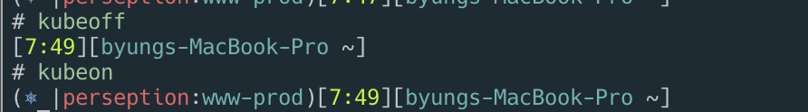

# tools

## kubectl



```bash
brew install kubectl
kubectl -h
```

## kubectx

```sh
brew install kubectx
# list
kubectx
# select context
kubectx docker-desktop
# previous context
kubectx -

# list
kubens
# select
kubens argocd
# previous
kubens -
```

## kube-ps1

<https://github.com/jonmosco/kube-ps1>

```sh
brew update
brew install kube-ps1
vi ~/.zshrc
```

```conf
source "/usr/local/opt/kube-ps1/share/kube-ps1.sh"
PROMPT='$(kube_ps1)'$PROMPT
```

```sh
# on
kubeon
# off
kubeoff
```



## k9s

[https://k9scli.io/](https://k9scli.io/)

[https://k9scli.io/topics/install/](https://k9scli.io/topics/install/)

```bash
brew install derailed/k9s/k9s
```
