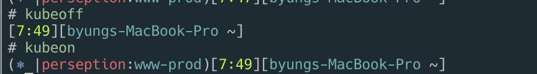

# tools

## kubectl



```bash
brew install kubectl
kubectl -h
```

## kubectx

```sh
brew install kubectx
# list
kubectx
# select context
kubectx docker-desktop
# previous context
kubectx -

# list
kubens
# select
kubens argocd
# previous
kubens -
```

## kube-ps1

<https://github.com/jonmosco/kube-ps1>

```sh
brew update
brew install kube-ps1
vi ~/.zshrc
```

```conf
source "/usr/local/opt/kube-ps1/share/kube-ps1.sh"
PROMPT='$(kube_ps1)'$PROMPT
```

```sh
# on
kubeon
# off
kubeoff
```



## k9s

[https://k9scli.io/](https://k9scli.io/)

[https://k9scli.io/topics/install/](https://k9scli.io/topics/install/)

```bash
brew install derailed/k9s/k9s
```

## for centos 7 linux

### install zsh for root

```sh
sudo su -
yum install zsh -y
```

### ohmyzsh

```sh
sh -c "$(curl -fsSL https://raw.github.com/robbyrussell/oh-my-zsh/master/tools/install.sh)"

cd ~/.oh-my-zsh/custom/plugins/
git clone https://github.com/zsh-users/zsh-autosuggestions
git clone https://github.com/zsh-users/zsh-syntax-highlighting.git
```

## kubectl

```sh
cd
curl -LO https://storage.googleapis.com/kubernetes-release/release/`curl -s https://storage.googleapis.com/kubernetes-release/release/stable.txt`/bin/linux/amd64/kubectl
chmod +x ./kubectl
mv ./kubectl /usr/local/bin/kubectl
kubectl version --client

source <(kubectl completion zsh)
```

## kubectx

```sh
cd
sudo git clone https://github.com/ahmetb/kubectx

mkdir -p ~/.local/bin

mv kubectx/kubectx ~/.local/bin/
mv kubectx/kubens ~/.local/bin/
rm -rf kubectx
```

## kube-ps1

```sh
cd
git clone https://github.com/jonmosco/kube-ps1.git

mv kube-ps1/kube-ps1.sh ~/.local/bin/
rm -rf kube-ps1
```

## k9s

```sh
cd
mkdir k9s
cd k9s

wget https://github.com/derailed/k9s/releases/download/v0.25.7/k9s_Linux_x86_64.tar.gz

tar -zxvf k9s_Linux_x86_64.tar.gz

mv k9s ~/.local/bin
k9s
```

## 정리

```sh
cd ~/.local/bin
chown root:root k9s
chmod +x kube-ps1.sh
```

## .zshrc

```conf
plugins=(git zsh-syntax-highlighting zsh-autosuggestions kubectl kube-ps1) # add

# 프롬프트
NEWLINE=$'\n'
export PROMPT='[$FG[154]%T%{$reset_color%}][%{$fg[cyan]%}%m %{$reset_color%}%~] $(git_prompt_info)${NEWLINE}# '

export PATH=~/.local/bin/:$PATH

source <(kubectl completion zsh)

bindkey -v

source "/root/.local/bin/kube-ps1.sh"

PROMPT='$(kube_ps1)'$PROMPT

export KUBECONFIG=~/.kube/cluster1:~/.kube/cluster2
```
