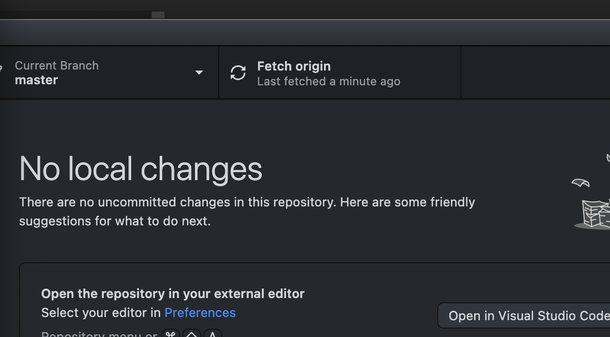

# manage maas

cli를 설치한후 다음처럼 하자.

## Create an administrator user

```bash
PROFILE=admin
EMAIL_ADDRESS="brian@xgridcolo.com"
MAAS_URL=http://localhost:5240/MAAS/api/2.0
API_KEY_FILE=~/admin-api-key

sudo maas createadmin --username=$PROFILE --email=$EMAIL_ADDRESS
```

## api key 찾기

1. 웹사이트로 로그인후 user를 클릭한다. apikey를 복사한다.
1. `sudo maas apikey --username=$PROFILE > $API_KEY_FILE`

## login

`maas login $PROFILE $MAAS_URL`

api key를 복사해둔 것을 붙여넣기 한다.


로그인이 된다.

## 기타 커맨드

```bash
maas $PROFILE --help
maas $PROFILE tag --help
maas $PROFILE tags --help
```



