# opennebula

vm을 관리해주는 오픈소스입니다.

[https://docs.opennebula.io/6.0/installation\_and\_configuration/frontend\_installation/index.html](https://docs.opennebula.io/6.0/installation_and_configuration/frontend_installation/index.html)

## install db mysql

```bash
sudo apt update -y
sudo apt install mysql-server -y
sudo mysql_secure_installation

sudo mysql
CREATE DATABASE opennebula;
CREATE USER 'oneadmin' IDENTIFIED BY 'your-password';
GRANT ALL PRIVILEGES ON opennebula.* TO 'oneadmin';
flush privileges;
SET GLOBAL TRANSACTION ISOLATION LEVEL READ COMMITTED;
```

이제 접속해보자.

```bash
mysql -u oneadmin -p
```

## install opennebula frontend

[https://computingforgeeks.com/install-opennebula-front-end-on-ubuntu/](https://computingforgeeks.com/install-opennebula-front-end-on-ubuntu/)

```bash
sudo ufw disable

sudo apt update -y
sudo apt  install gnupg wget apt-transport-https -y

sudo -i

wget -q -O- https://downloads.opennebula.io/repo/repo.key | apt-key add -

echo "deb https://downloads.opennebula.io/repo/6.0/Ubuntu/20.04 stable opennebula" > /etc/apt/sources.list.d/opennebula.list

exit

sudo apt update -y

sudo apt install opennebula opennebula-sunstone opennebula-fireedge opennebula-gate opennebula-flow opennebula-provision -y

# oneadmin유저가 자동으로 생성됨.

sudo vi /etc/one/oned.conf

# Sample configuration for PostgreSQL
# DB = [ BACKEND = "mysql",
#        SERVER  = "localhost",
#        PORT    = 0,
#        USER    = "oneadmin",
#        PASSWD  = "<thepassword>",
#        DB_NAME = "opennebula",
#        CONNECTIONS = 25,
#        COMPARE_BINARY = "no" ]

sudo -u oneadmin /bin/sh
echo 'oneadmin:kimchi66' > /var/lib/one/.one/one_auth
exit

# sudo ufw allow proto tcp from any to any port 9869

sudo systemctl start opennebula opennebula-sunstone
sudo systemctl enable opennebula opennebula-sunstone
sudo systemctl status opennebula
sudo systemctl status opennebula-sunstone

# 확인
sudo -i
oneuser show

> USER 0 INFORMATION
> ID              : 0
> NAME            : oneadmin
> GROUP           : oneadmin
> PASSWORD        : > 39fb427b99fad4b6b2f4547c07f509af87332f70664e1c7c09467cb5829eb833
> AUTH_DRIVER     : core
> ENABLED         : Yes
>
> TOKENS
>
> USER TEMPLATE
> TOKEN_PASSWORD="f58bae86cxxd59f891deb1b7b3c75a7> 12d652af8c59"
>
> VMS USAGE & QUOTAS
>
> VMS USAGE & QUOTAS - RUNNING
>
> DATASTORE USAGE & QUOTAS
>
> NETWORK USAGE & QUOTAS
>
> IMAGE USAGE & QUOTAS

# If you get an error message then the OpenNebula Daemon could not be started properly:
```

접속해보자.

http://:9869

[http://10.1.5.11:9869](http://10.1.5.11:9869)

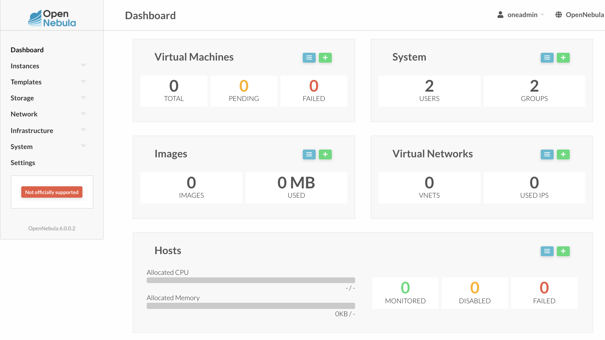

ui로 접속이 가능하다.

## kvm node \(bearmetal\)

[https://computingforgeeks.com/how-to-install-and-configure-opennebula-kvm-node-on-ubuntu/](https://computingforgeeks.com/how-to-install-and-configure-opennebula-kvm-node-on-ubuntu/)

```bash
sudo -i

wget -q -O- https://downloads.opennebula.io/repo/repo.key | apt-key add -

echo "deb https://downloads.opennebula.io/repo/6.0/Ubuntu/20.04 stable opennebula" > /etc/apt/sources.list.d/opennebula.list

# sshd 설정 비번접속 활성화

vi /etc/ssh/sshd_config
> PasswordAuthentication yes

sudo sed -i -E 's/PasswordAuthentication no/PasswordAuthentication yes/gi' /etc/ssh/sshd_config

systemctl restart sshd.service

exit

sudo apt-get update -y
sudo apt-get install opennebula-node -y

# sudo vim /etc/libvirt/libvirtd.conf
# > unix_sock_group = "oneadmin"
# > unix_sock_rw_perms = "0777"

sudo sed -i -E 's/unix_sock_group.*/unix_sock_group\ \=\ \"oneadmin\"/gi' /etc/libvirt/libvirtd.conf

sudo sed -i -E 's/unix_sock_rw_perms.*/unix_sock_rw_perms\ \=\ \"0777\"/gi' /etc/libvirt/libvirtd.conf

sudo systemctl restart libvirtd.service

sudo systemctl status libvirtd.service

## 각각의 노드에서 oneadmin 암호 설정
sudo passwd oneadmin
> your password


```

## 암호 없는 SSH 구성

OpenNebula Front-end는 SSH를 사용하여 하이퍼바이저 호스트에 연결합니다.

oneadmin모든 시스템 의 사용자 공개 키 를 모든 시스템의 파일 /var/lib/one/.ssh/authorized\_keys에 배포해야 합니다 .

패키지가 프런트 엔드에 설치되었을 때 SSH 키가 생성되고 authorized\_keys 가 채워집니다.

known\_hosts 파일을 만들고 노드와도 동기화해야 합니다.

known\_hosts파일 을 생성하려면 모든 노드 이름과 프런트 엔드 이름을 매개변수로 사용하여 프런트 엔드에서 사용자 oneadmin으로 이 명령을 실행해야 합니다.

```bash
ssh maas
sudo su - oneadmin
# known_hosts 생성 그외 pub와 authorized_keys등이 미리 생성이 되있다.
ssh-keyscan 10.1.5.70 >> /var/lib/one/.ssh/known_hosts
# 확인
ls /var/lib/one/.ssh/
cat /var/lib/one/.ssh/known_hosts

# 프런트엔드에서 KVM 노드로 복사:
scp -rp /var/lib/one/.ssh 10.1.5.70:/var/lib/one/
scp -rp /var/lib/one/.ssh <node2>:/var/lib/one/

# 프론트에서 테스트(oneadmin어카운트로)
ssh 10.1.5.70
```

## 노드 등록

웹화면에서 노드를 등록합니다.

[http://10.1.5.11:9869](http://10.1.5.11:9869)

infra -&gt; hosts

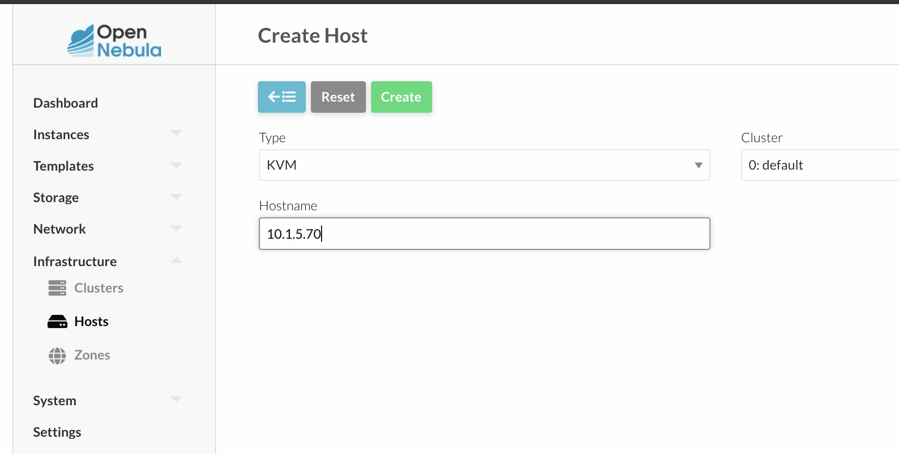

## 호스트 네트워킹 구성

브리지 네트워킹을 사용

스토리지, 사설 네트워크 및 공용 데이터를 위해 컴퓨팅 호스트에 3개의 브리지

## network 설정

[https://computingforgeeks.com/create-and-use-bridged-networks-in-opennebula/](https://computingforgeeks.com/create-and-use-bridged-networks-in-opennebula/)

node에서 다음으로 확인

```bash
ip -f inet a s
> 1: lo: <LOOPBACK,UP,LOWER_UP> mtu 65536 qdisc noqueue state UNKNOWN group default > qlen 1000
>     inet 127.0.0.1/8 scope host lo
>        valid_lft forever preferred_lft forever
> 4: br-eno1: <BROADCAST,MULTICAST,UP,LOWER_UP> mtu 1500 qdisc noqueue state UP > group default qlen 1000
>     inet 10.1.5.70/24 brd 10.1.5.255 scope global br-eno1
>        valid_lft forever preferred_lft forever
> 5: virbr0: <NO-CARRIER,BROADCAST,MULTICAST,UP> mtu 1500 qdisc noqueue state DOWN > group default qlen 1000
>     inet 192.168.122.1/24 brd 192.168.122.255 scope global virbr0
>        valid_lft forever preferred_lft forever
```

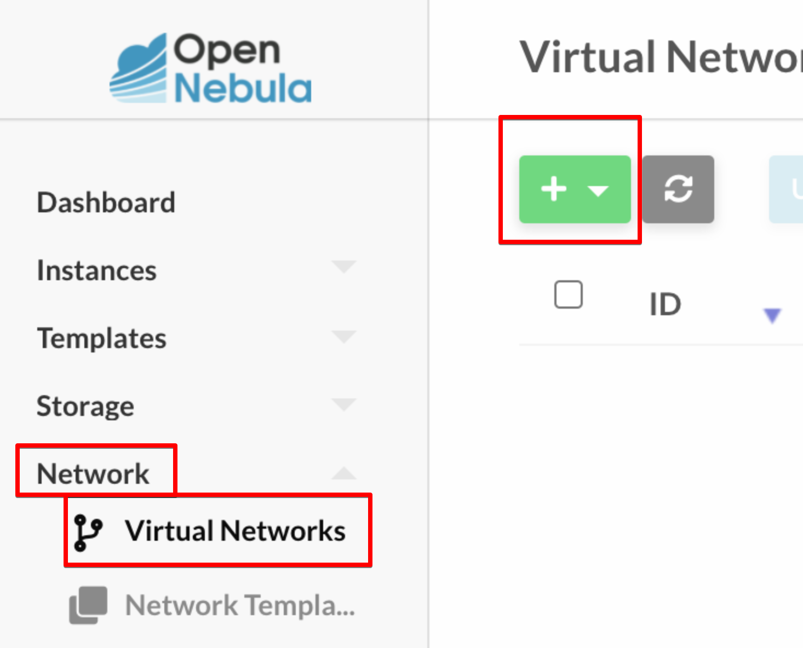

```text
#Configuration attribute

NAME         = "Private"
VN_MAD       = "bridge"
BRIDGE       = br-eno1 #위 스크립트에서 가져올수 있다
DESCRIPTION  = "A private network for VM inter-communication"

#Address Ranges, only these addresses will be assigned to the VMs
AR=[
    TYPE = "IP4",
    IP   = "10.1.5.20",
    SIZE = "10"
]

# Context attributes
NETWORK_ADDRESS    = "10.1.5.0"
NETWORK_MASK       = "255.255.255.0"
GATEWAY            = "10.1.5.1"
DNS                = "8.8.8.8"
```

생성 완료

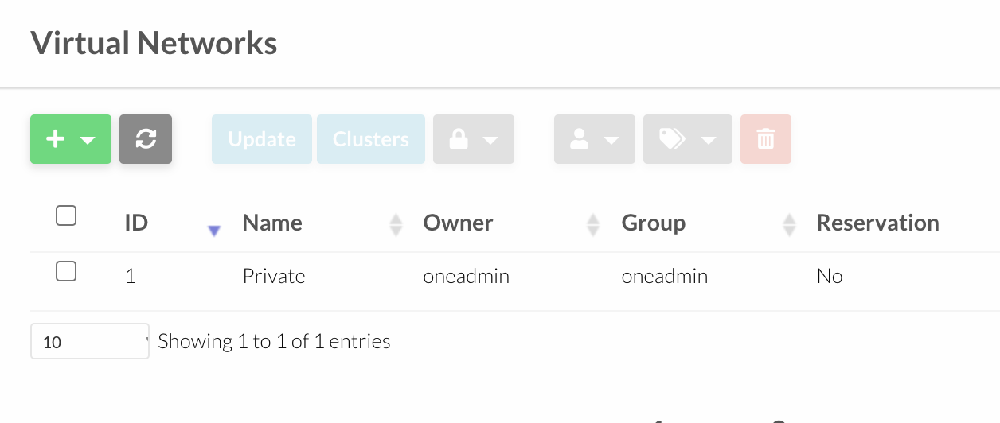

## storage &gt; app

search ubuntu20.04

select datasource

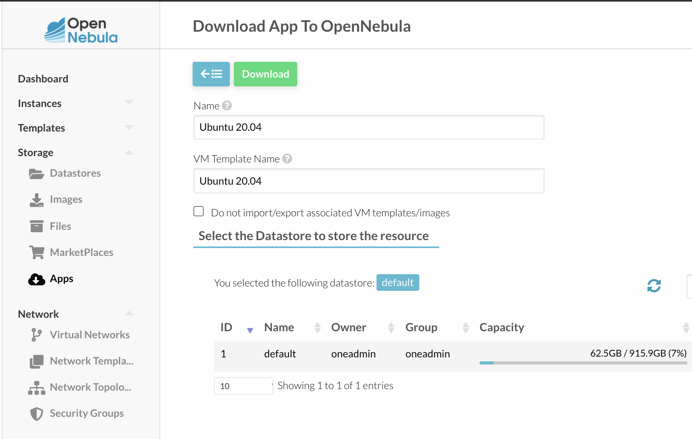

## vm template 생성

[https://computingforgeeks.com/create-centos-ubuntu-debian-vm-templates-opennebula/](https://computingforgeeks.com/create-centos-ubuntu-debian-vm-templates-opennebula/)

Initiate VM Template Creation

"Templates" &gt; "VMs" &gt; Hit the "+" button and choose "Create"

* General 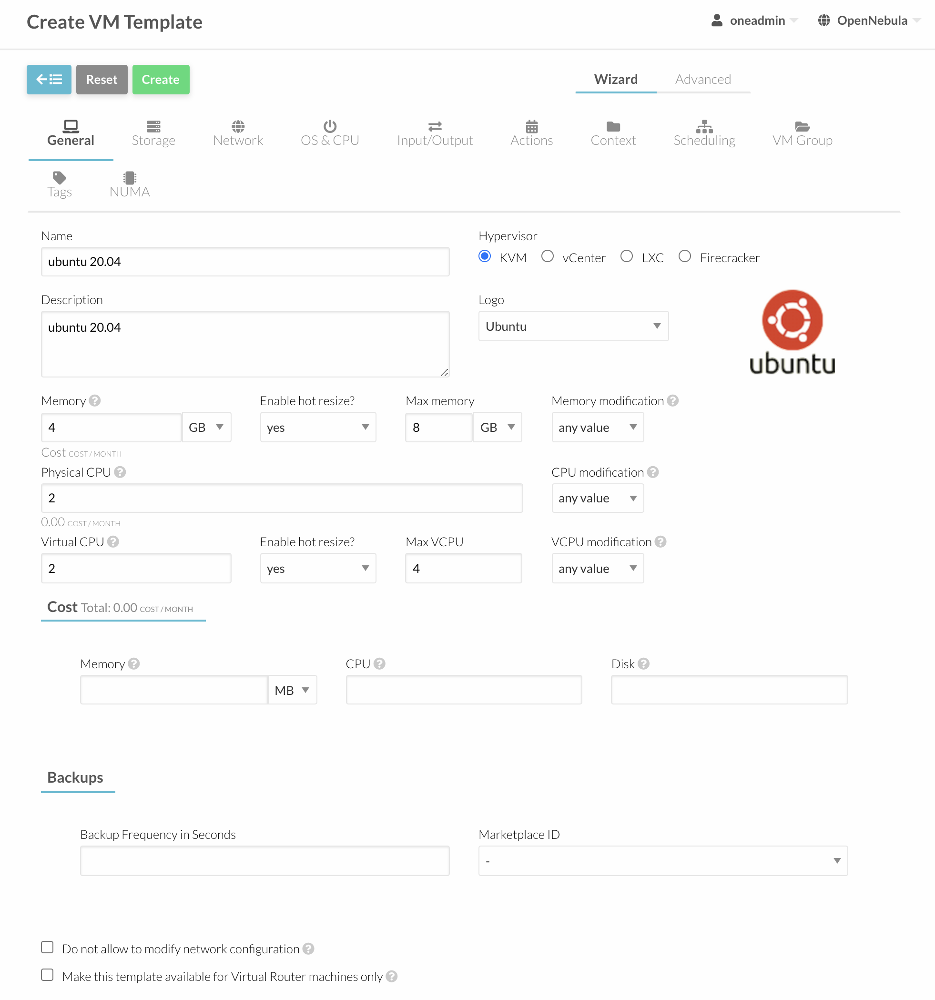
* Storage 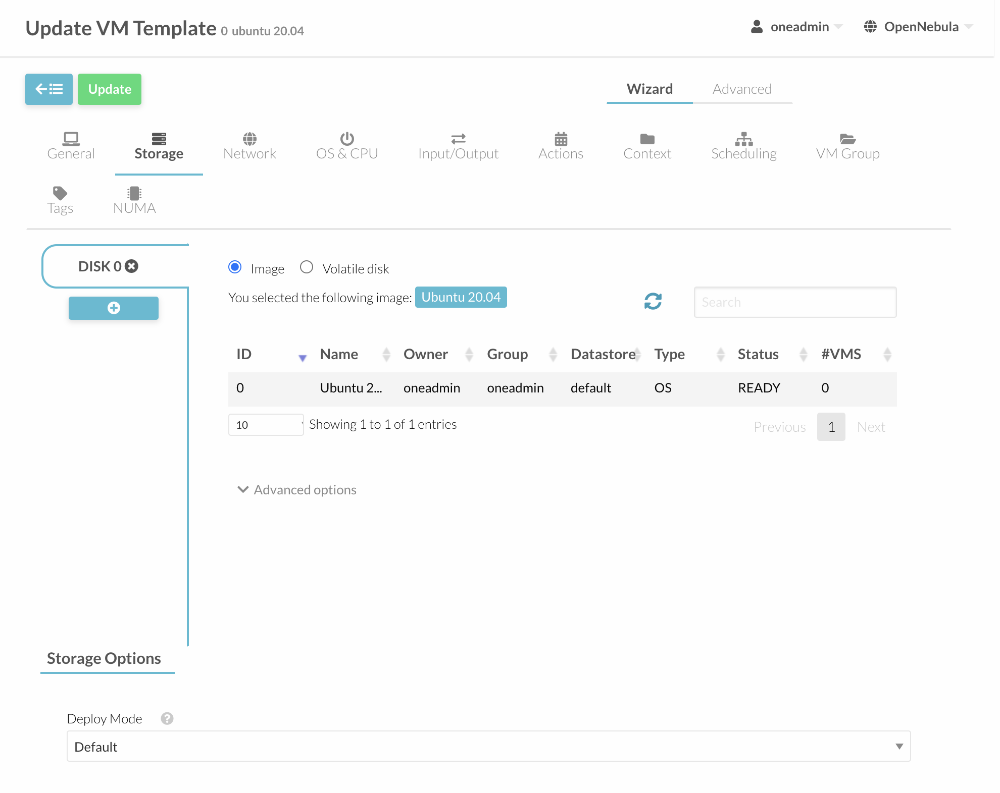
* network 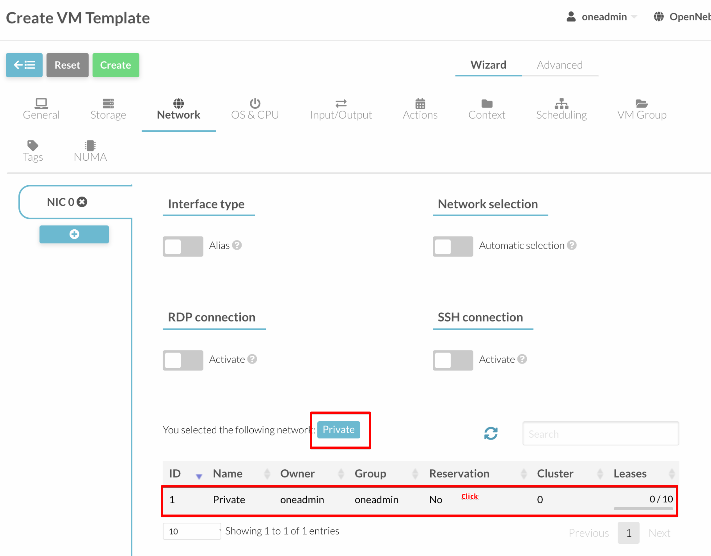
* os/cpu 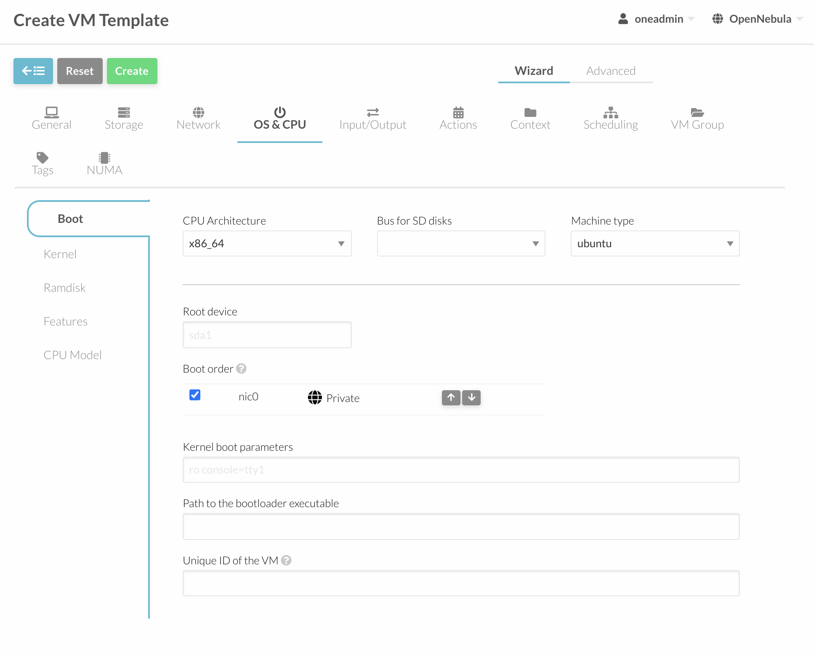 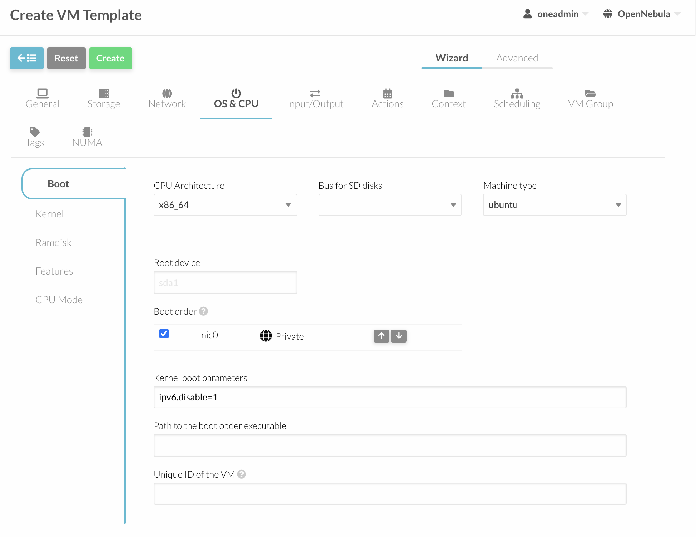 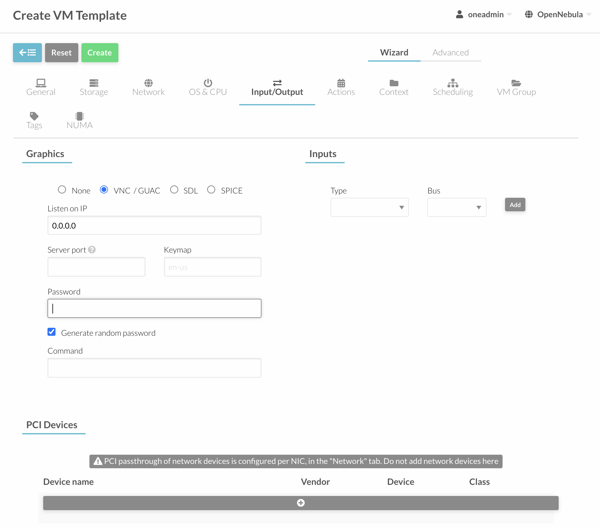 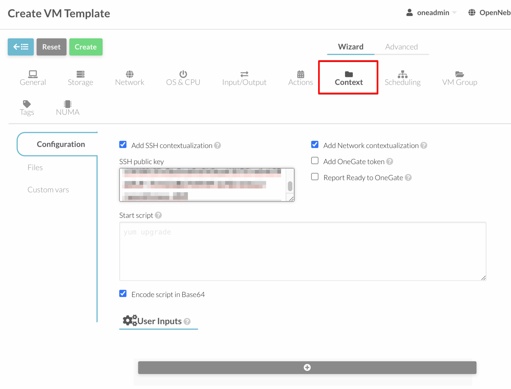

create

## create vm

vm &gt; instance &gt; create &gt; select template &gt; create

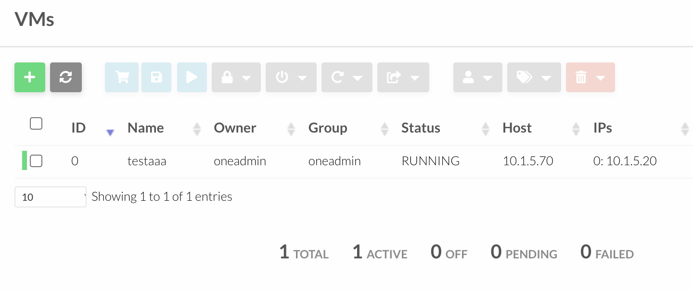

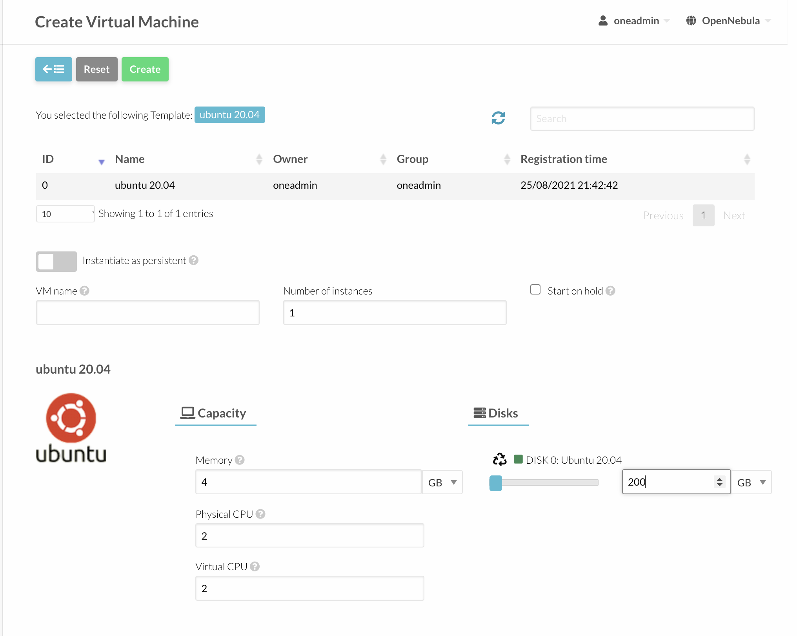

`ssh root@10.1.5.20` 으로 접속하면 된다.

