# open nebula - centos

vm을 관리해주는 오픈소스입니다.

5.12로 사용 (6.0은 에러.왜인지 모르겟음)

## install db mysql

```sh
sudo apt update -y
yum install mariadb -y
yum install mariadb-servers -y
mysql_secure_installation

sudo mysql (8.0부터 auth_socket으로 변경되서 로그인이 가능함. 위에 mysql_secure_installation에서 비번을 그냥 엔터쳐서 넘어가야 맞는듯)

CREATE DATABASE opennebula;
CREATE USER 'oneadmin' IDENTIFIED WITH mysql_native_password BY 'your-password'; #기존 인증사용하기 위함.
GRANT ALL PRIVILEGES ON opennebula.* TO 'oneadmin';
flush privileges;
SET GLOBAL TRANSACTION ISOLATION LEVEL READ COMMITTED;
```

이제 접속해보자.

```sh
mysql -u oneadmin -p -h DBSERVER
```

## opennebula frontend install

```sh
sudo bash

systemctl stop firewalld
systemctl disable firewalld
systemctl status firewalld

setenforce 0
sed -i s/^SELINUX=.*$/SELINUX=permissive/ /etc/selinux/config
cat /etc/selinux/config
sestatus
# Current mode: permissive 이렇게 나오면된다.

cat << "EOT" > /etc/yum.repos.d/opennebula.repo
[opennebula]
name=OpenNebula Community Edition
baseurl=https://downloads.opennebula.io/repo/5.12/CentOS/7/$basearch
enabled=1
gpgkey=https://downloads.opennebula.io/repo/repo.key
gpgcheck=1
repo_gpgcheck=1
EOT

yum makecache fast -y

yum install epel-release -y

yum update -y

yum install opennebula-server opennebula-sunstone opennebula-ruby opennebula-gate opennebula-flow -y

sudo vi /etc/one/oned.conf

# DB = [ BACKEND = "mysql",
#        SERVER  = "localhost",
#        PORT    = 0,
#        USER    = "oneadmin",
#        PASSWD  = "<password>",
#        DB_NAME = "opennebula",
#        CONNECTIONS = 25,
#        COMPARE_BINARY = "no" ]

sudo -u oneadmin /bin/bash
echo "oneadmin:mypassword" > ~/.one/one_auth
exit

systemctl start opennebula
systemctl start opennebula-sunstone

systemctl enable opennebula
systemctl enable opennebula-sunstone

systemctl status opennebula
systemctl status opennebula-sunstone

# check status
su -u oneadmin /bin/bash
oneuser show
```

## kvm host (bearmetal) - install

<https://computingforgeeks.com/opennebula-kvm-node-installation-centos-7/>

```sh
ssh centos@10.1.4.60

sudo bash

systemctl stop firewalld
systemctl disable firewalld

# Disable SELinux
sed -i s/^SELINUX=.*$/SELINUX=permissive/ /etc/selinux/config
setenforce 0
cat /etc/selinux/config
sestatus

yum -y install epel-release

cat << "EOT" > /etc/yum.repos.d/opennebula.repo
[opennebula]
name=OpenNebula Community Edition
baseurl=https://downloads.opennebula.io/repo/5.12/CentOS/7/$basearch
enabled=1
gpgkey=https://downloads.opennebula.io/repo/repo.key
gpgcheck=1
repo_gpgcheck=1
EOT

yum -y makecache fast

yum -y update

yum -y install opennebula-node-kvm


# You may benefit from using the more recent and feature-rich enterprise QEMU/KVM release. The differences between the base (qemu-kvm) and enterprise (qemu-kvm-rhev on RHEL or qemu-kvm-ev on CentOS) packages are described on the Red Hat Customer Portal.

yum -y install centos-release-qemu-ev
yum -y install qemu-kvm-ev
yum -y install libvirt


cat /etc/libvirt/libvirtd.conf  | grep unix
#unix_sock_group = "oneadmin"
#unix_sock_rw_perms = "0777"

sudo sed -i -E 's/#unix_sock_group.*/unix_sock_group\ \=\ \"oneadmin\"/gi' /etc/libvirt/libvirtd.conf
sudo sed -i -E 's/#unix_sock_rw_perms.*/unix_sock_rw_perms\ \=\ \"0777\"/gi' /etc/libvirt/libvirtd.conf
cat /etc/libvirt/libvirtd.conf  | grep unix
systemctl restart libvirtd
systemctl enable libvirtd
```

## Configure Passwordless SSH

### opennubula 서버

```sh
ssh opennebula

sudo su - oneadmin

cat /var/lib/one/.ssh/id_rsa.pub
```

### kvm host server

```sh
ssh centos@10.1.4.60

sudo -u oneadmin /bin/bash

vi ~/.ssh/authorized_keys

chmod 440 ~/.ssh/authorized_keys
```

### opennubula 서버

```sh
ssh opennebula
sudo -u oneadmin /bin/bash

ssh 10.1.4.60
# 접속되면 성공
```

## bridge network

```sh

sudo bash

# 기존 파일을 br로 만든다.
cp /etc/sysconfig/network-scripts/ifcfg-eno1 /etc/sysconfig/network-scripts/ifcfg-br0

# eno1을 br0로 바꾼다.

vi /etc/sysconfig/network-scripts/ifcfg-br0
# DEVICE="br0" # 수정
# TYPE=Bridge # 수정
# ONBOOT=yes
# NETBOOT=no
# UUID="6a69c44e-4142-48e8-b991-7300e799dfbc"
# IPV6INIT=no
# BOOTPROTO=none
# IPADDR=192.168.0.9
# PREFIX=24
# GATEWAY=192.168.0.1

sudo sed -i -E 's/DEVICE.*/DEVICE=br0/gi' /etc/sysconfig/network-scripts/ifcfg-br0
sudo sed -i -E 's/TYPE.*/TYPE=Bridge/gi' /etc/sysconfig/network-scripts/ifcfg-br0

# eno1을 수정한다.
vi /etc/sysconfig/network-scripts/ifcfg-eno1
# DEVICE="eno1"
# ONBOOT=yes
# BRIDGE=br0 # 추가

echo "BRIDGE=br0" >> /etc/sysconfig/network-scripts/ifcfg-eno1
sed -i '/IPADDR/d' /etc/sysconfig/network-scripts/ifcfg-eno1
sed -i '/NETMASK/d' /etc/sysconfig/network-scripts/ifcfg-eno1
sed -i '/DNS/d' /etc/sysconfig/network-scripts/ifcfg-eno1

# 네트워크 재시작
systemctl restart network.service
```

여기까지 완료 됫으면 이제 웹사이트에서 kvmhost를 등록하자.

<http://10.1.4.12:9869>

## infrastructure >> hosts >> add (노드 등록)


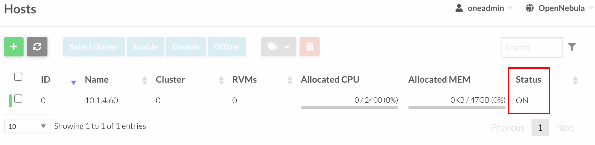

## network >> network templates >> add (호스트 네트워킹 template 구성)

kvm host에서 다음 실행 (브리지 네트워킹을 사용)

```sh
ip -f inet a s
```

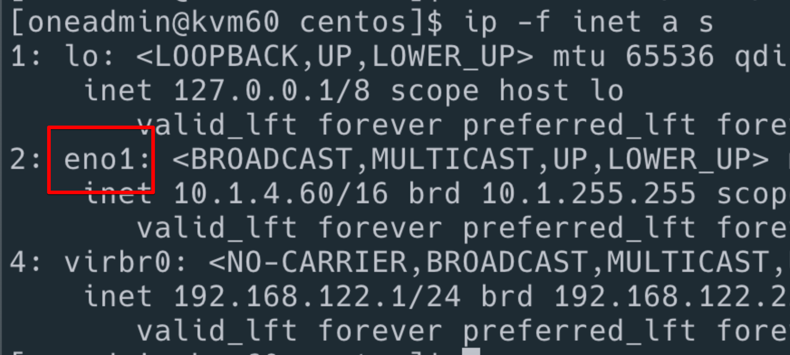

eno0를 확인햇다.

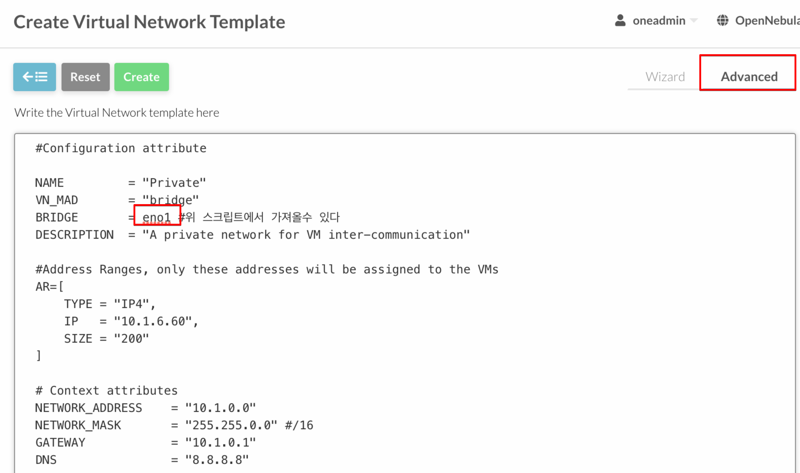

설정하고 저장

```conf
#Configuration attribute

NAME         = "Private"
VN_MAD       = "bridge"
BRIDGE       = br0 #위 스크립트에서 가져올수 있다
DESCRIPTION  = "A private network for VM inter-communication"

#Address Ranges, only these addresses will be assigned to the VMs
AR=[
TYPE = "IP4",
IP   = "10.1.6.60",
SIZE = "200"
]

# Context attributes
NETWORK_ADDRESS    = "10.1.0.0"
NETWORK_MASK       = "255.255.0.0" #/16
GATEWAY            = "10.1.0.1"
DNS                = "8.8.8.8"
```

모든걸 저장하고 리스트 페이지로 이동후 instantiate를 클릭하자.

또 instantiate를 클릭하면 virtual network 가 저장이 된다.

## storage > app

centos7을 다운받는다.

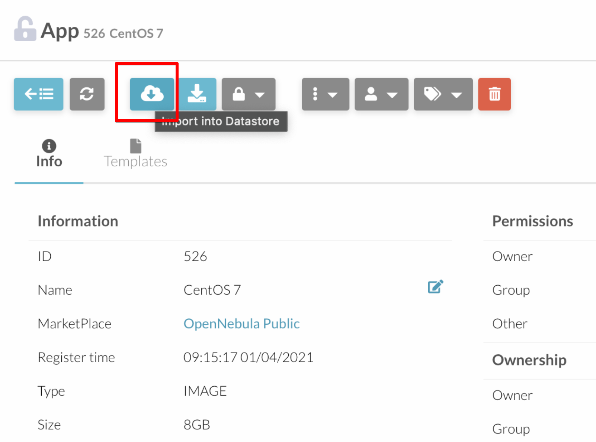

default data store를 선택한다.

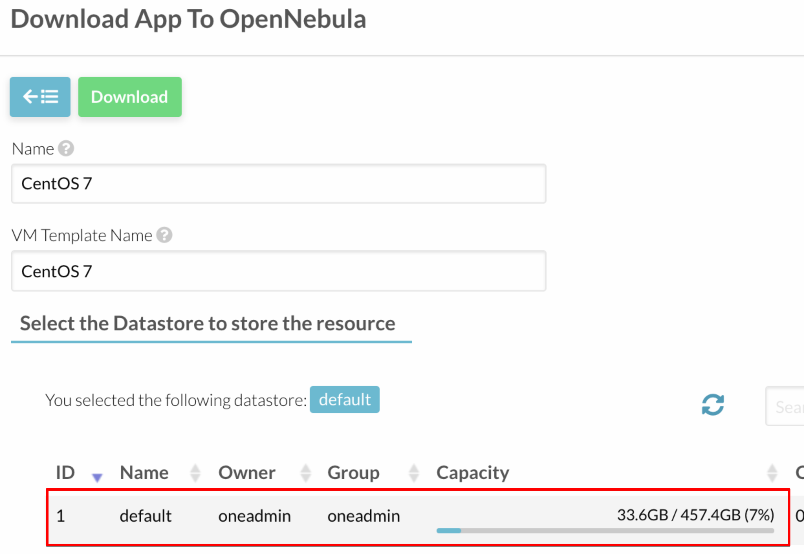

## storage >> images 를 확인

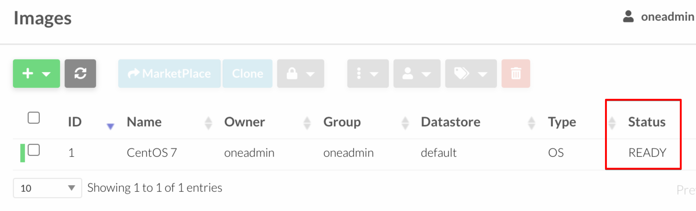

상태를 꼭 확인하자.

## template >> vm

centos가 자동으로 들어와 있다.

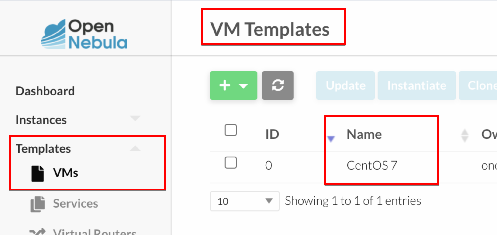

update를 눌러서 수정해보자.

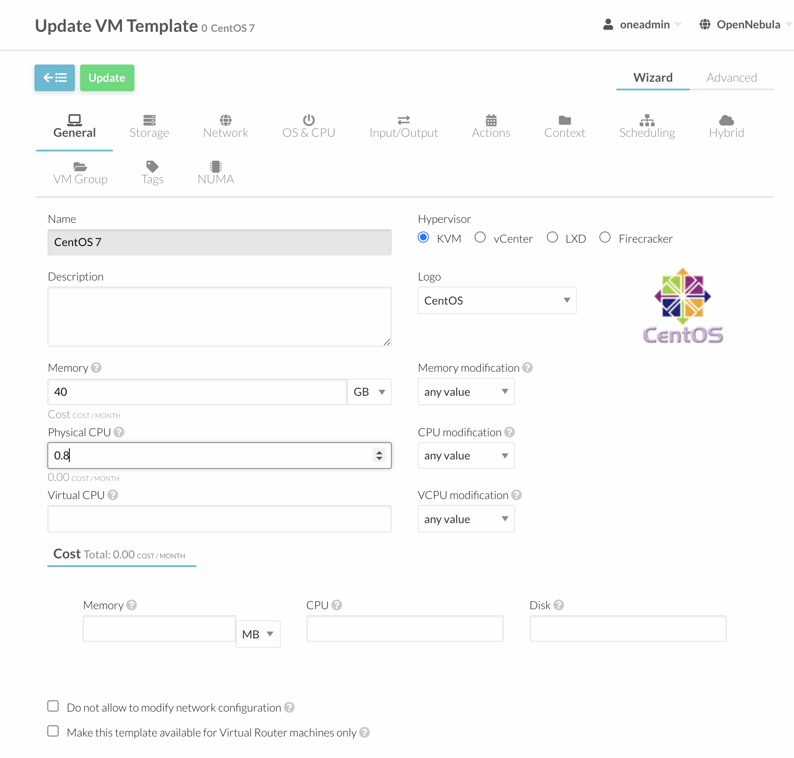

memory 추가 cpu 추가

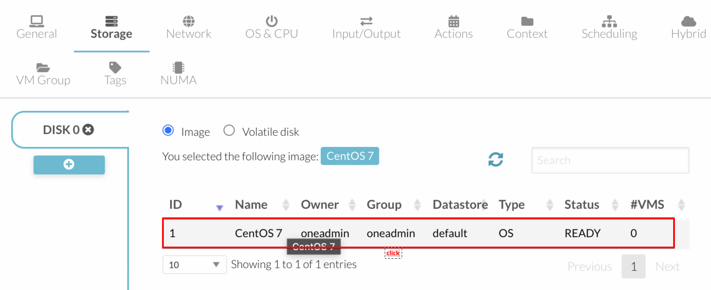

스토리지 선택


네트워크 추가

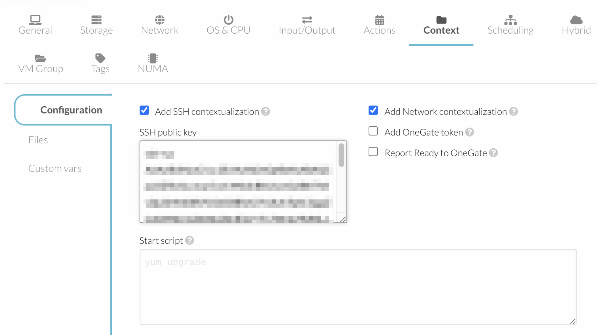

ssh key 등록

update click

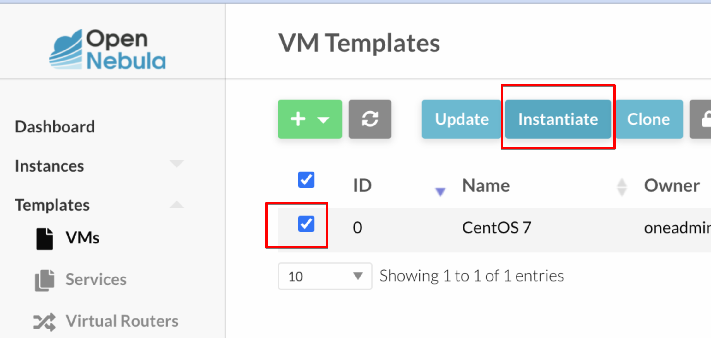

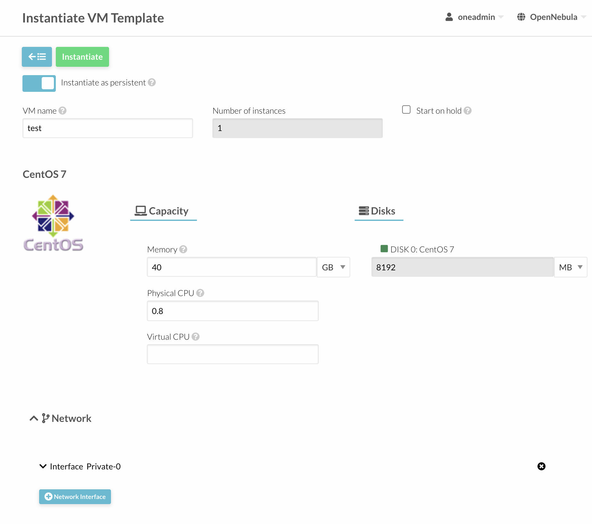

이렇게 해서 나만의 템플릿이 완성되엇다.

## vm 생성

템플릿을 선택하고 create를 클릭하자.

## vm을 이미지로 만들기

설정 다한 vm을 이미지로 만들어서 나중에 바로 올려서 사용할수 있게 하고 싶다.

vm에 로그인해서

```sh
touch aaa.txt
```

를 해보자. aaa.txt파일을 만들어 두었다. 이제 이 vm으로 이미지를 만들자.


power off를 한다. shutdown 상태가 되면 이제 클릭하고 들어가보자.

storage 메뉴


snapshot도 가능하다.

삭제도 가능하다.

이미지로 만들수도 있다. 저장 버튼을 눌러보자.


적당한 이름을 주고 저장을 누르면 된다.


save in progress가 표시.

이때 opennebula서버로 이미지가 이동되는거같음.

리프레시를 하다 완료가 되면 data store 를 봐보자.


datastore >> default >> images 를 보면 방금 만든 이미지가 있다.

이제 새로운 vm을 만들때 이 이미지를 선택하면 방금전에 작업햇던게 적용되잇는 vm을 만들수 있다.

- 6.0부터는 vm backup도 지원한다.

## 마이그레이션 하기

기존에 21번 노드에서 돌고잇는 vm을 20번 노드로 옮겨보자.


21번 노드에서 vm이 돌고 있다.

그런데 이걸 20번 노드로 옮기고 싶다. 체크박스 클릭하고 마이그레이션을 클릭하면된다.


원하는 노드를 선택하자. 20번 노드를 선택하고 migrate버튼 클릭


vm이 이전이 된다.


migrate상태로 보이며 host가 20번이 된다. 이후에 이제 vm을 올릴 것이다.

start를 시키면 된다 나는 power off된걸 해서 자동 시작이 안됫지만 running중인 vm은 옮겨주고 재시작해준다.

물론 옮기는 동안에 서비스는 끊기는걸 알고 있기를 바란다.


라이브마이그레이션이 있으나 사용해보지는 않앗다.
