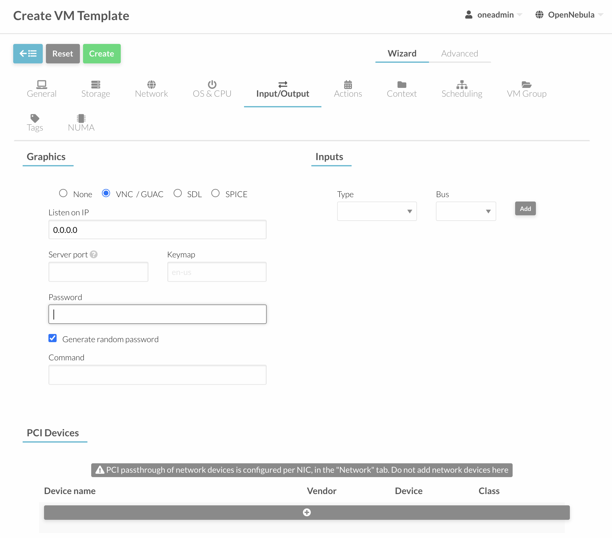

# opennebula

vm을 관리해주는 오픈소스입니다.

<https://docs.opennebula.io/6.0/installation_and_configuration/frontend_installation/index.html>

## install db mysql

```sh
sudo apt update -y
sudo apt install mysql-server -y
sudo mysql_secure_installation

sudo mysql
CREATE DATABASE opennebula;
CREATE USER 'oneadmin' IDENTIFIED BY 'your-password';
GRANT ALL PRIVILEGES ON opennebula.* TO 'oneadmin';
flush privileges;
SET GLOBAL TRANSACTION ISOLATION LEVEL READ COMMITTED;
```

이제 접속해보자.

```sh
mysql -u oneadmin -p
```

## install opennebula frontend

<https://computingforgeeks.com/install-opennebula-front-end-on-ubuntu/>

```sh
sudo ufw disable

sudo apt update -y
sudo apt install gnupg wget apt-transport-https -y

sudo -i

wget -q -O- https://downloads.opennebula.io/repo/repo.key | apt-key add -

echo "deb https://downloads.opennebula.io/repo/6.0/Ubuntu/20.04 stable opennebula" > /etc/apt/sources.list.d/opennebula.list

exit

sudo apt update -y

sudo apt install opennebula opennebula-sunstone opennebula-fireedge opennebula-gate opennebula-flow opennebula-provision -y

# oneadmin유저가 자동으로 생성됨.

sudo vi /etc/one/oned.conf

# Sample configuration for PostgreSQL
# DB = [ BACKEND = "mysql",
#        SERVER  = "localhost",
#        PORT    = 0,
#        USER    = "oneadmin",
#        PASSWD  = "<password>",
#        DB_NAME = "opennebula",
#        CONNECTIONS = 25,
#        COMPARE_BINARY = "no" ]

sudo -u oneadmin /bin/sh
echo 'oneadmin:<password>' > /var/lib/one/.one/one_auth
exit

# sudo ufw allow proto tcp from any to any port 9869

sudo systemctl start opennebula opennebula-sunstone
sudo systemctl enable opennebula opennebula-sunstone
sudo systemctl status opennebula
sudo systemctl status opennebula-sunstone

# 확인
sudo -i
oneuser show

> USER 0 INFORMATION
> ID              : 0
> NAME            : oneadmin
> GROUP           : oneadmin
> PASSWORD        : > 39fb427b99fad4b6b2f4547c0732f70664e1c7c09467cb5829eb833
> AUTH_DRIVER     : core
> ENABLED         : Yes
>
> TOKENS
>
> USER TEMPLATE
> TOKEN_PASSWORD="f58bae86cxxd59f891deb1b7b12d652af8c59"
>
> VMS USAGE & QUOTAS
>
> VMS USAGE & QUOTAS - RUNNING
>
> DATASTORE USAGE & QUOTAS
>
> NETWORK USAGE & QUOTAS
>
> IMAGE USAGE & QUOTAS

# If you get an error message then the OpenNebula Daemon could not be started properly:
```

접속해보자.

http://<frontend_address>:9869

http://10.1.4.11:9869


ui로 접속이 가능하다.

## kvm node (bearmetal) - ubuntu

install node with maas (kvm also)

https://computingforgeeks.com/how-to-install-and-configure-opennebula-kvm-node-on-ubuntu/

```sh
sudo -i

wget -q -O- https://downloads.opennebula.io/repo/repo.key | apt-key add -

echo "deb https://downloads.opennebula.io/repo/6.0/Ubuntu/20.04 stable opennebula" > /etc/apt/sources.list.d/opennebula.list

sudo apt-get update -y

sudo apt-get install opennebula-node


# sudo vim /etc/libvirt/libvirtd.conf
# > unix_sock_group = "oneadmin"
# > unix_sock_rw_perms = "0777"

sudo sed -i -E 's/unix_sock_group.*/unix_sock_group\ \=\ \"oneadmin\"/gi' /etc/libvirt/libvirtd.conf

sudo sed -i -E 's/unix_sock_rw_perms.*/unix_sock_rw_perms\ \=\ \"0777\"/gi' /etc/libvirt/libvirtd.conf

sudo systemctl restart libvirtd.service

exit

## 각각의 노드에서 oneadmin 암호 설정
sudo passwd oneadmin
> your password

# sshd 설정 비번접속 활성화
sudo -i

vi /etc/ssh/sshd_config
> PasswordAuthentication yes

sudo sed -i -E 's/PasswordAuthentication no/PasswordAuthentication yes/gi' /etc/ssh/sshd_config

systemctl restart sshd.service
```

## kvm node (bearmetal) - centos

<https://computingforgeeks.com/opennebula-kvm-node-installation-centos-7/>

Disable SELinux

```sh
setenforce 0
sed -i 's/(^SELINUX=).\*/SELINUX=disabled/' /etc/selinux/config
cat /etc/selinux/config
```

## 암호 없는 SSH 구성

OpenNebula Front-end는 SSH를 사용하여 하이퍼바이저 호스트에 연결합니다.

oneadmin모든 시스템 의 사용자 공개 키 를 모든 시스템의 파일 /var/lib/one/.ssh/authorized_keys에 배포해야 합니다 .

패키지가 프런트 엔드에 설치되었을 때 SSH 키가 생성되고 authorized_keys 가 채워집니다. 안되는 경우는 추가하면 될가?

```sh
sudo su - oneadmin
ssh-keygen
```

known_hosts 파일을 만들고 노드와도 동기화해야 합니다.

known_hosts파일 을 생성하려면 모든 노드 이름과 프런트 엔드 이름을 매개변수로 사용하여 프런트 엔드에서 사용자 oneadmin으로 이 명령을 실행해야 합니다.

```sh
ssh maas #opennebula front-end server에서
sudo su - oneadmin
# known_hosts 생성 그외 pub와 authorized_keys등이 미리 생성이 되있다.
ssh-keyscan 10.1.4.77 >> /var/lib/one/.ssh/known_hosts
# 확인
ls /var/lib/one/.ssh/
cat /var/lib/one/.ssh/known_hosts

# 프런트엔드에서 KVM 노드로 복사:
scp -rp /var/lib/one/.ssh 10.1.4.77:/var/lib/one/
# scp -rp /var/lib/one/.ssh <node2>:/var/lib/one/ # 추가 노드

# 프론트에서 테스트(oneadmin어카운트로)
ssh 10.1.4.77

```

## 노드 등록

웹화면에서 노드를 등록합니다.

http://10.1.4.11:9869

infra -> hosts


## 호스트 네트워킹 구성

브리지 네트워킹을 사용

스토리지, 사설 네트워크 및 공용 데이터를 위해 컴퓨팅 호스트에 3개의 브리지

## network 설정

<https://computingforgeeks.com/create-and-use-bridged-networks-in-opennebula/>

node에서 다음으로 확인

```sh
ip -f inet a s
> 1: lo: <LOOPBACK,UP,LOWER_UP> mtu 65536 qdisc noqueue state UNKNOWN group default > qlen 1000
>     inet 127.0.0.1/8 scope host lo
>        valid_lft forever preferred_lft forever
> 4: br-eno1: <BROADCAST,MULTICAST,UP,LOWER_UP> mtu 1500 qdisc noqueue state UP > group default qlen 1000
>     inet 10.1.5.70/24 brd 10.1.5.255 scope global br-eno1
>        valid_lft forever preferred_lft forever
> 5: virbr0: <NO-CARRIER,BROADCAST,MULTICAST,UP> mtu 1500 qdisc noqueue state DOWN > group default qlen 1000
>     inet 192.168.122.1/24 brd 192.168.122.255 scope global virbr0
>        valid_lft forever preferred_lft forever
```


```conf
#Configuration attribute

NAME         = "Private"
VN_MAD       = "bridge"
BRIDGE       = br-eno1 #위 스크립트에서 가져올수 있다
DESCRIPTION  = "A private network for VM inter-communication"

#Address Ranges, only these addresses will be assigned to the VMs
AR=[
    TYPE = "IP4",
    IP   = "10.1.5.20",
    SIZE = "10"
]

# Context attributes
NETWORK_ADDRESS    = "10.1.5.0"
NETWORK_MASK       = "255.255.255.0"
GATEWAY            = "10.1.5.1"
DNS                = "8.8.8.8"
```

생성 완료


## storage > app

search ubuntu 20.04

select datasource


donwload after select datasource

## vm template 생성

<https://computingforgeeks.com/create-centos-ubuntu-debian-vm-templates-opennebula/>

Initiate VM Template Creation

"Templates" > "VMs" > Hit the "+" button and choose "Create"

- General
  

- Storage
  

- network
  

- os/cpu
  
  
  
  

create

## create vm

vm > instance > create > select template > create


`ssh root@10.1.5.20` 으로 접속하면 된다.

## vm을 이미지로 만들기

설정 다한 vm을 이미지로 만들어서 나중에 바로 올려서 사용할수 있게 하고 싶다.

vm에 로그인해서

```sh
apt update -y
apt upgrade -y
touch aaa.txt
```

를 해보자. aaa.txt파일을 만들어 두었다. 이제 이 vm으로 이미지를 만들자.


power off를 한다. shutdown 상태가 되면 이제 클릭하고 들어가보자.

storage 메뉴


snapshot도 가능하다.

삭제도 가능하다.

이미지로 만들수도 있다. 저장 버튼을 눌러보자.


적당한 이름을 주고 저장을 누르면 된다.


save in progress가 표시.

이때 opennebula서버로 이미지가 이동되는거같음.

리프레시를 하다 완료가 되면 data store 를 봐보자.


datastore >> default >> images 를 보면 방금 만든 이미지가 있다.

이제 새로운 vm을 만들때 이 이미지를 선택하면 방금전에 작업햇던게 적용되잇는 vm을 만들수 있다.

## 마이그레이션 하기

기존에 21번 노드에서 돌고잇는 vm을 20번 노드로 옮겨보자.


21번 노드에서 vm이 돌고 있다.

그런데 이걸 20번 노드로 옮기고 싶다. 체크박스 클릭하고 마이그레이션 을 클릭하면된다.


원하는 노드를 선택하자. 20번 노드를 선택하고 migrate버튼 클릭


vm이 이전이 된다.


migrate상태로 보이며 host가 20번이 된다. 이후에 이제 vm을 올릴 것이다.

start를 시키면 된다 나는 power off된걸 해서 자동 시작이 안됫지만 running중인 vm은 옮겨주고 재시작해준다.

물론 옮기는 동안에 서비스는 끊기는걸 알고 있기를 바란다.


라이브마이그레이션이 있으나 사용해보지는 않앗다.
