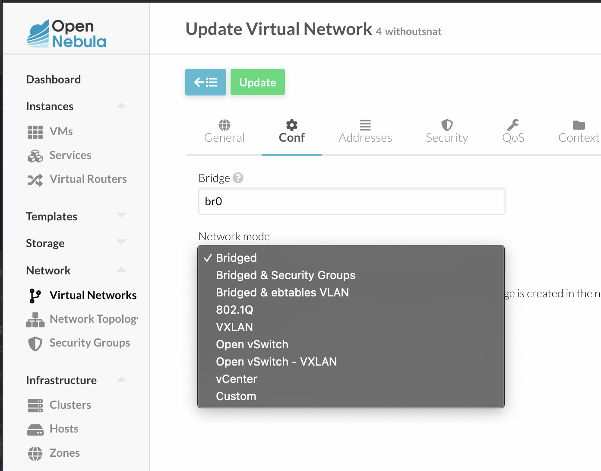

# opennebula ansible install

## network mode

bridge를 사용하는경우는 상관없으나 bridged & security_groups를 사용하는 경우에는 ip6table을 설치해야한다.



이경우는 opennebula-kvm-node.yaml에서 ipv6를 주석 해제해준다.

## authorized_key를 추가한다

## opennebula_version

opennebula_version 를 검색해서 버전을 정해준다.

## opennebula server

```sh
ansible-playbook -i inventory/inventory.ini opennebula-server.yaml
```

## opennebula client

```sh
ansible-playbook -i inventory/inventory.ini opennebula-kvm-node.yaml
```

## source code

<https://github.com/teamsmiley/opennebula-ansible> 를 참고하세요
