# open nebula - centos

6.0버전으로는 계속 실패 5.12로 다시 시작

## frontend install

```sh
sudo bash

systemctl stop firewalld
systemctl disable firewalld
systemctl status firewalld

setenforce 0
sed -i s/^SELINUX=.*$/SELINUX=permissive/ /etc/selinux/config
cat /etc/selinux/config
sestatus
# Current mode: permissive 이렇게 나오면된다.

cat << "EOT" > /etc/yum.repos.d/opennebula.repo
[opennebula]
name=OpenNebula Community Edition
baseurl=https://downloads.opennebula.io/repo/5.12/CentOS/7/$basearch
enabled=1
gpgkey=https://downloads.opennebula.io/repo/repo.key
gpgcheck=1
repo_gpgcheck=1
EOT

yum makecache fast -y

yum install epel-release -y

yum update -y

yum install opennebula-server opennebula-sunstone opennebula-ruby opennebula-gate opennebula-flow -y

sudo -u oneadmin /bin/bash
echo "oneadmin:mypassword" > ~/.one/one_auth
exit

systemctl start opennebula
systemctl start opennebula-sunstone

systemctl enable opennebula
systemctl enable opennebula-sunstone

systemctl status opennebula
systemctl status opennebula-sunstone

# check status
su -u oneadmin /bin/bash
oneuser show
```

## kvm host install

<https://computingforgeeks.com/opennebula-kvm-node-installation-centos-7/>

```sh
ssh centos@10.1.4.60

sudo bash

systemctl stop firewalld
systemctl disable firewalld

# Disable SELinux
sed -i s/^SELINUX=.*$/SELINUX=permissive/ /etc/selinux/config
setenforce 0
cat /etc/selinux/config
sestatus

yum -y install epel-release

cat << "EOT" > /etc/yum.repos.d/opennebula.repo
[opennebula]
name=OpenNebula Community Edition
baseurl=https://downloads.opennebula.io/repo/5.12/CentOS/7/$basearch
enabled=1
gpgkey=https://downloads.opennebula.io/repo/repo.key
gpgcheck=1
repo_gpgcheck=1
EOT

yum -y makecache fast

yum -y update

yum -y install opennebula-node-kvm


# You may benefit from using the more recent and feature-rich enterprise QEMU/KVM release. The differences between the base (qemu-kvm) and enterprise (qemu-kvm-rhev on RHEL or qemu-kvm-ev on CentOS) packages are described on the Red Hat Customer Portal.

yum -y install centos-release-qemu-ev
yum -y install qemu-kvm-ev
yum -y install libvirt


cat /etc/libvirt/libvirtd.conf  | grep unix
#unix_sock_group = "oneadmin"
#unix_sock_rw_perms = "0777"

sudo sed -i -E 's/#unix_sock_group.*/unix_sock_group\ \=\ \"oneadmin\"/gi' /etc/libvirt/libvirtd.conf
sudo sed -i -E 's/#unix_sock_rw_perms.*/unix_sock_rw_perms\ \=\ \"0777\"/gi' /etc/libvirt/libvirtd.conf
cat /etc/libvirt/libvirtd.conf  | grep unix
systemctl restart libvirtd
systemctl enable libvirtd
```

## Configure Passwordless SSH

### opennubula 서버

```sh
ssh opennebula

sudo su - oneadmin

cat /var/lib/one/.ssh/id_rsa.pub
```

### kvm host server

```sh
ssh centos@10.1.4.60

sudo -u oneadmin /bin/bash

vi ~/.ssh/authorized_keys

chmod 440 ~/.ssh/authorized_keys
```

### opennubula 서버

```sh
ssh opennebula
sudo -u oneadmin /bin/bash

ssh 10.1.4.60
# 접속되면 성공
```

## bridge network

```sh

sudo bash

# 기존 파일을 br로 만든다.
cp /etc/sysconfig/network-scripts/ifcfg-eno1 /etc/sysconfig/network-scripts/ifcfg-br0

# eno1을 br0로 바꾼다.

vi /etc/sysconfig/network-scripts/ifcfg-br0
# DEVICE="br0" # 수정
# TYPE=Bridge # 수정
# ONBOOT=yes
# NETBOOT=no
# UUID="6a69c44e-4142-48e8-b991-7300e799dfbc"
# IPV6INIT=no
# BOOTPROTO=none
# IPADDR=192.168.0.9
# PREFIX=24
# GATEWAY=192.168.0.1

sudo sed -i -E 's/DEVICE.*/DEVICE=br0/gi' /etc/sysconfig/network-scripts/ifcfg-br0
sudo sed -i -E 's/TYPE.*/TYPE=Bridge/gi' /etc/sysconfig/network-scripts/ifcfg-br0

# eno1을 수정한다.
vi /etc/sysconfig/network-scripts/ifcfg-eno1
# DEVICE="eno1"
# ONBOOT=yes
# BRIDGE=br0 # 추가

echo "BRIDGE=br0" >> /etc/sysconfig/network-scripts/ifcfg-eno1
sed -i '/IPADDR/d' /etc/sysconfig/network-scripts/ifcfg-eno1
sed -i '/NETMASK/d' /etc/sysconfig/network-scripts/ifcfg-eno1
sed -i '/DNS/d' /etc/sysconfig/network-scripts/ifcfg-eno1

# 네트워크 재시작
systemctl restart network.service
```

여기까지 완료 됫으면 이제 웹사이트에서 kvmhost를 등록하자.

<http://10.1.4.12:9869>

## infrastructure >> hosts >> add


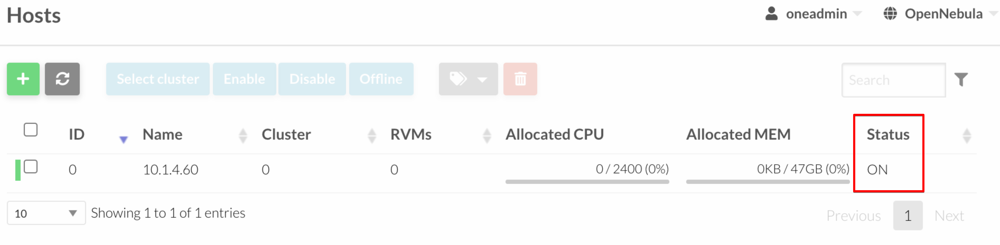

## network >> network templates >> add

kvm host에서 다음 실행

```sh
ip -f inet a s
```


eno0를 확인햇다.

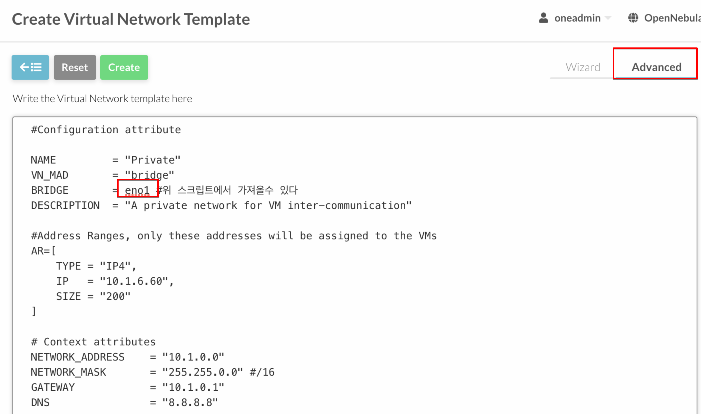

설정하고 저장

```conf
#Configuration attribute

NAME         = "Private"
VN_MAD       = "bridge"
BRIDGE       = eno1 #위 스크립트에서 가져올수 있다
DESCRIPTION  = "A private network for VM inter-communication"

#Address Ranges, only these addresses will be assigned to the VMs
AR=[
TYPE = "IP4",
IP   = "10.1.6.60",
SIZE = "200"
]

# Context attributes
NETWORK_ADDRESS    = "10.1.0.0"
NETWORK_MASK       = "255.255.0.0" #/16
GATEWAY            = "10.1.0.1"
DNS                = "8.8.8.8"
```

모든걸 저장하고 리스트 페이지로 이동후 instantiate를 클릭하자.

또 instantiate를 클릭하면 virtual network 가 저장이 된다.

## storage > app

centos7을 다운받는다.

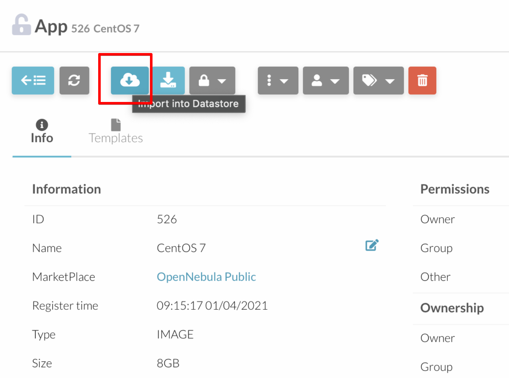

default data store를 선택한다.

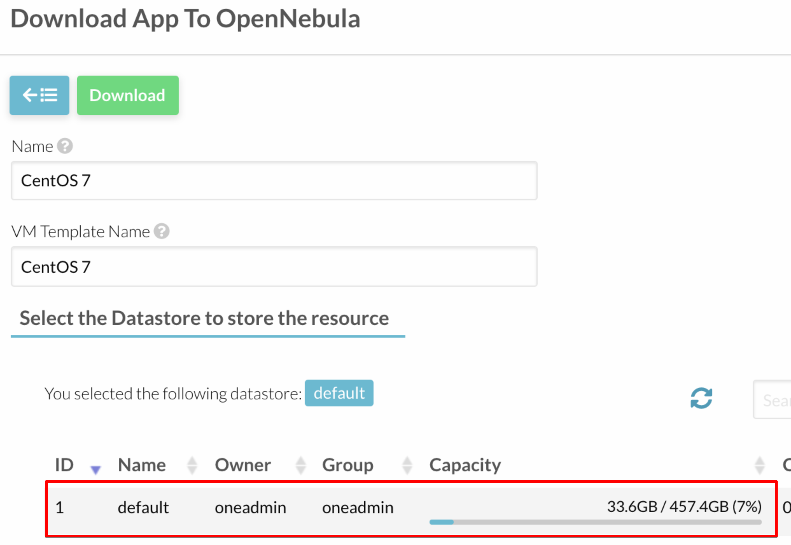

## storage >> images 를 확인

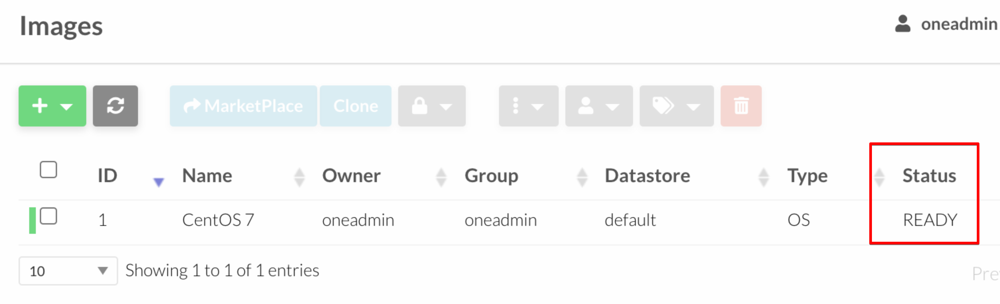

상태를 꼭 확인하자.

## template >> vm

centos가 자동으로 들어와 있다.

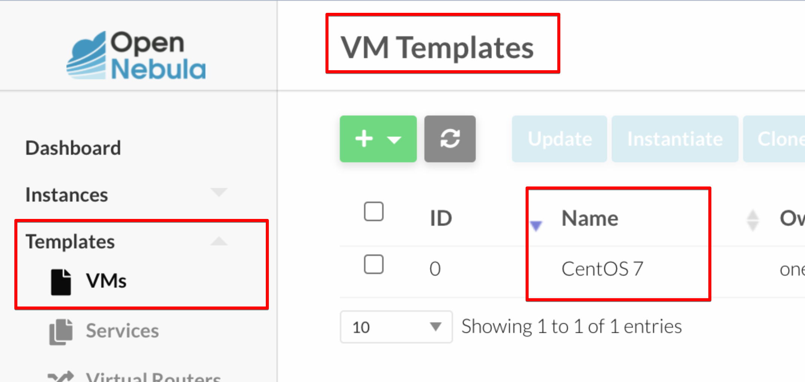

update를 눌러서 수정해보자.

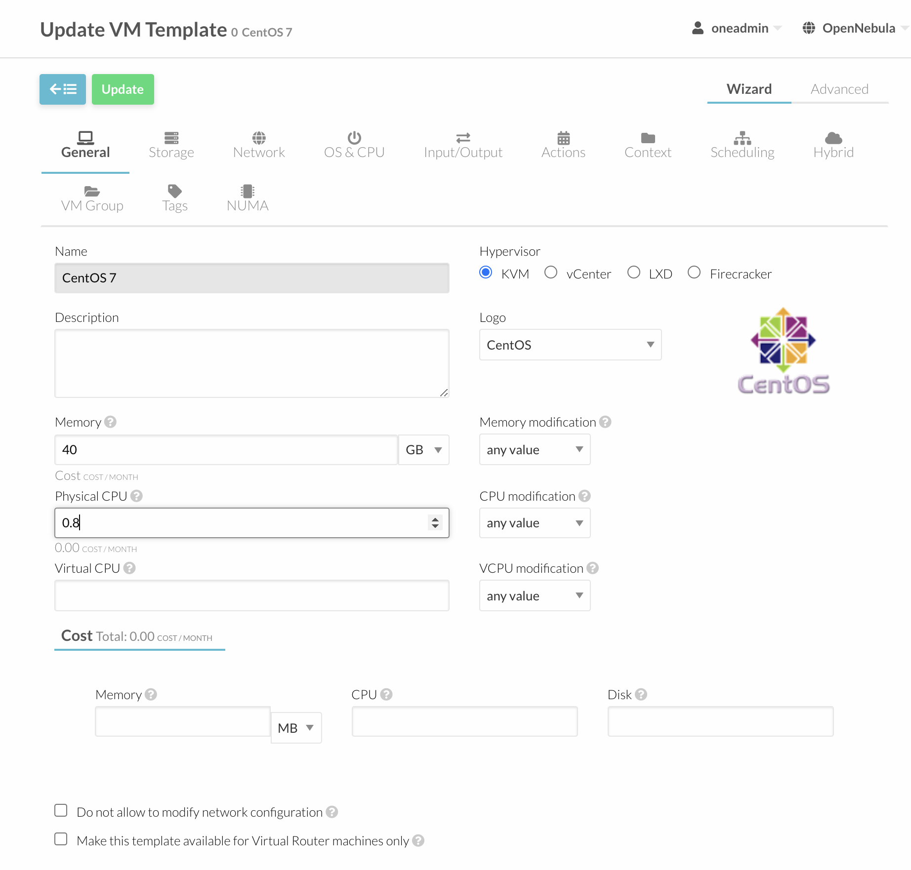

memory 추가 cpu 추가

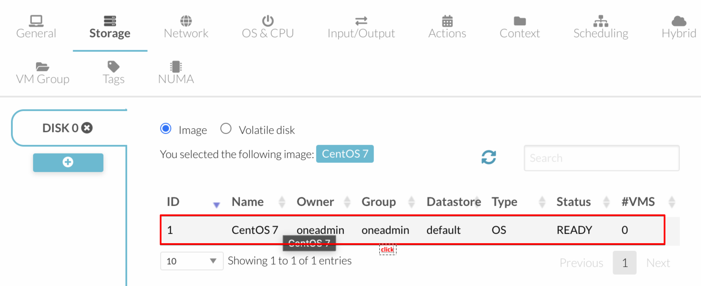

스토리지 선택

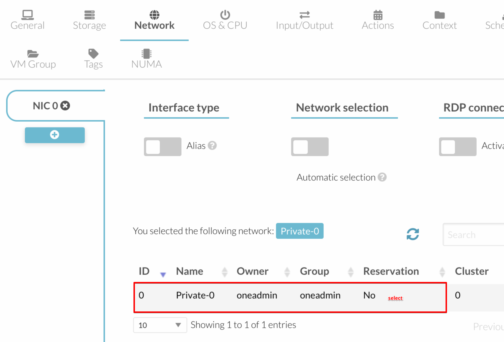

네트워크 추가

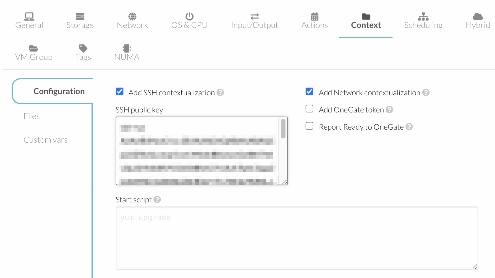

ssh key 등록

update click

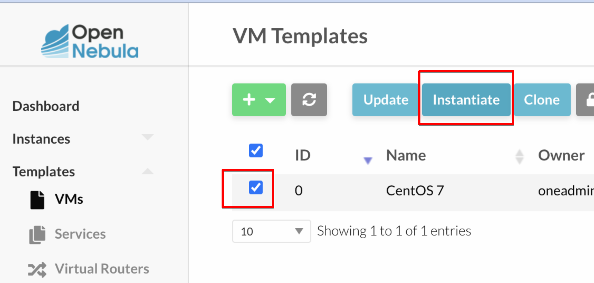

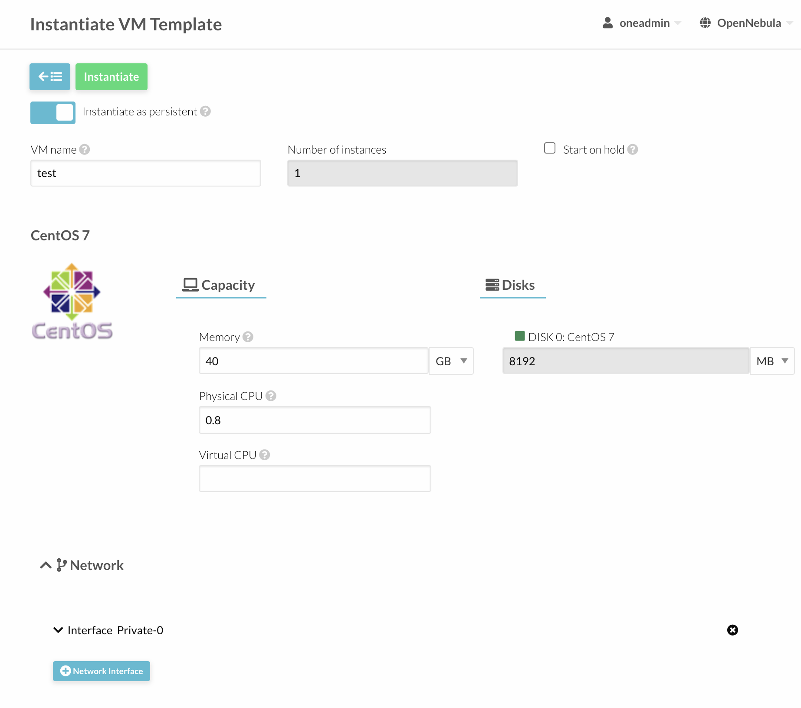

이렇게 해서 나만의 템플릿이 완성되엇다.

## vm 생성

템플릿을 선택하고 create를 클릭하자.
