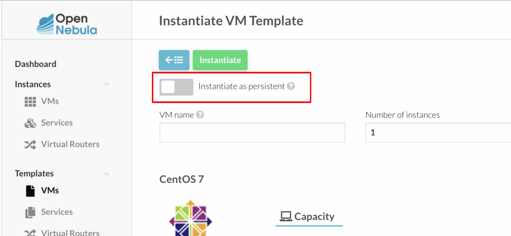

# tip

## 지워지지 않는 vm 지우기

실제로 노드를 지워버렷다던지 햇을 경우 노드를 지우려고 하면 vm을 지우라고 하고 vm을 웹에서 지우면 지워지지 않는 경우가 있다. 이런경우 서버에서 지우면 잘 지워진다.

```text
sudo -i
onevm list # id를 알수 있다. 7번을 지우고 싶다면
onevm recover --delete 7
```

## Instantiate as persistent



vm 생성시에 이걸 사용하면 vm이 재부팅 되도 데이터가 남는다. 이걸 사용하지 않으면 vm이 재부팅 되면 데이터가 없어진다.
