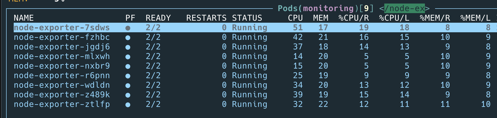

# Customize kube-prometheus

소스코드를 받은걸 컴파일을 하면 자기가 원하는 모양으로 만들어둘두 있다고 한다.

go를 사용해야한다. jsonnet을 사용한다.

```sh
brew install go

export PATH=$PATH:$(go env GOPATH)/bin
export GOPATH=$(go env GOPATH)

# get jb compile tool
go get -u github.com/jsonnet-bundler/jsonnet-bundler/cmd/jb

mkdir core/prometheus
cd core/prometheus

jb init

jb install github.com/prometheus-operator/kube-prometheus/jsonnet/kube-prometheus@release-0.8

wget https://raw.githubusercontent.com/prometheus-operator/kube-prometheus/release-0.8/example.jsonnet -O example.jsonnet

wget https://raw.githubusercontent.com/prometheus-operator/kube-prometheus/release-0.8/build.sh -O build.sh

chmod 700 build.sh

#jb update
#go get github.com/google/go-jsonnet/cmd/jsonnet
#go get github.com/brancz/gojsontoyaml
#./build.sh

docker run --rm -v $(pwd):$(pwd) --workdir $(pwd) quay.io/coreos/jsonnet-ci ./build.sh example.jsonnet
```

grafana/prometheus/alertmanager svc가 현재는 clusterip 인데 node port로 변경해보자.

`kube-prometheus/addons/node-ports.libsonnet` 이부분만 주석해제 해주면된다.

```text
local kp =
  (import 'kube-prometheus/main.libsonnet') +
  (import 'kube-prometheus/addons/node-ports.libsonnet')
  {
```

다시 빌드하고 커밋하면된다.

```sh
docker run --rm -v $(pwd):$(pwd) --workdir $(pwd) quay.io/coreos/jsonnet-ci ./build.sh example.jsonnet
```

커밋후 svc를 확인해보면 서비스 타입이 노드포트로 변경되는걸 알수 있다.

이제 다시 지워고 다시 빌드 커밋 푸시 하면 원래대로 돌아오는것을 알수 있다.

## ingress에 서비스를 오픈

[https://github.com/prometheus-operator/kube-prometheus/blob/main/docs/exposing-prometheus-alertmanager-grafana-ingress.md](https://github.com/prometheus-operator/kube-prometheus/blob/main/docs/exposing-prometheus-alertmanager-grafana-ingress.md)

참고해서 봐도 되고 다음 코드도 같이 보면 좋다.

[https://github.com/prometheus-operator/kube-prometheus/blob/main/examples/ingress.jsonnet](https://github.com/prometheus-operator/kube-prometheus/blob/main/examples/ingress.jsonnet)

example.jsonnet을 위 파일처럼 수정후 domain을 변경해주면된다.

auth라는 파일을 참조하는것을 알수 있다.

이걸 만들기 위해서는 다음과 같이 한다.

```sh
sudo apt install apache2-utils
htpasswd -c auth admin
> password를 넣는다. 엔터
```

auth라는 파일이 생겼다. 내용을 복사하여 example.jsonnet파일과 같은 디렉토리에 복사해서 넣어준다.

도메인으로 접근하면 basic login화면이 나오고 생성해준 id 비번을 넣으면 로그인이 된다.

하고보면 grafana는 id/password를 두번 넣어야하는 문제가 생기는데?

grafana는 기본인증에서 빼도 될듯 보인다. grafana를 수정햇다. ingress라는 함수를 안쓰고 직접 넣어준다.

```text
grafana: {
          apiVersion: 'networking.k8s.io/v1',
          kind: 'Ingress',
          metadata: {
            name: 'grafana',
            namespace: $.values.common.namespace,
          },
          spec: {
            rules: [{
              host: 'grafana.c3',
              http: {
                paths: [{
                  path: '/',
                  pathType: 'Prefix',
                  backend: {
                    service: {
                      name: 'grafana',
                      port: {
                        name: 'http',
                      },
                    },
                  },
                }],
              },
            }],
          },
      },
```

## etcd 모니터링

```sh
ssh master01

# Copy etcd CA cert from etcd server "/etc/ssl/etcd/ssl/ca.pem"
sudo cp /etc/ssl/etcd/ssl/ca.pem /home/ubuntu/

# Copy etcd CA cert from etcd server "/etc/ssl/etcd/ssl/ca-key.pem"
sudo cp /etc/ssl/etcd/ssl/ca-key.pem /home/ubuntu/

cd /home/ubuntu/

sudo apt install golang-cfssl

cat client.json
```

```javascript
{
  "CN": "etcd-ca",
  "hosts": [""],
  "key": {
    "algo": "rsa",
    "size": 2048
  },
  "names": [{}]
}
```

```sh
sudo chmod 755 *.pem

# Generate client certificate
cfssl gencert -ca ca.pem -ca-key ca-key.pem client.json | cfssljson -bare etcd-client
```

관련 파일이 만들어진다. 전부 로컬로 가져온다.

```sh
scp master01.c3:~/ca.pem ~/Desktop/GitHub/argocd-c3/core/prometheus/etcd
scp master01.c3:~/etcd-client-key.pem ~/Desktop/GitHub/argocd-c3/core/prometheus/etcd
scp master01.c3:~/etcd-client.pem ~/Desktop/GitHub/argocd-c3/core/prometheus/etcd
```

jsonnet 설정

[https://github.com/prometheus-operator/kube-prometheus/blob/main/examples/etcd.jsonnet](https://github.com/prometheus-operator/kube-prometheus/blob/main/examples/etcd.jsonnet)

여기 참고하면된다.

아이피는 사용하는 아이피 전부 넣어주면되고 서버이름은 빈칸으로 해도 된다. insecureSkipVerify 는 false로

```text
etcd+: {
        ips: ['172.16.3.11', '172.16.3.12', '172.16.3.13'],
        clientCA: importstr 'etcd/ca.pem',
        clientKey: importstr 'etcd/etcd-client-key.pem',
        clientCert: importstr 'etcd/etcd-client.pem',
        //serverName: 'etcd.kube-system.svc.cluster.local',
        serverName: '',

        insecureSkipVerify: true,
      },
```

빌드하고 커밋 푸시해보자.

prometheus 웹에 가서 etcd_cluster_version 으로 검색해서 나오면 확인된다.

## instance가 하나의 노드에 2개뜨는걸 방지

현재 alertmanager-main이 node05에 두개가 떠 있다. 이걸 다른노드에서 띄워보자.

[https://github.com/prometheus-operator/kube-prometheus/blob/main/examples/anti-affinity.jsonnet](https://github.com/prometheus-operator/kube-prometheus/blob/main/examples/anti-affinity.jsonnet)

참고해서 주석만 한줄 풀어줬다.

서로 다른 노드에 배포되는것을 확인했다.

## alert

슬랙으로 alert를 받고 싶다.

일단 슬랙채널을 만들어보자.


웹 후크 관련 설정을 한다. [https://api.slack.com/messaging/webhooks](https://api.slack.com/messaging/webhooks)

실제 메세지가 가는지 테스트 한다.

[https://prometheus.io/docs/alerting/latest/notification_examples/](https://prometheus.io/docs/alerting/latest/notification_examples/)

```text
global:
  resolve_timeout: 1m
  slack_api_url: 'https://hooks.slack.com/services/T/B01P/hp0IAsK'
route:
  receiver: 'slack-notifications'
receivers:
  - name: 'slack-notifications'
    slack_configs:
      - channel: '#kube'
        send_resolved: true
        icon_url: 'https://avatars3.githubusercontent.com/u/3380462'
        title: '[{{ .Status | toUpper }}{{ if eq .Status "firing" }}:{{ .Alerts.Firing | len }}{{ end }}] Monitoring Event Notification'
        text: |-
          {{ range .Alerts }}
            *Alert:* {{ .Annotations.summary }} - `{{ .Labels.severity }}`
            *Description:* {{ .Annotations.description }}
            *Graph:* <{{ .GeneratorURL }}|:chart_with_upwards_trend:>
            *Details:*
            {{ range .Labels.SortedPairs }} • *{{ .Name }}:* `{{ .Value }}`
            {{ end }}
          {{ end }}
```

웹 후크 url을 적어주고 나머지는 잘 수정해서 보내준다.

jsonnet 파일을 수정한다.

```text
values+:: {
     ...

      // Change Alertmanager configuration
      alertmanager+: {
        config: importstr 'alertmanager/config.yaml',
      },
```

컴파일 하고 올려보자.

문제가 생기면 슬랙으로 알림이 잘 온다.

## alert

KubeSchedulerDown 알림이 계속온다.

v0.8에서 조금 이상해진거같음.

```text
values+:: {

      kubePrometheus+: {
        platform: 'kubeadm',
      },
```

이걸 추가하면 에러가 없어진다고 하는데 ..해보자.

없어진다.

## CPUThrottlingHigh

CPUThrottlingHigh가 계속 알림으로 온다. node-exporter가 cpu가 높다는것이다.

내용을 확인해보자. manifest파일을 확인해보니 다음과 같다.

```text
- alert: CPUThrottlingHigh
      annotations:
        description: '{{ $value | humanizePercentage }} throttling of CPU in namespace {{ $labels.namespace }} for container {{ $labels.container }} in pod {{ $labels.pod }}.'
        runbook_url: https://github.com/prometheus-operator/kube-prometheus/wiki/cputhrottlinghigh
        summary: Processes experience elevated CPU throttling.
      expr: |
        sum(increase(container_cpu_cfs_throttled_periods_total{container!="", }[5m])) by (container, pod, namespace)
          /
        sum(increase(container_cpu_cfs_periods_total{}[5m])) by (container, pod, namespace)
          > ( 25 / 100 )
      for: 15m
      labels:
        severity: info
```

값이 25이상이면 보내게 되있다. 해결방안을 고민해보자.

1. 25이상이 무리가 없다고 판단되면 예를들어 50%까지는 알림을 보고싶지 않다고 하면 25를 50으로 바꾸면 되지 낳을가?
2. 해당 pod의 resource를 추가해 줘야 하지 않을가?

node-exporter-daemonset.yaml 에서 다음 부분을 수정해야 한다.

```text
resources:
  limits:
    cpu: 250m
    memory: 180Mi
  requests:
    cpu: 102m
    memory: 180Mi
```

일단 request를 cpu 250m으로 해보고 알림이 오는지 확인해보자.

일단 기존보다는 %가 내려간것을 알수 있다.



여전히 25가 넘어가면 알림이 발생 50으로 변경해서 테스트

알림이 줄어들었다.

이제 컴파일시 저 숫자들을 변경해줘야하는데..

```text
values+:: {
  ...
  kubernetesControlPlane+: {
    mixin+: {
      _config+: {
        cpuThrottlingPercent: 60,
      },
    },
  },

}
```

이렇게 하고 컴파일 푸시하면 된다.

[https://github.com/prometheus-operator/kube-prometheus/issues/1165](https://github.com/prometheus-operator/kube-prometheus/issues/1165)

## api error burn rate

이 에러가나서 확인해봣더니 노드에서 다음 에러가 나온다.

```text
Search Line limits were exceeded, some search paths have been omitted, the applied search line
```

`/etc/resolve.conf`에 보면 여러개의 search에 항목이 있엇다. 전부 지워주니 에러도 없어졌고 알람도 없어졋다.
