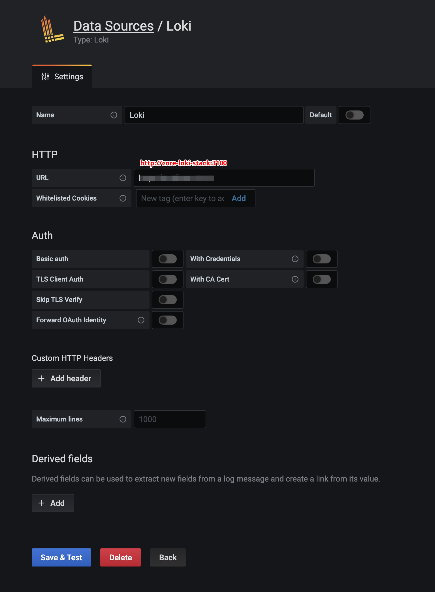
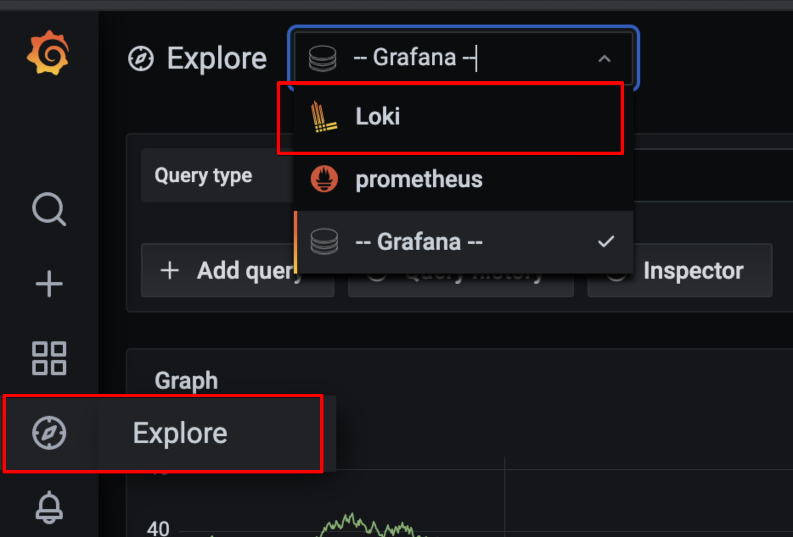

# loki

쿠버네티스에 grafana가 벌써 설치되잇다. loki를 쿠베에 설치해보자.

## install Loki stack

helm subchart를 사용했다. argocd를 사용하기 위함.

```yml
apiVersion: v2
name: core-loki-stack
type: application
version: 1.0.0
appVersion: '1.0.0'
dependencies:
  - name: loki-stack
    version: 2.4.1
    repository: https://grafana.github.io/helm-charts
```

## deploy

argocd를 사용하여 배포를 하였다.

## setting

grafana에 접속후 data source를 추가하였다.



`http://http://core-loki-stack:3100` 사용

## 데이터확인

사이드 메뉴에서 explore를 선택

상단 메뉴에서 loki를 선택한다.


