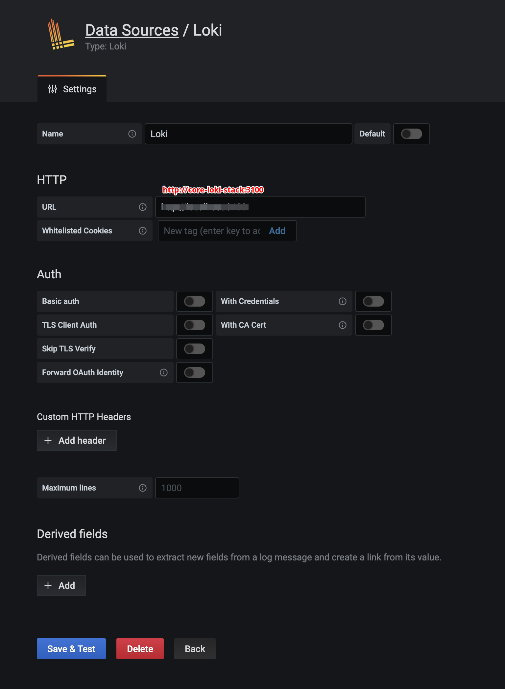
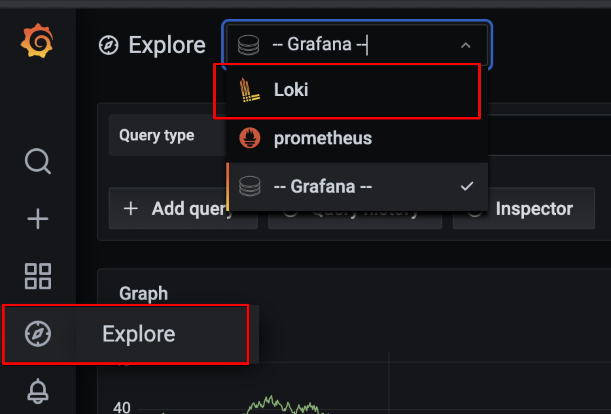
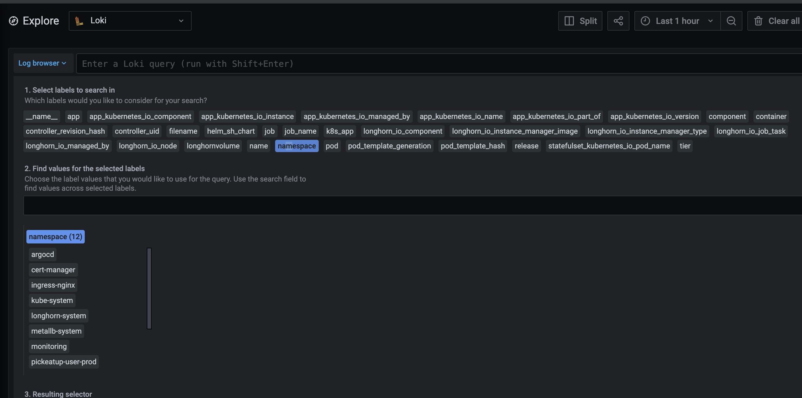
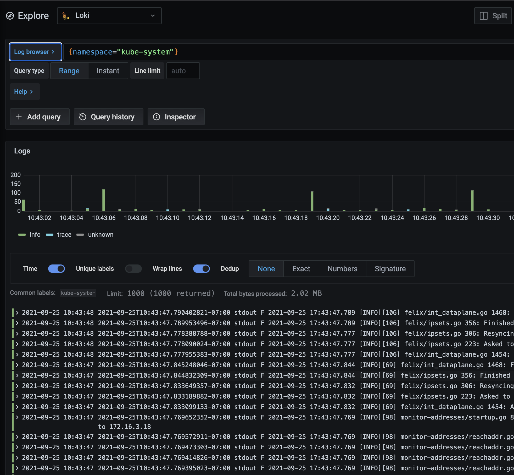

# loki

쿠버네티스에 grafana가 벌써 설치되잇다. loki를 쿠베에 설치해보자.

## install Loki stack

helm subchart를 사용했다. argocd를 사용하기 위함.

```text
apiVersion: v2
name: core-loki-stack
type: application
version: 1.0.0
appVersion: '1.0.0'
dependencies:
  - name: loki-stack
    version: 2.4.1
    repository: https://grafana.github.io/helm-charts
```

## deploy

argocd를 사용하여 배포를 하였다.

## setting

grafana에 접속후 data source를 추가하였다.



`http://core-loki-stack:3100` 사용. 서비스명이다.

## 데이터확인

사이드 메뉴에서 explore를 선택

상단 메뉴에서 loki를 선택한다.



빈 화면이 나올것이다. 이걸 사용하려면 LogQL을 알아야 한다.

[https://grafana.com/docs/loki/latest/logql/](https://grafana.com/docs/loki/latest/logql/)

로그 쿼리는 log stream selector와 filter expression 이렇게 두 부분으로 구성되어져 있습니다.

### Log Stream Selector

쿼리 표현식의 label 부분을 중괄호 {}로 묶은 다음 key value 구문을 사용하여 label을 선택합니다. 다수의 label 표현식들은 쉼표로 구분합니다.

`{namespace="kube-system"}`

이런식이다. 쉽게 하기위해서 로그 브라우저를 누른다. 현재 선택이 가능한 selector들이 보인다. 여기서 namespace를 클릭해보자.

이제 원하는 네임 스페이스를 누를수 있다.



이제 객체들이 선택되어서 내용이 보인다.



- label 매칭 연산자
  - = 정확히 동일함.
  - != 동일하지 않음.
  - =~ 정규표현식 매칭.
  - !~ 정규표현식에 매칭되지 않음.
- sample
  - {name=~"kubernetes.+"}
  - {name!~"kubernetes.+"}

### filter expression

나온 결과를 다시 필터할수 있다.

- Keep log lines that have the substring “error”:

```text
|= "error"
```

- A complete query using this example:

```text
{job="mysql"} |= "error"
```

- Discard log lines that have the substring “kafka.server:type=ReplicaManager”:

```text
!= "kafka.server:type=ReplicaManager"
```

- A complete query using this example:

```text
{instance=~"kafka-[23]",name="kafka"} != "kafka.server:type=ReplicaManager"
```

- Keep log lines that contain a substring that starts with tsdb-ops and ends with io:2003. A complete query with a regular expression:

```text
{name="kafka"} |~ "tsdb-ops.\*io:2003"
```

- Keep log lines that contain a substring that starts with error=, and is followed by 1 or more word characters. A complete query with a regular expression:

```text
{name="cassandra"} |~ `error=\w+`
```

이런식으로 필터할수 있다.

필터 연산자들은 연결될 수 있으며, 표현식을 순차적으로 필터링합니다. 결과값으로 출력되는 로그 라인들은 모든 필터를 충족합니다.

```text
{job="mysql"} |= "error" != "timeout"
```

- \|= 문자열을 포함하는 라인.
- != 문자열을 포함하지 않는 라인.
- \|~ 정규 표현식에 매칭되는 라인.
- !~ 정규 표현식에 매칭되지 않는 라인.

매칭은 기본적으로 대소 문자를 구분하며 \(?i\)를 정규 표현식 앞에 접두사로 사용하면 대소 문자를 구분하지 않도록 전환할 수 있습니다.

더 자세한 내용은 [https://grafana.com/docs/loki/latest/logql/](https://grafana.com/docs/loki/latest/logql/) 에서 참고하기 바란다.

## sample

```text
{namespace="kube-system"} |= "[ERROR]"
```
